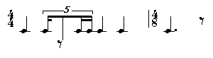
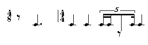
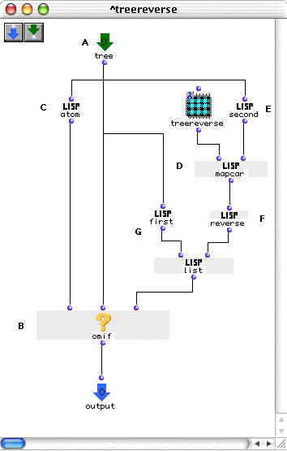
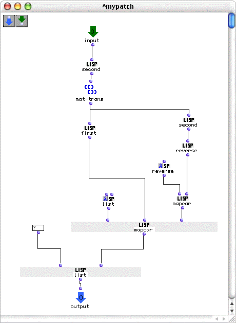
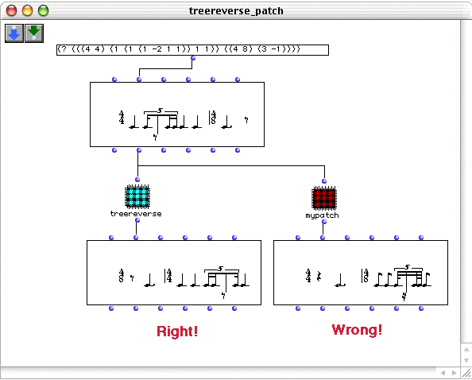

OpenMusic Tutorials  
---  
[Prev](tut.gen.38)| Chapter 14. Flow Control IV: Recursive Functions|
[Next](tut.gen.40-41)  
  
* * *

# Tutorial 39: Recursive patch II

## Topics

Using a recursive patch to reverse the output of a rhythm tree.

## Key Modules Used

[ omif ](omif), [**Voice**](voice), standard LISP functions

## The Concept:

As we saw in [Tutorial 24](tut.gen.24), traditional rhythmic notation in
the [**Voice**](voice) object is formalized in what's called a rhythm
tree. The rhythm tree is a series of [_nested_](glossary#NESTING) lists
in the form (D S) where D is the duration and S is the structure of that
duration, and S may contain additional lists in the form (D S). Notice that
this form is itself recursive, containing the same element on many different
structural levels. Taking a retrograde of such a structure is _not_ equivalent
to taking the retrograde of the rhythm it represents.

Consider this rhythm:

represented by the rhythm tree:

    
    
    (? (((4 4) (1 (1 (1 -2 1 1)) 1 1)) ((4 8) (3 -1))))  
  
---  
  
If we go through the list from beginning to end we will notice that in order
to obtain a correct retrograge rhythm some expressions must be reversed and
others not. For example, the first element '?' must always figure in the
beginning of the list and therefore must be left as is. Measure signatures
must also figure in the beginning of each measure-list. In general, all
elements in 'D' position of a rhythm tree must be left alone. Only 'S'
elements must be reversed, such as the (1 -2 1 1), it being a low level rhtyhm
structure representing a quintolet.

The correct retrograde form is thus:

    
    
    (? (((4 8) (-1 3)) ((4 4) (1 1 (1 (1 1 -2 1)) 1))))  
  
---  
  
Representing the notation:

Notice that this is **not** what we get by putting the original tree through
the LISP function [ reverse ](reverse).

A rhythm tree can have unlimited levels of nesting. In addition, not all
measures need have the same number of levels, so a simple
[ omloop ](omloop) won't do the trick. We must create a recursive
function which calls itself as many times as necessary to descend the levels
of recursion in the rhythm tree. For each element (D S), we will reverse S but
leave D untouched.

## The Patch:

Here it is. The actual reversal of elements is accomplished by (E) and (G),
which split the (D S) structure into its first and second elements and reverse
the second.

The termination test is performed by [ omif ](omif) using a special LISP
[_predicate_](glossary#PREDICATE), [ atom ](atomlisp), which returns
t only if its input is _not_ a list. Recursion will thus stop when we reach
the "bottom" of the rhythm tree.

[ mapcar ](mapcar) is used to call the recursive part of the patch.
[ mapcar ](mapcar) takes our  treereverse  and applies it to all sublists
of the 'S' portion of the current level of the tree.

Once the termination test is satisfied and we begin to work back out of the
levels of recursion, the reversed portions of the lists (the 'S' portion')
representing the distribution of rhythmic values will be put back together
with the 'D' portions (the time signatures, which we didn't touch) with the
[ list ](list) function.

The result is the correct retrograde of the rhythm. To further prove our point
about the necessity of the recursive function, let's look at the incorrect
results of a simple non-recursive function which splits the D and S elements
apart and reverses the S elements.

This patch has two problems. The first is that it only reverses elements down
to two levels of rhythm-tree sublists. If we had smaller rhythmic values as
groups within beats of the measures, they would not have been reversed.We
don't so this is not a problem. The second problem, and this one shows up, is
that the order of time signatures is not reversed. See for yourself:

* * *

[Prev](tut.gen.38)| [Home](index)| [Next](tut.gen.40-41)  
---|---|---  
Tutorial 38: Recursive patch I| [Up](tut.gen.38-39)| The Maquette II

