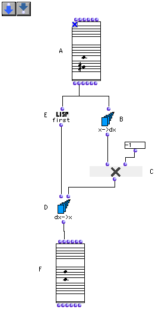

OpenMusic Tutorials  
---  
[Prev](tut.gen.3.sgm)| Chapter 1. Using Musical Objects I|
[Next](tut.gen.5.sgm)  
  
* * *

# Tutorial 4: Inverting an interval II

## Topics

Inverting pitches using series functions

## Key Modules Used

[ **Chord**](chord), [`x->dx`](x-dx), [`dx->x`](dx-x),
[`om*`](ommultiply), [`first`](first)

## The Concept:

Here we revisit tutorial 2 with an alternate solution. We will invert the
interval, this time by converting it into a relative interval with the
[`x->dx`](x-dx) function, and by multiplying this relative interval by -1
to reverse its direction. We use the complementary function
[`dx->x`](dx-x) to convert back to absolute pitch. [`x->dx`](x-dx)
finds the distances between elements of a series, and its sister function
[`dx->x`](dx-x) converts relative values to absolute values, given some
starting point.

## The Patch:

OK, so we start with our [**Chord-seq**](chord-seq) object. We take the
`_lmidic_` output, which produces (6000 4900) in our example. On the right, we
send that list of values to [`x->dx`](x-dx), which converts them into a a
relative distance. The output of [`x->dx`](x-dx) will always have one
less element than the list, since it measures distances between elements.

In this case, the difference between the two is -1100. It's negative because
6000 is considered to be the first value and the interval is thus downward.
Remember that the order of notes in a [**Chord**](chord) object is
determined by the order they were entered in. Had the other note been entered
first, it would be taken as the starting point instead of 6000. We multiply
this by -1 with [`om*`](ommultiply). Which gives us 1100, the inversion
of the interval. Now, we need to make that 1100 relative to the first note,
6000.

To do this, we use the lisp function [`first`](first), which, you guessed
it, takes the first element of a list, to extract 6000 from the list (6000
4900). That value is passed to the first input of [`dx->x`](dx-x), which
uses it as a 'jumpin off' point for the interval 1100 and arrives at the next
note, 7100. These two notes are passed to the [**Chord**](chord) object,
which renders the inverted interval.

* * *

[Prev](tut.gen.3.sgm)| [Home](index)| [Next](tut.gen.5.sgm)  
---|---|---  
Tutorial 3: Building a scale| [Up](tut.gen.1-9)| Tutorial 5: Retrograde

