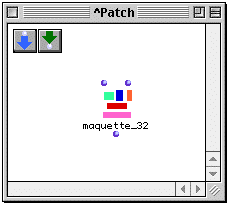
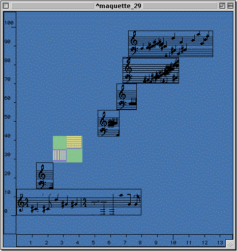

OpenMusic Tutorials  
---  
[Prev](tut.gen.40-41)| Chapter 15. The Maquette II|
[Next](tut.gen.41)  
  
* * *

# Tutorial 40: More Advanced Maquettes and MIDI

## Topics

Loading a [**Maquette**](glossary#MAQUETTE) with objects via its icon;
saving [**Maquette**](glossary#MAQUETTE) output as a MIDI file.

## Key Modules Used

[ **Maquette**](glossary#MAQUETTE), [**Voice**](voice), [ Chord-
seq ](chord-seq), [ list ](list), [ save-as-midi ](save-as-
midi)

## The Concept:

The [**Maquette**](glossary#MAQUETTE) is the ideal object for arranging
musical events and processes in time. Here we will examine a simple way of
placing a range of objects such as other
[**Maquette**](glossary#MAQUETTE)s, [**Chord-seq**](chord-seq)s and
[**Voice**](voice) objects in [**Maquette**](glossary#MAQUETTE)s.
After that, we will save our musical sketch in the form of a **Midifile**.

First, we create a new patch and a new [**Maquette**](glossary#MAQUETTE):

Now we open the patch window and drag the
[**Maquette**](glossary#MAQUETTE) into it. Whenever you drag a
[**Maquette**](glossary#MAQUETTE) from the Workspace into a patch window,
the following icon appears to represent it:

As is the case with patches, this icon is a reference to the original; any
changes we make to it will be made directly to the original object. If we
don't want to change the original, we must abstract it in the same way as we
do a patch, by selecting it and hitting **a**.

The first input is a list of onset times, in milliseconds. The onset times
correspond to the elements of a list passed to the second input. (They have
the same number of elements.) The elements of this list can be any playable
object or another [**Maquette**](glossary#MAQUETTE) or patch (provided
that you've configured these patches to play in a
[**Maquette**](glossary#MAQUETTE) \- see [Tutorial 32](tut.gen.32)).
These objects are placed within the [**Maquette**](glossary#MAQUETTE) at
the onset times specified at the first input.

In this patch we will take a series of objects created in previous tutorials
and combine them in a [**Maquette**](glossary#MAQUETTE). The first of
these is a [**Voice**](voice) object, at (A). We will use the rhythm of
this [**Voice**](voice) to trigger the entrances of the other objects in
the [**Maquette**](glossary#MAQUETTE).

## The Patch:

At (A) we will create a [**Voice**](voice) facrtory and edit both the
rhythm tree and the notes. We will use this [**Voice**](voice) as a type
of "cantus firmus" for our musical sequence, meaning that the other events
(objects) that we place inside our [**Maquette**](glossary#MAQUETTE) will
be syncronized, entering with the notes of the [**Voice**](voice).

We have decided to put seven events in the
[**Maquette**](glossary#MAQUETTE) , including [**Voice**](voice) (A)
which will be the starting event. The rhythm tree (B)

    
    
    (? (((4 4) (1 (2 ((2 (1.0 4)) 1)) 1.0)) ((4 4) ((2 (-3 2)) (1 (2.0 2 1)) (1 (1.0 6))))))  
  
---  
  
...will therefore have seven attacks.

The notes of this cantus firmus [**Voice**](voice) are taken from a
[**Chord-seq**](chord-seq) connected to the third input,  _chords_  of
the [**Voice**](voice) factory.

The combination of the two yields:

At (J) we use [ list ](list) to collect the seven objects that will be
placed in the [**Maquette**](glossary#MAQUETTE).

The first object is our cantus firmus [**Voice**](voice).

Objects (D), (F), and (G) are different random results of the patch
demonstrated in [Tutorial 12](tut.gen.12).

The [**Maquette**](glossary#MAQUETTE) at (E) is an abstraction (remember,
we have to do this to preserve the original object) of the
[**Maquette**](glossary#MAQUETTE) built in [Tutorial
33](tut.gen.33). Remember how we ahave to evaluate a
[**Maquette**](glossary#MAQUETTE) before playing it? Well, the same holds
true for sub-patches and abstractions of
[**Maquette**](glossary#MAQUETTE)s. You must open the abstraction and
evaluate it before playing the master [**Maquette**](glossary#MAQUETTE).

(H) is an interpolation between two chords, as computed in [Tutorial
18](tut.gen.18).

(I) is an abstraction of the patch from [Tutorial 13](tut.gen.13),
modified so that the [**Chord-seq**](chord-seq) it generates is connected
to an output (necessary so it can play through the
[**Maquette**](glossary#MAQUETTE).):

### The onsets

In order to get our onsets in the form of a list in milliseconds, we will have
to connect our [**Voice**](voice) object to a [**Chord-seq**](chord-
seq) (K). Via their respective  _self_  inputs and output. This is an
efficient way to transcribing traditional rhythmic notation into simple
numerical data. (This is done through [_inheritance_](inheritance). The
[**Chord-seq**](chord-seq) will inherit data from the
[**Voice**](voice) object using appropriate
[_methods._](glossary#METHOD)).

At the first input of the [**Maquette**](glossary#MAQUETTE) (L) we
connect a the list of onsets coming from the [**Chord-seq**](chord-seq)
(K) . These onsets are the 'temporal coordinates' of each object of our list
(J), which is connected to the second input of the
[**Maquette**](glossary#MAQUETTE) (L).

### Evaluating Maquettes

It's important to remember that evaluating a
[**Maquette**](glossary#MAQUETTE)'s icon is **not** the same as entering
the [**Maquette**](glossary#MAQUETTE) itself and clicking the Eval button
on the palette. The Eval button only causes items already _within_ the
[**Maquette**](glossary#MAQUETTE) to be evaluated. Connections made to
the [**Maquette**](glossary#MAQUETTE)'s inputs in the patch window are
_not_ evaluated. In building this tutorial from scratch, for example, you must
evaluate the [**Maquette**](glossary#MAQUETTE) icon in order to add the
objects, then click the Eval button within the
[**Maquette**](glossary#MAQUETTE) in order to evaluate the individual
objects.

When we evaluate the [**Maquette**](glossary#MAQUETTE), the objects are
placed within it at the onsets given at the first input. They are arranged in
a rising vertical order automatically for ease of viewing. Selecting them and
turning on the mini-view with **m** gives something like this:

|  **Contextual Menus in[
**Maquette**](glossary#MAQUETTE)s**  
---|---  
 |

If you changed the MIDI port settings for any of your objects, you may have to
set the general [**Maquette**](glossary#MAQUETTE) MIDI output port
withing the [**Maquette**](glossary#MAQUETTE) itself so that they all
play back automatically.. This is done in a contextual menu brought up by
**ctrl** -clicking in the [**Maquette**](glossary#MAQUETTE) window. This
can also be accomplished with the right mouse button of a two-button mouse, if
you have one installed. The contextual menu choice Midi Ports brings up a
mini-dialog where you can change the master input and output ports for your
[**Maquette**](glossary#MAQUETTE).  
  
Lastly, the real-time output of any [**Maquette**](glossary#MAQUETTE) can
be directly connected to the input of the [ save-as-midi ](save-as-midi)
function. Evaluating this brings up a dialog box where you can choose where to
save a MIDI file of the output. That file can then be transferred to other
programs, or reopened in OM by using a **Midifile** object. The output from
this [**Maquette**](glossary#MAQUETTE) might look like this (it will
change because of the random elements):

* * *

[Prev](tut.gen.40-41)| [Home](index)| [Next](tut.gen.41)  
---|---|---  
The Maquette II| [Up](tut.gen.40-41)| Tutorial 41

