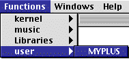

OpenMusic Tutorials  
---  
[Prev](tut.gen.42-43)| Chapter 16. Classes and Inheritance|
[Next](tut.gen.43)  
  
* * *

# Tutorial 42: Creating a Generic Function I

A general approach

## Topics

Creating your own generic functions in OM

## Key Modules Used

The LISP function `+`, [`omloop`](omloop)

## The Concept:

Here you will learn how to create your own generic functions. What is a
generic function? There are many different data types in the OM environment.
As you have seen, certain functions in OM can respond to more than one data
type. Take [`om+`](omplus), for example. When you give it a number and a
list, it adds the number to all the elements of the list. However, you can
also give it two numbers, in which case it simply adds them. How does it know
what to do?

It turns out that within the function [`om+`](omplus) are a series of
sub-functions called [_methods_](glossary#METHOD). A method is a set of
instructions for processig a specific combination of data types in a function.
When you use [`om+`](omplus) with a list and a number,
[`om+`](omplus) automatically calls a method for adding a list and a
number. You can see the methods of a function by opening its box with a
double-click. If the function cannot find a method appropriate to the data
types you are trying to give it, it generates an error.

A function composed of methods for different data types is called a generic
function. **All OM functions are generic functions.** The advantage of working
with generic functions is that operations which are conceptually similar but
apply to widely differing data types can be organized into a single function
with a single name, which is much more logical for humans.

You can write your own generic functions in OM. We will create a single
function called `myplus` and then add methods to it so that it can deal with a
variety of different data types, in the same way as [`om+`](omplus).

## Creating the Function

In order to create a generic function, one must first open a patch. Then, in
the patch window, select File->New Generic Function.

A dialog box opens:

Give your function the name `myplus`, and add a remark about what it does.
This documentation will be used in the pop-up bubble help you get with
command-click. To change the icon, click on it. This window will appear:

Icons on the right are standard OM icons. Icons on the left are user-
customizable icons.

You may customize the icons using a resource editor such as ResEdit and adding
these icons to the file `WSPL.rsrc` file in the current workspace folder.

Be careful editing these resources. Always work with a copy!

After editing the name and icon and hitting OK, the function's editing window
will appear:

This looks and acts a lot like a normal patch window. We can add inputs and
outputs and combine other functions and patches in any way we like. The
difference is that we must 'type' our inputs. When you add inputs to a patch,
they are a universal type (in fact, they are the LISP type t) which can apply
to any data type. Click the button to add an input. A type of input you've not
seen before appears:

Remember how we said function inputs have data types? Well, this input is of
type t. For know, you should know that t (its our old friend, the truth value
used in LISP [_predicates_](glossary#PREDICATE)) is effectively a
universal data type. Any type of input can pass through a t input. For this
reason, a method for type t will always be called if a more appropriate one
cannot be found. You could leave it like this, but that would defeat the
purpose of creating methods for different data types. We want to create a
different type of method, however.

Let's start by defining a method for adding two integers. We need two inputs,
if you haven't already added them.

In order to type our inputs, we drag an icon representing the data type we
want to handle onto the input. These are all found in the `Packages` folder.
We find all our functions and classes in this folder. In fact, any class is a
data type when used as a function input. integer is a class (data type) that
is part of the LISP kernel of OM. Go into the `Packages` folder and open the
`kernel:lisp` package:

We see a list of all the basic LISP classes (data types). Drag the icon for
integer to the two input icons in your patch window. The icons change to
represent the new typing. Now add the function `+` by command-clicking in the
window and typing **+**. Connect the two inputs and add an output:

Close the window. Our function is now in the Functions menu:

This function adds two integers, just like the LISP function `+`. It is
equivalent to the LISP expression (+ 5 3).

`myplus` doesn't know how to deal with lists, however. Let's add a method
allowing `myplus` to handle an integer as its first argument and a list as its
second.

Once you've used `myplus` in a patch window, double click it to open its
methods window:

Notice that our first method has icons representing the data types it accepts.
While in this window we add a new method with File->New Method:

A new editing window will appear with some extra radio buttons in its upper
part. Don't worry about them for now. Here we edit a second method for our
function. Notice that the two inputs are already present. Methods ALWAYS have
the same number of inputs, so they are added automatically, and cannot be
removed.

Drag two classes from the LISP package, but this time make them one integer
and one list:

Create an [`omloop`](omloop) and configure it:

Close the patch window. You now see another method in the window with the
appropriate data type icons.

Add another method, this time with the data types list and integer. It's just
like the one we just added, except that you have to reverse the inputs.

Add a third method for two lists. The [`omloop`](omloop) function will
look like this:

We now have 4 methods in our `myplus` function:

We can now accomplish all four types of addition, as presented in the Tutorial
patch:

User-created generic function definitions are stored in the Workspace folder,
in the subfolder `user`:

If you want to use them in other workspaces, you must copy them to the `user`
folder in the other Workspace folder.

* * *

[Prev](tut.gen.42-43)| [Home](index)| [Next](tut.gen.43)  
---|---|---  
Classes and Inheritance| [Up](tut.gen.42-43)| Tutorial 43: Creating a
Generic Function II

