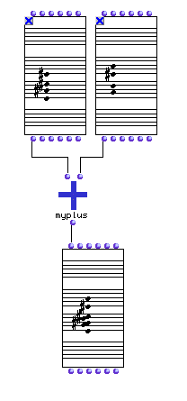

OpenMusic Tutorials  
---  
[Prev](tut.gen.42)| Chapter 16. Classes and Inheritance|
[Next](tut.gen.44-45)  
  
* * *

# Tutorial 43: Creating a Generic Function II

A musical approach

## Topics

Using musical classes as data types for [_methods_](glossary#METHOD)

## Key Modules Used

[`x-append`](x-append), [`sort.`](sort.), [`remove-dup`](remove-
dup), [**Note**](note), [**Chord**](chord)

## The Concept:

As we saw in the previous tutorial, a function may contain any number of
[_methods_](glossary#METHOD) determining its behavior. Each method
corresponds to a set of data types at the function's inputs, and is
automatically called when these data types are present. Any class can be used
as a data type, it turns out. In this tutorial we will add functionality to
our `myplus` function, defined in the previous tutorial, allowing it to 'add'
[**Chord**](chord)s and [**Note**](note)s by adding additional
methods.

## Adding New Methods

We will define the addition operation for the NOTE class as adding two notes
to produce a diad. Two notes will form an interval. In order to do this we
will again use classes from the `Packages` folder in the Workspace. This time,
however, we will open the Music:Score package:

Open up `myplus` and select File->New Method. The usual method editor window
comes up. This time, drag the [**Note**](note) class icon twice from the
`Packages` folder. Notice these inputs have many outputs:

Each of these outputs refers to a [_slot_](glossary#SLOT) of the class.
They give us access not only to the `_self_` output of the
[**Note**](note), but to its constituent slots `_midic_` , `_vel_` ,
`_dur_` , and `_chan_`.

If we open the [**Note**](note) class in the `Packages` folder, we see
these slots:

Notice that the `_self_` slot is not shown- this is because it is always
present most classes. (The [**Note**](note) icon could be taken to
represent the `_self_` slot, in fact. You also see extra slots that don't
appear in the graphic representation of the class when the class is used in
the patch: `_tie_` and `_symb-info_`. These slots are used when the
[**Note**](note) becomes part of a larger object; we won't need to
manipulate them directly.

So, in order to combine the pitches of the two notes, we will create a list
with [`x-append`](x-append). We could simply pass this list to the
output, but it would make more sense for `myplus` to return a musical object
in this case, so we give the values to the `_midic_` input of a
[**Chord**](chord) object, and pass the entire object to the output (via
the `_self_` output).

We may use our newly edited function:

Using two [**Note**](note)s, we connect them to `myplus` and get back a
[**Chord**](chord):

Now let's create a method for two [**Chord**](chord) objects. This method
will combine them into a single object, without any repretition of pitches,
and will sort all notes from lowest to highest.

First, we create the new method and drag the [**Chord**](chord) classes
from the `Packages` folder to the inputs. We connect the `_lmidic_` output of
both to the [`x-append`](x-append) function, which combines the midics
into a single list. Then we connect that to [`sort.`](sort.) (note the
period at the end of the name) which will arrange them, by default, in
ascending order. Next, they are passed to [`remove-dup`](remove-dup),
which, by default, removes duplicate elements from the list. Now we're ready
to put our filtered, sorted list of midics into the `_lmidic_` input of a
[**Chord**](chord) object, and on to the output.

We can now use the new method: A [**Chord**](chord)

and second [**Chord**](chord):

...are connected to `myplus` and the output passed to a third
[**Chord**](chord) object:

The resulting chord, viewed in order mode:

* * *

[Prev](tut.gen.42)| [Home](index)| [Next](tut.gen.44-45)  
---|---|---  
Tutorial 42: Creating a Generic Function I| [Up](tut.gen.42-43)| Classes
and Inheritance

