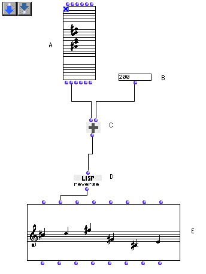

OpenMusic Tutorials  
---  
[Prev](tut.gen.4.sgm)| Chapter 1. Using Musical Objects I|
[Next](tut.gen.6)  
  
* * *

# Tutorial 5: Retrograde

## Topics

Here we perform the basic musical operation of retrograde on a group of notes.
We'll transpose it in the process.

## Key Modules Used

[ **Chord**](chord), [**Chord-seq**](chord-seq),
[`om+`](omplus), [`reverse`](reverse)

## The Concept:

Here, we'll take the `_lmidic_` output of the [**Chord**](chord) factory.
You can check to see what's coming out of the factory at this output by
option-clicking this output. If you haven't changed the notes, you'll see this
in the Listener window:

`? OM->(6000 5600 6400 7800 7200 7100)`

Remember that the order of notes here just represents the order they were
entered in. This list of midics will be passed to [`om+`](omplus) for a
transposition and then retrograded with [`reverse`](reverse).

## The Patch:

The midics are passed to [`om+`](omplus). Notice that
[`om+`](omplus) can accept both a list and a single number as inputs. In
this case, it adds the single number to all the elements of the list.

The resulting transposed list is reversed with [`reverse`](reverse),
which does just what it says it does. The new sequence of notes is plugged
into the second input of a [**Chord-seq**](chord-seq) object. We could
have plugged it into a [**Chord**](chord) object, but the retrograde
would not have been visible since the notes would have been stacked one on top
of the other. (Unless we went into the editor and used the order selection
from the pull-down menu)

* * *

[Prev](tut.gen.4.sgm)| [Home](index)| [Next](tut.gen.6)  
---|---|---  
Tutorial 4: Inverting an interval II| [Up](tut.gen.1-9)| Tutorial 6: Four
basic operations on a 12-tone row

