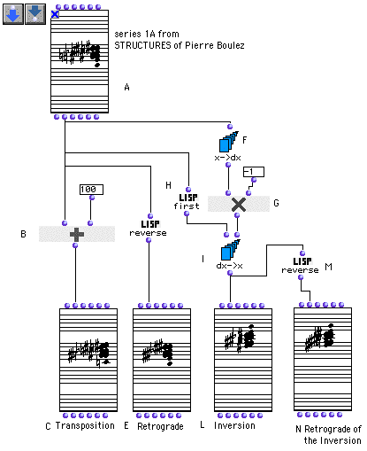
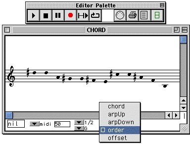
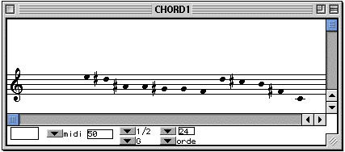
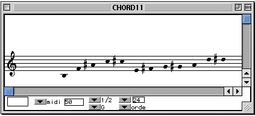
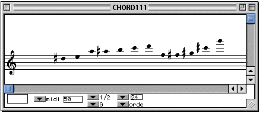
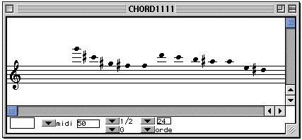

OpenMusic Tutorials  
---  
[Prev](tut.gen.5.sgm)| Chapter 1. Using Musical Objects I|
[Next](tut.gen.7.sgm)  
  
* * *

# Tutorial 6: Four basic operations on a 12-tone row

## Topics

This tutorial applies what we've learned in the previous four to
transformations of a 12-tone row.

## Key Modules Used

[ **Chord**](chord) [**dx- >x**](dx-x), [ first ](first),
[ om* ](ommultiply), [ om+ ](omplus), [ reverse ](reverse),
[ x->dx ](x-dx)

## The Concept:

Here we perform the operations of the preceding four tutorials on a single bit
of material, in this case from Boulez's _Structures_. They are: transposition,
retrograde, inversion and retrograde of the inversion.

## The Patch:

The original row from _Structures_ is in the [**Chord**](chord) box at
the top. You may keep these or change them around in the editor. Select the
order option for the view (it's less cluttered than a big fat chord).

The four [**Chord**](chord) objects will also need to be viewed in order
mode. They can be evaluated individually.

Evaluate [**Chord**](chord) (C) and the notes are transposed:

The retrograde is accomplished by the [ reverse ](reverse) function.
Evalute [**Chord**](chord) (E):

The inversion is a little more complicated. The [ x->dx ](x-dx) function
(F) converts the notes into intervals. Multiplying these by -1 (G) changes
their direction. With [ dx->x ](dx-x), (I) we will rebuild the list
starting from the first element, which we extract with [ first ](first)
(H). The result (L):

And finally, it's easy to take the retrograde of this last row with the
[ reverse ](reverse) function:

* * *

[Prev](tut.gen.5.sgm)| [Home](index)| [Next](tut.gen.7.sgm)  
---|---|---  
Tutorial 5: Retrograde| [Up](tut.gen.1-9)| Tutorial 7: Changing melodic
contour

