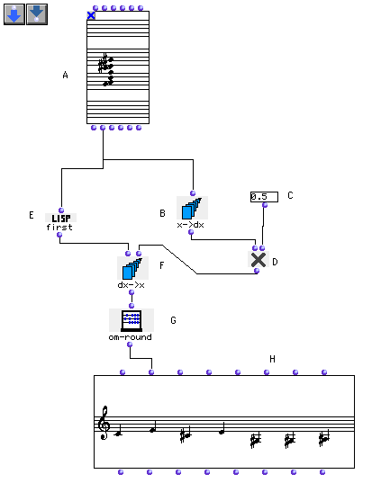
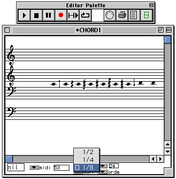

OpenMusic Tutorials  
---  
[Prev](tut.gen.6)| Chapter 1. Using Musical Objects I|
[Next](tut.gen.8.sgm)  
  
* * *

# Tutorial 7: Changing melodic contour

## Topics

A melody form is compressed or expanded vertically by a set amount.

## Key Modules Used

[ **Chord**](chord), [**Chord-seq**](chord-seq),
[`dx->x`](dx-x), [`x->dx`](x-dx), [`first`](first),
[`om*`](ommultiply), [`om-round`](om-round)

## The Concept:

Here we'll take a group of notes ordered in time as a melodic contour that we
want to play around with. The midic values of the notes are taken from the
[**Chord**](chord) object, converted into relative intervals with
[`x->dx`](x-dx), and multiplied by a scaling factor. The result is
converted back into absolute values and passed back to a [**Chord-
seq**](chord-seq) module.

## The Patch:

The 'trick' in this patch is the use of [`x->dx`](x-dx) and
[`dx->x`](dx-x) to convert back and forth between absolute pitch and
relative intervals. [`x->dx`](x-dx) (B) converts the midics of the
[**Chord**](chord) to intervals, which are multiplied (D) by a scaling
factor (C). The result is reconstructed with the help of [`first`](first)
and [`dx->x`](dx-x) to start on the original first note.

The multiplcation factor (C) can be any number. Entering numbers smaller than
1 but greater than zero will make the intervals smaller. Entering numbers
larger than 1 will make the intervals larger. Entering values smaller than
zero will, as we saw in the last tutorials, invert the interval sequence.

The [`first`](first) box takes the midic of the first note of the
[**Chord**](chord), which is not necessarily the lowest- remember, the
[**Chord**](chord) returns notes in the order they were entered, not the
order in which they occur in the chord.

The [`om-round`](om-round) function rounds any number to the nearest
whole number. To check this, change the multiplier at (C) to something with
lots of decimals, .7654321 for example. The midics that it returns will have
lots of decimals. [`om-round`](om-round) changes them into integers
(whole numbers) before transmission to the [**Chord-seq**](chord-seq)
object. **This is unecessary.** As mentioned earlier, the music object editors
have an automatic 'rounding function' for display purposes. Try this: Drag a
connection from the output of the [`dx->x`](dx-x) function directly to
the second input of the [**Chord-seq**](chord-seq). Evaluate (by option-
clicking) the output of [`dx->x`](dx-x) to make sure the results have
lots of decimals. Evaluate the second **output** of the [**Chord-seq**](chord-
seq) object. The decimals are still there, right? Even though your midics
were not multiples of 100, the [**Chord-seq**](chord-seq) object displays
notes as if they were rounded off- this is only for display and does not
affect the data itself.

Now, open the [**Chord-seq**](chord-seq) editor. From the pull-down menu,
select 1/4 from the list:

You'll notice some of the notes changing because their original midics were
closer to quarter-tones than to semi-tones. Change it to 1/8 and you'll
probably see some more notes change to the more exact 8th-tone temperament.

* * *

[Prev](tut.gen.6)| [Home](index)| [Next](tut.gen.8.sgm)  
---|---|---  
Tutorial 6: Four basic operations on a 12-tone row| [Up](tut.gen.1-9)|
Tutorial 8: Construction of a harmonic series

