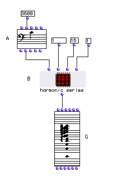
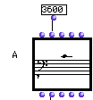
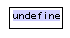
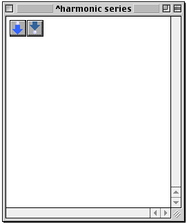
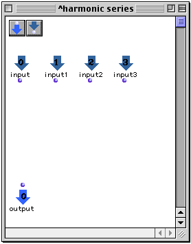
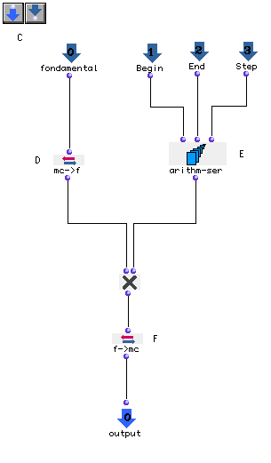
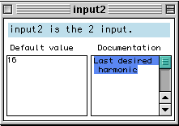
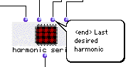

OpenMusic Tutorials  
---  
[Prev](tut.gen.7.sgm)| Chapter 1. Using Musical Objects I|
[Next](tut.gen.9.sgm)  
  
* * *

# Tutorial 8: Construction of a harmonic series

## Topics

We'll use the functions [`arithm-ser`](arithm-ser) and
[`om*`](ommultiply) to generate a harmonic series based on a fundamental
we supply. This patch is built for you in this tutorial but try building it
yourself from scratch.

## Key Modules Used

[ **Note**](note), [`mc->f`](mc-f), [`f->mc`](f-mc), [`arithm-
ser`](arithm-ser).

## The Concept:

As many of you will remember from high school physics, (if you're not yet in
high school, bless your precocious little heart) the integer multiples of a
given frequency (the fundamental) represent a harmonic series present in all
pitched tones. We can construct a musical object with the same structure.

To do this, we first need to establish the frequency of our fundamental. Then
we need to multiply it by a series of increasing integers. Then the results
need to be converted from frequencies into notes (midics).

We introduce the abstraction (red patch)

## The Patch:

The default note is a low C, two ledger lines below the staff. For very low
notes such as this, the mini-visualization may change to an octava clef (the
bass octava clef in this view displays notes two octaves above their true
pitch):

In this patch, we're going to use an what's called an abtraction, better known
as a red patch. The fact that this patch is red indicates that it exists only
within this patch. You can drag it to another patch or make copies of it, but
those copies exist separately and making changes in one does not affect the
other.

|  **Abstractions**  
---|---  
 |

Abstractions have two advantages: firstly, abstractions are because they only
exist within the current patch. The blue patches, in contrast, represent a
master copy of that patch- when you drag a blue patch from the workspace into
a patch window, you create a reference to that patch. This means that the same
patch can be used over and over in various contexts, but if you make any
changes to the patch, those changes also occur wherever else the patch is
referenced. Sometimes this is great; if you don't want this, however, you must
_abstract_ a patch from the blue patch- creating a local copy that you can
manipulate with impunity.

We, on the other hand, are interested in a second, more mundane advantage of
the red patch. It's a handy housekeeping device. You can put a bunch of
functions which accomplish a certain task within your function in an
abstraction and give it an evocative name- it helps a lot once your patches
get big, and can save loads of time when troubleshooting.  
  
So, let's create the abstraction first, to hold the part of our patch which
calculates the series. Command-click somewhere in the patch window. the usual
box appears:

Type `**patch**`.

The abstraction apppears.

We can now rename the patch 'harmonic series' by double-clicking on the name
'mypatch'. Open the patch by double-clicking on its icon. You will notice in
the upper left corner two buttons just like the two in the upper left of the
patch window. They represent outputs and inputs which can be added to the
patch to allow it to communicate with the outside world. Clicking the left-
hand button adds an output, and clicking the right-hand button adds an input.
Once added, you can rename an output or an input just like you did the red
patch.

Click to add four inputs and one output. If you add too many select them and
hit delete.

Now rename them as shown and add the rest of the modules:

The inputs we've added are gateways to the outside world. We'll pass data to
these inputs from outside the patch box.

To generate a harmonic spectrum we must multiply the frequency of the fundame
ntal note by the its place in the harmonic series (for example, we must
multiply a fundamental at 60 Hz, by 1,2,3 etc...)

First, we need to convert the fundamental pitch from a midic into a frequency,
which will be done with the [`mc->f`](mc-f) function. We'll also need a
list of integers representing the pitch ratios of the series. For this we'll
use [`arithm-ser`](arithm-ser), which will generate an arithmetic series
beginning at `_begin_` , and adding `_step_` each time until `_end_` is
reached. These amounts, like the fundamental, will be set from outside the
patch. Using 1 as `_step_` will return a list of consecutive numbers (1 2
3...) and will thus return the entire harmonic series. If we wanted to get the
odd harmonics only, however, we could use 2 as `_step_` , generating the
series (1 3 5 7...). Whatever we choose, the fundamental frequency will be
multiplied by these numbers to produce the series. The resulting frequencies
will then be converted back into notes by the module [`f->mc`](f-mc).

When you finish making the connections, evaluate the [`f->mc`](f-mc) box.
Why? This is because the inputs that we added are producing the value nil, and
the functions [`mc->f`](mc-f) and [`arithm-ser`](arithm-ser) don't
know what to do with that value. They are expecting numbers. We must change
the inputs so that they return a different value by default.

|  **Default Values at Inputs**  
---|---  
 |

When you're building a patch, you'll usually need to test it before you're
finished. When you're inside a patch, the inputs produce their _default
values_ , **even when connected to other stuff outside the patch.** This can
cause problems when evaluating your work halfway through. Luckily, you can set
the default value produced by an input. Choosing a goood default value allows
you to test the patch before you close the window. On the outside, this
default value is replaced by whatever you connect to the input. If you connect
nothing, however, the patch behaves as if you used this default input. In this
way you can set the 'default behavior' for a patch.  
  
Let's change the default values for our inputs by double-clicking the arrow
icons inside the patch window. For each one, a window like this comes up:

Here you can set the default value of the inputs, as well as add a bit of
information about what they do. Naming them is done by clicking on their names
in the patch window.

|  **Input and Output Names**  
---|---  
 |

Remeber the pop-up help you get Command-clicking on inputs and outputs? That
pop-up help also appears for your own custom-built patches, and the names that
you give your inputs and ouputs within the patch are the names that pop up in
the bubbles when command-clicked from the outside.

Giving your inputs and outputs names is a good habit to get into, it's easy to
forget what's what when your screen is filled with icons.  
  
If you've been using the pre-made patch in the `Tutorials` folder, the default
values have already been set. Try rebuilding the patch from scratch to see
what we mean.

* * *

[Prev](tut.gen.7.sgm)| [Home](index)| [Next](tut.gen.9.sgm)  
---|---|---  
Tutorial 7: Changing melodic contour| [Up](tut.gen.1-9)| Tutorial 9:
Dealing with data types

