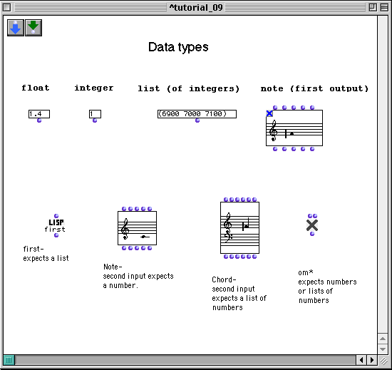
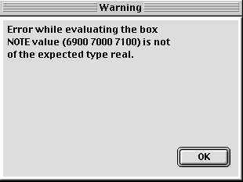

OpenMusic Tutorials  
---  
[Prev](tut.gen.8.sgm)| Chapter 1. Using Musical Objects I|
[Next](tut.gen.10)  
  
* * *

# Tutorial 9: Dealing with data types

## Topics

Introduces the concept of data type.

## Key Modules Used

[ **Note**](note), [ first ](first), [ om* ](ommultiply),
[**Chord**](chord)

## The Concept:

This postlude will demonstrate what is meant by data type.

## The Patch:

In LISP, inputs to functions and classes are typed, which is to say they
expect a certain kind of data. To see what we mean, bring up the online
documentation for the [**Note**](note) object by selecting it and hitting
**d**. The inputs are listed, and we see that the second,  _midic_  , expects
a number.

Now, drag a connection from the list of integers to this second input of
[**Note**](note) and evaluate. You'll get an error like this:

This is because a list is a different data type than a real. real is LISP's
term for any kind of number.

[ first ](first), on the other hand, only accepts lists as input, since
it takes the first element of a list. Give the float to [ first ](first)
as input and you'll get a similar error. float is LISP's term for a number
with decimals.

Now, plug the list of integers into [ first ](first).
[ first ](first) has what it wants; evaluating gives the answer 6900. You
can take this 6900 at the output of [ first ](first) and plug it into the
second input  _midic_  of the [**Note**](note) object. It too, now has
what it wants. **You can find out the data types accepted by any function by
looking it up in the[Function Reference](funcref)**.

Take the list of integers and plug it into the second input  _lmidic_  of the
[**Chord**](chord) object. This input expects a list, and you'll see the
notes in the mini-view.

Now, take the first output of the top [**Note**](note) object,  _self_ .
 _self_  exists for many classes, and outputs the entire object. Evaluate self
and you'll see something like  #<note #x9327B36>  in the Listener. This is the
[**Note**](note) object, and it is a data type like list and float. Plug
this into the first input of the lower [**Note**](note) object.
Evaluating effectively duplicates the [**Note**](note) because it passes
itself to the  _self_  input of the other note.

Plug the  _self_  output of the [**Note**](note) into one of the inputs
of [ om* ](ommultiply). Error. This is because the [**Note**](note)
object is not just a midic- it's the collection of attributes of that
[**Note**](note), including volume, duration, and MIDI channel. The
 _self_  output of the [**Note**](note) contains all the information from
the other inputs. As seen earlier, if you want to take just the midic of the
[**Note**](note), you must take it from the  _midic_  output. Do this now
and plug it into [ om* ](ommultiply). At the second input you may use
_either_ a integer or a list or a float. None of these cause errors. Why not?

OM functions are what is called a generic or polymorphic function. This means
that they can be programmed to perfom differently depending on the data type
they are given as input. This will be discussed in more detail later.

Now take the  _self_  output of the [**Note**](note) object and plug it
into the  _self_  input of the [**Chord**](chord) object. The note
appears in the [**Chord**](chord). What gives?

You've just witnessed a concept called [_inheritance_](inheritance).
Inheritance will be explained in more detail later, but for now, you should
know that all classes in LISP, but particularly the music objects, can
'inherit' information from simpler objects. A [**Chord**](chord) is
collection of [**Note**](note)s; it can therefore inherit from the
[**Note**](note) class.

Play around with the functions and objects in this patch to get your mind
around the concept of data type.

* * *

[Prev](tut.gen.8.sgm)| [Home](index)| [Next](tut.gen.10)  
---|---|---  
Tutorial 8: Construction of a harmonic series| [Up](tut.gen.1-9)| Playing
MIDI I

