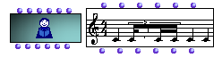

OpenMusic Reference  
---  
[Prev](textfile)| | [Next](editors.intro)  
  
* * *

# Voice

  
  
Voice  
  
(score module) \--  

## Syntax

 **Voice**    self tree chords tempo legato ties   

## Slots

name| data type(s)| comments  
---|---|---  
_self_ | [ **Voice**](voice) object, [**Measure**](measure) object, list of [**Measure**](measure) objects, [**Chord-seq**](chord-seq) object|  
_tree_ |  a rhythm tree|  
_chords_ | [ **Chord**](chord) object, list of [**Chord**](chord) objects, list of midics or list of lists of midics|  
_tempo_ |  a positive integer| defaults to 60; measured against the quarter note, regardless of time signature  
_legato_ |  a number between 1 and 100, | Indicates the duration of the chords as a percentage of the time from their onset to the onset of the next chord. If it is non-zero (the default), the  _ldur_  and  _loffset_  inputs are ignored, and notes in the chords are given durations based on the  _legato_  value.|  
_ties_ |  a list of lists of midics. | When a midic appears in a sublist, it means that this note in the corresponding chord will be tied to the same note (if it exists) in the next chord.|  
  
## Notes

See the Chapter on [Rhythm Trees](concepts.rhythm-trees) for a detailed
description of this input.

[ **Note:**](note) **Voice** has a graphic editor described in detail in the
[Editors Reference](editors.notation)

* * *

[Prev](textfile)| [Home](index)| [Next](editors.intro)  
---|---|---  
Textfile| [Up](classref.main)| OM Editors Reference

