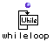
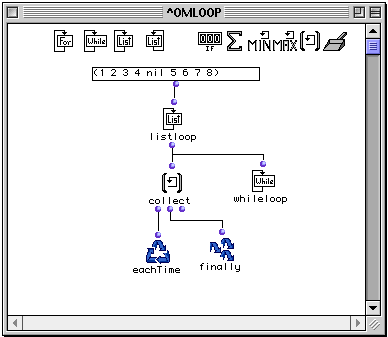

OpenMusic Reference  
---  
[Prev](forloop)| | [Next](listloop)  
  
* * *

# whileloop

  
  
whileloop  
  
(control module) \-- Allows repetition in  omloop  to continue as long as a
condition is met  

## Syntax

   **whileloop**  expr  

## Inputs

name| data type(s)| comments  
---|---|---  
  _expr_ |  nil or non-nil| any data type is accepted. A value of nil causes
the loop the exit  
  
## Output

 whileloop  has no outputs. It terminates loop execution as soon as it
receives the value nil.

## Description

|

 listloop  is part of a group of functions for performing iterative
[loops](glossary#LOOP). They can only be used within an
[omloop](omloop) patch window. Since they only function within the
context of the entire repeating loop, they (or any function connected to them)
cannot be evaluated directly within the patch window. You must evaluate the
entire loop. See the entry on  omloop  for more information.  
  
---|---  
  
 whileloop  evaluates  _expr_  at each repetition of the
[loop](glossary#LOOP). As long as  _expr_  does not evaulate to nil,
 whileloop  does nothing. As soon as nil is encountered, it causes the loop to
terminate. Whileloop is often used in conjunction with other iterators to
interrupt the loop.

## Examples

### Using  whileloop  to interrupt iteration

Here we will use  whileloop  to interrupt the enumeration of the elements of a
series:

Iterator functions may be combined in the same loop. In this case, Here we
will use  listloop  in combination with  whileloop  When two iterators are
combined, the loop will end when _either_ of the two finishes. Here,
 listloop  will sequentially enumerate the list of 9 elements.  whileloop ,
however, will interrupt this sequence because it contains nil as its fifth
element. When  whileloop  detects the nil, it causes the loop to exit, and so
only the first four elements of the list will be collected by  collect :

 ? OM->(1 2 3 4) 

* * *

[Prev](forloop)| [Home](index)| [Next](listloop)  
---|---|---  
forloop| [Up](funcref.omloop)| listloop

