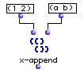
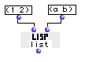

OpenMusic Reference  
---  
[Prev](volume)| | [Next](x-diff)  
  
* * *

# x-append

  
  
x-append  
  
(lists module) \-- combines two or more lists into a single one  

## Syntax

`` **x-append**` l1? l2? &rest lst? `

## Inputs

name| data type(s)| comments  
---|---|---  
` _l1?_`|  any|  
` _l2?_`|  any|  
` _lst?_`|  any| optional; additional lists to combine  
  
## Output

output| data type(s)| comments  
---|---|---  
first| a tree|  
  
## Description

Combines the lists in the order input into one new list. The module removes on
level of parentheses from the lists during the merge. Compare with the
[`list`](list) function. See examples, below.

## Examples

### Appending a list to another

This appends (1 2) to (a b), removing a level of parentheses, with the result

`? OM->(1 2 a b)`

Compare with the `list` function, which does not remove parentheses, performed
on the same data:

`? OM->((1 2) (a b))`

* * *

[Prev](volume)| [Home](index)| [Next](x-diff)  
---|---|---  
volume| [Up](funcref.main)| x-diff

