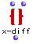

OpenMusic Reference  
---  
[Prev](x-append)| | [Next](x-dx)  
  
* * *

# x-diff

  
  
x-diff  
  
(sets module) \-- returns a list wth all the elements present in  _l1?_  and
 _list_  but not in  _l2?_ .  

## Syntax

   **x-diff**    l1? l2? &optional test key &rest list  

## Inputs

name| data type(s)| comments  
---|---|---  
  _l1?_ |  a list or tree|  
  _l2?_ |  a list or tree|  
  _test_ |  a function name or lambda function| optional; the function with which to compare the two lists. Defaults to 'equal'  
  _key_ |  a function name or lambda function| optional; a function to apply to the lists before comparison. Defaults to 'identity'  
  _list_ |  list| optional, extensible; additional lists to be compared.  
  
## Output

output| data type(s)| comments  
---|---|---  
first| a list| a single list, containing the elements present in  _l1?_  but
not  _l2?_  but not both. If used with  _list_  , returns any elements
present in  _l1?_  , but not  _l2?_  and any  _list_  s.  
  
## Description

Each element of  _l1?_  is compared to all the elements of the other list(s)
and passed to the output only if it does not equal any of them. This box is
similar in function to [ x-xor ](x-diff), except that it only passes
elements of  _l1?_ .

If the optional  _test_  argument is added, the lists can be compared
according to any [predicate](glossary#PREDICATE). The default value of
 _test_  is 'equal. Only elements in  _l1?_  that return nil in comparison
with **every** element in the other list (according to the predicate) are
returned in the result list. Since the default comparison returns t if the
elements are equal, only elements which apppear only in  _l1?_  are passed.

If the  _key_  argument is included (the default function is  identity ), the
function at  _key_  is first evaluated using each of  _l1?_  's and  _l2?_  's
elements as input, and then the lists are compared according to the test on
the results of the function.  _test_  and  _key_  may be either the name of a
predicate function or a connected function or subpatch icon in lambda mode.

Additional lists can be compared by adding  _list_  inputs.

|

This function is not commutative; only elements which apppear only in  _l1?_ 
are passed. See below.  
  
---|---  
  
## Examples

### The non-commutative property of  x-diff .

This finds the elements belonging to the first set but not the second:

 ? OM->(1 5 1) . Note the order of the elements.

Here we switch the outputs. The result list is not the same since only
elements of the first list could pass:  ? OM->(7) .

* * *

[Prev](x-append)| [Home](index)| [Next](x-dx)  
---|---|---  
x-append| [Up](funcref.main)| x->dx

