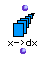
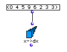

OpenMusic Reference  
---  
[Prev](x-diff)| | [Next](x-intersect)  
  
* * *

# x->dx

  
  
x->dx  
  
(series module) \-- returns a list of the intervals between values of a list  

## Syntax

 **x- >dx**   self  

## Inputs

name| data type(s)| comments  
---|---|---  
  _self_ |  a list|  
  
## Output

output| data type(s)| comments  
---|---|---  
first| a list of intervals|  
  
## Description

This function is the complement of [ dx->x ](dx-x)

 x->dx  takes its name from the mathematical notation for the change over time
in a given quantity. This change in time is usually symbolized by the greek
letter delta: Δ. It is also notated with a _d_ and the variable whose change
over time is being measured, frequently _x_ , i.e. _dx_.

 x->dx  finds the relative change between each pair of values in  _self_ . The
list returned will thus have one less element than the list input.

## Examples

### Calculating the delta of a number series

This number series will return:

 ? OM->(4 1 4 -3 -4 1 0) 

### Calculating the intervals in a melody

The **Chord-seq** at the top is passed through  flat  in order to get rid of
[nesting](glossary#NESTING) and turn it into a flat list of
[midics](glossary#MIDIC).  x->dx  returns  (300 100 100 200 400) , which
is divided by 100 to yield the number of semitones between each note:

 ? OM->(3 1 1 2 4) 

This melody is reconstructed in the example for [ dx->x ](dx-x)

* * *

[Prev](x-diff)| [Home](index)| [Next](x-intersect)  
---|---|---  
x-diff| [Up](funcref.main)| x-intersect

