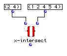
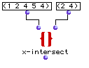

OpenMusic Reference  
---  
[Prev](x-dx)| | [Next](x-union)  
  
* * *

# x-intersect

  
  
x-intersect  
  
(sets module) \-- returns the common elements of several lists  

## Syntax

   **x-intersect**    l1? l2? &optional test key &rest list   

## Inputs

name| data type(s)| comments  
---|---|---  
  _l1?_ |  a list or tree|  
  _l2?_ |  a list or tree|  
  _test_ |  a function name or lambda function| optional; the function with which to compare the two lists. Defaults to 'equal'  
  _key_ |  a function name or lambda function| optional; a function to apply to the lists before comparison. Defaults to 'identity'  
  _list_ |  list| optional, extensible; additional lists to be compared.  
  
## Output

output| data type(s)| comments  
---|---|---  
first| a list| a single list, containing the intersection of  _l1?_  and
 _l2?_  (and any  _list_  s, if present)  
  
## Description

Normally, this box returns the elements common to two sets,  _l1?_  and
 _l2?_  , in a single list, with no repetitions.

If the optional  _test_  argument is added, the lists can be compared
according to any [predicate](glossary#PREDICATE). The default value of
 _test_  is 'equal. Only elements in the first list that return t in
comparison with **at least one** of the elements in the second list (according
to the predicate) are returned in the result list. Since the default
comparison returns t if the elements are equal, only elements in the first
list which also occur in the second list are passed.

If the  _key_  argument is included (the default function is  identity ), the
function at  _key_  is first evaluated using each of  _l1?_  's elements as
input, and then the lists are compared according to the test on the results of
the function.  _test_  and  _key_  may be either the name of a predicate
function or a connected function or subpatch icon in lambda mode.

Additional lists can be compared by adding  _list_  inputs.

|

This function is not commutative; repeated elements in the first list which
pass the test will be passed. See below. If you need to be sure that the
resulting list contains no duplicates, use [ remove-dup ](remove-dup).  
  
---|---  
  
## Examples

### Finding the intersection of two sets

This finds the intersection of the two sets and returns:  ? OM->(2 4) . The
following, however:

will return

 ? OM->(2 4 4) 

since the 4 is compared twice, because it apppears twice in the first set.

* * *

[Prev](x-dx)| [Home](index)| [Next](x-union)  
---|---|---  
x->dx| [Up](funcref.main)| x-union

