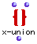
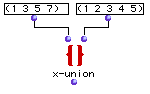

OpenMusic Reference  
---  
[Prev](x-intersect)| | [Next](x-xor)  
  
* * *

# x-union

  
  
x-union  
  
(sets module) \-- merges two sets  

## Syntax

`` **x-union**` l1? l2? &optional test key &rest list `

## Inputs

name| data type(s)| comments  
---|---|---  
` _l1?_`|  a list or tree|  
` _l2?_`|  a list or tree|  
` _test_`|  a function name or lambda function| optional; the function with
which to compare the two lists. Defaults to 'equal'  
` _key_`|  a function name or lambda function| optional; a function to apply
to the lists before comparison. Defaults to 'identity'  
` _list_`|  list| optional, extensible; additional lists to be compared.  
  
## Output

output| data type(s)| comments  
---|---|---  
first| a list| a single list, the union of `_l1?_` and `_/l2?_` (and `_list_`
s, if present)  
  
## Description

Normally, this box merges two sets, `_l1?_` and `_l2?_` , into a single list,
with no repetitions.*

|

*There is an exception: `x-union` does not remove duplicate elements if they both occur within one of the original lists. If you need to be sure that the resulting list contains no duplicates, use [`remove-dup`](remove-dup).  
  
---|---  
  
If the optional `_test_` argument is added, the lists can be compared
according to any [predicate](glossary#PREDICATE). The default value of
`_test_` is 'equal. Only elements in the first list that return nil when
compared with _all_ the elements in the second list (according to the
predicate) are returned in the result list, along with all the elements of the
second list. Since the default comparison returns t if the elements are equal,
elements in the first list which also occur in the second list are eliminated.

If the `_key_` argument is included (the default function is `identity`), the
function at `_key_` is first evaluated using each of `_l1?_` 's elements as
input, and then the lists are compared according to the test on the results of
the function. `_test_` and `_key_` may be either the name of a predicate
function or a connected function or subpatch icon in lambda mode.

Additional lists can be compared by adding `_list_` inputs.

|

When using `_test_` s other than the default, this function is not commutative  
  
---|---  
  
## Examples

### Finding the union of two sets

This mergers the two sets and returns: `? OM->(7 1 3 4 5)`

* * *

[Prev](x-intersect)| [Home](index)| [Next](x-xor)  
---|---|---  
x-intersect| [Up](funcref.main)| x-xor

