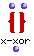
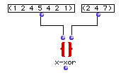
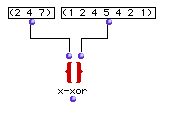
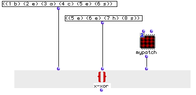
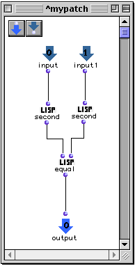

OpenMusic Reference  
---  
[Prev](x-union)| | [Next](classref)  
  
* * *

# x-xor

  
  
x-xor  
  
(sets module) \-- performs a `XOR` (exclusive `OR` on two or more lists  

## Syntax

`` **x-xor**` l1? l2? &optional test key &rest list `

## Inputs

name| data type(s)| comments  
---|---|---  
` _l1?_`|  a list or tree|  
` _l2?_`|  a list or tree|  
` _test_`|  a function name or lambda function| optional; the function with
which to compare the two lists. Defaults to 'equal'  
` _key_`|  a function name or lambda function| optional; a function to apply
to the lists before comparison. Defaults to 'identity'  
` _list_`|  list| optional, extensible; additional lists to be compared.  
  
## Output

output| data type(s)| comments  
---|---|---  
first| a list| a single list, containing the elements present in `_l1?_` or
`_/l2?_` but not both. If used with `_list_` , returns any elements present in
only one of `_l1?_` , `_/l2?_` and any `_list_` s.  
  
## Description

Normally, this box performs the logical operation `XOR`. On two sets. `XOR` is
a [predicate](glossary#PREDICATE) which returns t when either, but not
both, of its inputs are true, unlike the simple `OR` function, which will
return t whenever either of the inputs are true. `XOR` is an abbreviation of
"exclusive OR".

Elements of the two sets are XORed, meaning the set returned has elements
appearing in either one or the other set, but not both.

If the optional `_test_` argument is added, the lists can be compared
according to any [predicate](glossary#PREDICATE). The default value of
`_test_` is 'equal. Only elements in either list that return nil in comparison
with **every** element in the other list (according to the predicate) are
returned in the result list. Since the default comparison returns t if the
elements are equal, only elements which apppear in both lists are eliminated.

If the `_key_` argument is included (the default function is `identity`), the
function at `_key_` is first evaluated using each of `_l1?_` 's and `_l2?_` 's
elements as input, and then the lists are compared according to the test on
the results of the function. `_test_` and `_key_` may be either the name of a
predicate function or a connected function or subpatch icon in lambda mode.

Additional lists can be compared by adding `_list_` inputs.

|

This function is not commutative; the list elements will not be compared in
the same order if the lists are reversed, and the output, while containing the
same elements regardless, will not contain them in the same order. If you need
to be sure that the resulting list is always in the same order regardless of
input, use the [`sort.`](sort.) function.  
  
---|---  
  
## Examples

### `XOR`ing two sets

This finds the elements belonging to either set but not both: `? OM->(1 5 1
7)`. Note the order of the elements.

Here we switch the outputs. The result list has the same elements but in a
different order: `? OM->(7 1 5 1)`.

### Using `XOR` with a lambda function to compare sublists

In this example we will `XOR` the two lists, but only as a function of the
second element of each sublist. To do this, we open the `_test_` input and
plug in a lambda function, 'mypatch', displayed below::

`'mypatch'` performs `equal` on the second element of whatever list comes into
its two inputs. `x-xor` will compare each element of `_l1?_` with each element
of `_l2?_` by passing them both to `'mypatch'`. So `x-xor` will actually only
compare the second element in each sublist. The result will be:

`? OM->((1 b) (3 a) (4 c) (7 h))`

* * *

[Prev](x-union)| [Home](index)| [Next](classref)  
---|---|---  
x-union| [Up](funcref.main)| OM Class Reference

