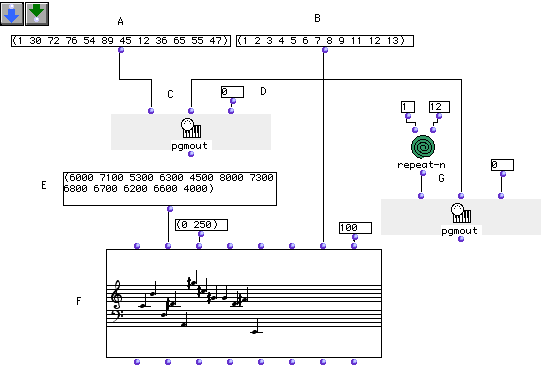
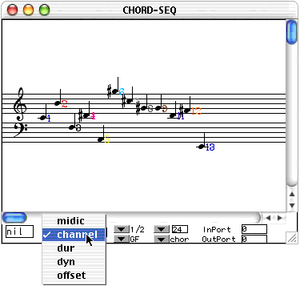
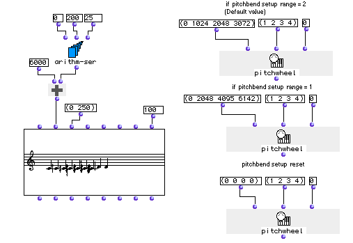

OpenMusic Tutorials  
---  
[Prev](tut.gen.10)| Chapter 2. Playing MIDI I| [Next](tut.gen.11-13)  
  
* * *

# Tutorial 10: Playing MIDI

## Topics

MIDI output with OM via Midishare and the QuickTime GM Synth

## Key Modules Used

[`pitchwheel`](pitchwheel), [`pgmout`](pgmout),
[`repeat-n`](repeat-n), [**Chord-seq**](chord-seq)

## The Concept:

This tutorial covers how to output MIDI from OM via Midishare. It assumes
you've installed and configured Midishare- if you haven't see the chapter on
[Installing Midishare](getting-started.install-midishare) Even if you
have no MIDI equipment, you can still use Apple's built-in QuickTime Musical
Instruments synthesizer (which responds to MIDI messages just like any other
MIDI instrument) to listen to your work. If you're working in 24- or 48-tone
octaves, you'll need to reconfigure QuickTime to play quarter and eighth
tones. This is covered in the second half of this Tutorial.

## The Patch:

### Changing MIDI instruments

In the top half of this patch we'll send the notes of a [**Chord-seq**](chord-
seq) out over 12 difference MIDI channels:

We'll use the two lists, (A) and (B) as program changes and MIDI channels,
respecively. Notice we've left out channel 10 as that channel is reserved for
percussion instruments on the General MIDI standard.

Evaluating [`pgmout`](pgmout) will send these program changes on the MIDI
port designated at its third input (D). This function always returns nil in
the Listener- the MIDI messages are sent anyway. Evaluate this box now.

Now enter some midicents in the list (E). Keep the list limited to 12
elements. Connect list (B) to the seventh input `_lchan_` of the [**Chord-
seq**](chord-seq) (F). The numbers in this list represent MIDI channels
to which consecutive notes will be assigned, and is why we wanted the lists to
be the same length. Evaluate the [**Chord-seq**](chord-seq) object and
open its editor.

Set the display options pop-up to channel. A color-coded numebr representing
the MIDI channel appears next to each note. If you play it, each note will
sound on a different channel, with a different timbre as a result of the
[`pgmout`](pgmout) command we issued.

To reassign a piano sound to all the channels, use the [`pgmout`](pgmout)
module at (G), which issues a program change back to 1 on all channels.

### Playing microtones using MIDI

Now let us build a simple patch that will play microtones using [**Chord-
seq**](chord-seq).

First, we'll use [`arithm-ser`](arithm-ser) to create a list of midics
running from 0 to 200 by increments of 25, representing eighth-tones.

We add 600 to each element using [`om+`](omplus) so that the list starts
on 6000. The result is (6000 6025 6050 6075 6100 6125 6150 6175 6200) Evaluate
the [**Chord-seq**](chord-seq).

In the editor, you must select 1/8 from the temperament pop-up menu in order
to see the eighth-tones displayed. However, they don't play back correctly.
This is because the MIDI standard does not directly incorporate intervals
smaller than a semitone. To get around this, we take advantage of the fact
that OM automatically sends microtones on other MIDI channels. Normal
semitones are sent on channel 1. Microtones are sent on other channels based
on how much higher they are:

Sharp by| Sent on MIDI channel  
---|---  
One eighth-tone| 2  
One quarter-tone| 3  
Three eighth-tones| 4  
  
We'll send a pitchwheel message to each of channels 2, 3, and 4, detuning the
entire channel so that its notes will play back corectly. The upper
[`pitchwheel`](pitchwheel) box sends the following messages:

  * 0 to channel 1 which stands for no pitch bend

  * 1024 to channel 2 which stands for one eighth-tone up

  * 2048 to channel 3 which stands for one quarter-tone up

  * 3072 to channel 4 which stands for three-quarters of a tone up.

8190 is the highest possible value for [`pitchwheel`](pitchwheel). It
represents a full tone on most MIDI instruments. This can be changed, however,
and some MIDI instruments map the [`pitchwheel`](pitchwheel) differently,
taking 8190 to be only a semitone. In this case you need to evaluate the
second [`pitchwheel`](pitchwheel) function.

Once you evaluate [`pitchwheel`](pitchwheel), the eighth-tones play back
correctly. The lowest [`pitchwheel`](pitchwheel) resets the other
channels to normal tuning.

* * *

[Prev](tut.gen.10)| [Home](index)| [Next](tut.gen.11-13)  
---|---|---  
Playing MIDI I| [Up](tut.gen.10)| Using Aleatoric Elements

