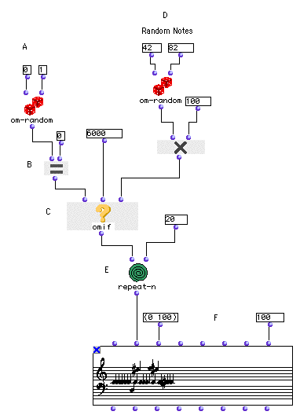
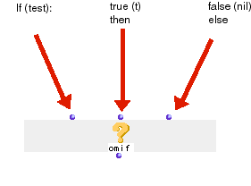

OpenMusic Tutorials  
---  
[Prev](tut.gen.14)| Chapter 4. Flow Control I: Predicates|
[Next](tut.gen.15-16)  
  
* * *

# Tutorial 14: Random construction of a sequence

Introduction to [`omif`](omif)

## Topics

The idea of flow control; introduction to conditional functions and
predicates.

## Key Modules Used

[`omif`](omif) and [`om=`](omequal)

## The Concept:

This patch uses the [`omif`](omif) module to choose between two possible
evaluations based on the outcome of the [predicate](glossary#PREDICATE)
module [`om=`](omequal). The structure for generating the random notes is
otherwise similar to the previous two tutorials'.

## The Patch:

At (A), we will use [`om-random`](om-random) as a 'coin toss' generating
0 or 1.

[`om=`](omequal) is what is called a predicate. Predicates perform some
kind of test and then return true or false. "True" in OM is represented by a
special data type called the truth value, t. "False" is usually represented by
the empty set, nil, although most conditional controls will take anything not
t as a "false" value.

Predicates are usually used as tests which feed into other modules controlling
_program flow_. The flow of a program or an OM patch determines what will be
done and in what order. OM patches are flowcharts which graphically represent
this flow. Mastering flow control is an important part of learning to program
because without it patches will always act the same way.

[`om=`](omequal) (B) tests the output of [`om-random`](om-random)
against its second argument, 0. If [`om-random`](om-random) outputs a
zero, the test will be true and will return the truth value t. If the output
of [`om-random`](om-random) is 1, [`om=`](omequal) will return nil
for false.

[`omif`](omif) is a module used to control program flow. It is modeled on
the simple _if - then - else_ syntax you may be familiar with from other
programming languages. Its function can be summarized:

If it receives t at its first input, it evaluates whatever is connected to its
second input. If not, it outputs nil. There is a third, optional input which
can be added by selecting the function and hitting option- **->**. If this
third input is present, [`omif`](omif) evaluates it instead of returning
nil when the predicate at the `_test_` input is false.

So, [`repeat-n`](repeat-n) (E) calls [`omif`](omif) (C) 20 times.
Each time, the predicate [`om=`](omequal) is evaluated against the random
result of [`om-random`](om-random). If the test is true,
[`omif`](omif) passes 6000. If it is false, the other branch of the patch
is evaluated producing a random middic between 4200 and 8200. The results are
collected in a [**Chord-seq**](chord-seq).

* * *

[Prev](tut.gen.14)| [Home](index)| [Next](tut.gen.15-16)  
---|---|---  
Flow Control I: Predicates| [Up](tut.gen.14)| Flow Control II: Loops

