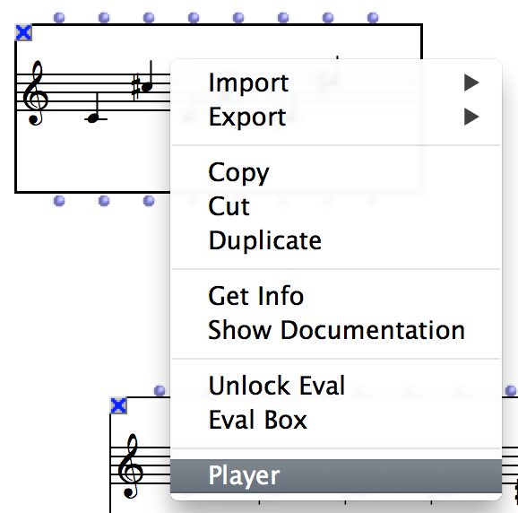

## FLUIDSYNTH AND OM

> This information applies to OM v.7.2 and higher
### Introduction

Since version 7.2, FluidSynth is integrated to OM as a dynamic library.

However, you will need to install fluidsynth on Linux and Mac platforms.

### Installing FluidSynth on Linux
You just have to use your package manager (apt for Debian, dnf for Fedora).

### Installing FluidSynth on Mac
One easy method to install on Mac is to use the Homebrew package manager. This will also allow you to install Csound, Lilypond, etc.

Here are the steps you must follow to install Homebrew and FluidSynht:

Press Command+Space and type Terminal and press enter/return key.

Copy and paste the following command in Terminal app:

...
Shell
        /bin/bash -c "$(curl -fsSL https://raw.githubusercontent.com/Homebrew/install/HEAD/install.sh)"
...
        
 and press enter/return key. Wait for the command to finish.
 
 If you are prompted to enter a password, please type your Mac user's login password and press ENTER. 
 
 Mind you, as you type your password, it won't be visible on your Terminal (for security reasons), but rest assured it will work.
 
 Now, copy/paste and run this command to make brew command available inside the Terminal: 

...
Shell 
            echo 'eval "$(/opt/homebrew/bin/brew shellenv)"' >> ~/.zprofile
...

Copy and paste the following command:

...
shell
        brew install fluidsynth
...

Done! You can now use fluidsynth.

### Score player selection

It is possible to choose among different **players** for your score objects (chord, chord-seq, voice, etc.)  

The selection of a player can be done using the _player_ button  on the tool-bar of the editors, or by right/ctrl-clicking the boxes and using the "Player" menu.

Select the **OM MIDI player** to render the object via MIDI

**Note:** The //MIDI port mode// tab on the right allows to select a MIDI port to direct the MIDI output, to use the default MIDI port (as set in the Preferences) or to use individual notes' ports. 

=> _Before to go any further in testing, check that your object(s) player selection is correct._

### MIDI setup in OM Preferences

Most of the MIDI settings are in the **MIDI** tab of OM Preferences.

When you change one of these options, push **Apply** in order to validate/apply the choice, and update the rest of the controls. 

The "Ports setup" button will allow you to set the routing of MIDI events to external MIDI devices and synthesizers. 
 
**You need to have a MIDI synthesizer or device running or connected to your system.** 

- **Mac OSX**: Apple stopped supporting MIDI playback since QuickTime X / MacOS 10.6.     
My personal pick for quick and easy testing and playback on MacOSX is **[SimpleSynth](http://notahat.com/simplesynth/)**:  (free). Just set the MIDI source carefully (same as MIDI out in OM) and it should work immediately. 

- **Windows**: Windows contains a default MIDI synthesizer.

When you click on the setup button, the following dialog appears, which allows to select devices and synthesizers to connect to your MIDI ports.

=> **Add in/out ports using the `+` button (remove them with the `-` buttons).**    
For the moment you might be interested in **one OUT port only (#0)**.

For each port a menu allows you to select any connected device or syhthesizer. 
The contents of these menus depends the devices and synthesizers running and connected _when you started OM_.     
- You need to restart OM if you connect or start another synth or device.     
- The use of virtual MIDI buses (e.g. IAC buses on MacOSX -- see note below) allows to cope with this drawback (the IAC bus is always open, and you can connect/unconnect devices to/from it anytime). 

**Notes:**

* **Your system may allow you to enable virtual MIDI buses (e.g. IAC buses on MacOSX).    
Virtual MIDI buses are convenient for they allow to abstract the device connection issues out from OM (e.g. connect port 0 to IAC bus 1 and then set IAC bus 1 as the input of your synthesizer).**      
More info, for instance [here](https://www.ableton.com/en/articles/using-virtual-MIDI-buses-live/) :)
  
* In the device lists you will see all detected MIDI synths or buses, including, for instance, the Max or the MicroPlayer MIDI inputs ("bm-microton" -- see picture above).      
You can therefore also play using MicroPlayer via MIDI (but in this case, it will not play microtones).

* Apparently non-UTF-8 characters in device names can make them not appear in the menu lists.
  
=> _**Press OK to validate the settings.**_

 

### Still not working ? 

Please report/comment on the ForumNet thread :      
[http://forumnet.ircam.fr/user-groups/openmusic/forum/topic/no-sound-in-scores/#post-12178](http://forumnet.ircam.fr/user-groups/openmusic/forum/topic/no-sound-in-scores/#post-12178)
