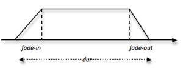

  * [Additional resources](Resources)

Navigation : [Previous](Events "page précédente\(Chant Events\)")
| [Next](Modulation "Next\(Modulating Effects\)")
Navigation generale :

  * [Guide](OM-Chant)
  * [Plan](OM-Chant_1)

OM-Chant 2.0 User Manual

Navigation : [Previous](Events "page précédente\(Chant Events\)")
| [Next](Modulation "Next\(Modulating Effects\)")

# Events Duration and "Continuous" Control

## Event duration (basics)

The control framework proposed by the Chant classes simulates the notion of
**event** in the actual sequence of control frames sent to the synthesizer.

The procedures explained below are most often transparent to the user;
however, they may help understanding the principles and better leverage the
possibilities offered by the system.

In the simple case of constant values (i.e. when numbers - and not BPFs - are
provided as values for the matrix components), the event is simulated by
duplicating the control values twice in the final SDIF frame stream: one time
at tb, the event's action-time, and one second time at te = action-time \+
dur. This way, the parameter values remains stable during the whole duration
of the event, and do not interpolate to the values of the next one until the
end of this event.

Total Duration

The activation time of the synthesis module, as well as the total duration of
the synthesis if not provided as an argument to SYNTHESIZE, is determined
automatically by taking into account the greater end time (action-time \+ dur)
among all Chant events.

On the following example we can observe the curve generated by the 4 points
delimitating 2 CH-FOF events. Not that after the second event ends, the FOF
module shuts down and the rest of the sound is null, although the F0 is still
running 1s more. The resulting sound has therefore 1s of silence at the end.

When parameters are specified using BPFs, the duration of the event is subject
to different possible interpretations.

**In the case of simple events (CH-F0, CH-NOISE)** the BPF is scaled to the
specified duration. In the following example, we see two CH-F0 objects with
the same F0 curve of appx. 2s. One scaled to a duration of 1s (in the first
event), and the other one remains of 2s duration. The resulting F0 control
sequence is visible in the SDIFFile editor.

**The case of matrix events (CH-FOF, CH-FLT) is detailed in the next
section.**

"Continuous" overlaps

Like in the case of constant event values, the overlapping of continuous
controls, if not handled explicitly, can lead to important artefacts in the
control sequence.

|

Result of the overlapping between two continuous controls.  
  
---|---  
  
Handling Transitions and Event Overlaps

  * [Transitions](Transitions)

## Handling of continuous controls with matrix events (CH-FOF, CH-FLT)

Matrix events (CH-FOF, CH-FLT) can have one or several parameters, and for one
or several of their inner components, specified as "continuous controls" in
the form of BPFs. In this case, and because of possible conflicts between the
several parameters, the dur parameter is **ignored** and the duration of the
BPF determines the real duration of the event.

In the following example the duration of the first CH-FOF event is 2s (as
described in the BPF) and the 1s duration specified for dur is ignored.

In order to set a continuous evolution for CH-FOF or CH-FLT events, the
function LIST must be used, event if there is only one BPF. Using a BPF alone
(without LIST) provokes the sampling on the BPF over the different components
of the matrix, as described in Section "[Chant events](Events)" /
"Setting the chant event attributes".

When several components of an event, or several parameters for a given
component, are specified with continuous controls (BPFs), the longest one is
determines the duration of the event. The other one (as well as the constant
parameters) keep their last value until the end of the event's duration. In
the example below, the amplitude BPF is shorter than the frequency BPF, and
therefore keeps is last value until the end of the first event.

Optimizing the control process - KT

Since all parameters of a given Chant module (say, a FOF generator) have to be
specified synchronously in common SDIF frames, they must all be interpolated
at the update rate of the continuous controls. The case where several
parameters/components are controlled with BPFs can therefore lead to high
computational costs. In order to reduce this computational cost, a global
control rate can be specified with the <kt> attribute of the event.

## Fade In, Fade Out

It is convenient to consider CHANT event as separate entities in a phrase, and
therefore to be able to control transitions between such events (see Section
"[Transitions](Transitions)") or to separate these events (as in a
"staccato" sequence). OM-Chant classes allow to isolate events with a fade-
in/fade-out parameter, supplied in addition to the event duration in the dur
slot of the events.

In order to set a fade in/out duration, just connect a list (duration in out)
instead of the single duration value. The fade in/out applies to:

  *  **amplitudes** with CH-FOF, CH-FLT and CH-NOISE objects ;
  *  **f0** with the CH-F0 objects.

In both cases, it produces and envelope of the form:

|

  
  
---|---  
  

F0 fade in/out

Applying the fade-in / fade out on a CH-F0 object will not modify the
amplitude but the frequency of the synthesis (F0 events have no amplitude).
When f0 = 0, the FOF is also silent. This can produce interesting effects of
pitch evolutions in a phrase.

References :

Plan :

  * [Introduction](OM-Chant)
  * [Installation](Install)
  * [Principles](Intro)
  * [Low-level Control Tools](Low)
  * [Displaying Results as a Sonogram](Display)
  * [Chant Events](Events)
  * Durations and Continuous Control
  * [Modulating Effects](Modulation)
  * [Formants and vocal simulation](Formants)
  * [Spatialization and Multi-Channel Control](Spatialization)
  * [Time and Structure](Time)
  * [Transitions](Transitions)
  * [Chant Maquettes](Maquette)
  * [Additional resources](Resources)

Navigation : [Previous](Events "page précédente\(Chant Events\)")
| [Next](Modulation "Next\(Modulating Effects\)")
