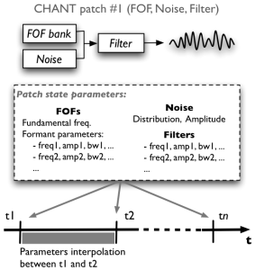
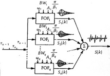

  * [Additional resources](Resources)

Navigation : [Previous](Install "page précédente\(Installation\)")
| [Next](Low "Next\(Low-level Control Tools\)")
Navigation generale :

  * [Guide](OM-Chant)
  * [Plan](OM-Chant_1)

OM-Chant 2.0 User Manual

Navigation : [Previous](Install "page précédente\(Installation\)")
| [Next](Low "Next\(Low-level Control Tools\)")

# Principles

## Chant "Patches"

The Chant synthesiser is initialised by the connexion of several synthesis or
processing modules : FOF banks (a set of FOF generators), Filter banks (a set
of resonant filters), Noise generator, and sound file player.

In the current implementation, 11 configurations (or "patches") are available.

Chant can therefore perform FOF synthesis, but also, for instance, filter an
input sound with a resonant filter, add a controlled noise source and merge
different configurations of these options (provided the corresponding patch is
available among the 11 options).

|

The 11 different configurations (or "patches") of the Chant synthesizer.  
  
---|---  
  
## Control Procedure

Chant is controlled via [SDIF](http://sdif.sourceforge.net/
"http://sdif.sourceforge.net/ \(nouvelle fenêtre\)") files (Sound Description
Interchange Format) where the state of the synthesis modules are specified at
different times (with a free and non-regular rate). The synthesizer
interpolates between these states in order to compute the output sound at the
final sample rate.

See the Chant/SDIF specification for more detail about the SDIF specification
for the control of Chant :
[http://recherche.ircam.fr/anasyn/sdif/SdifNormDoc](http://recherche.ircam.fr/anasyn/sdif/SdifNormDoc
"http://recherche.ircam.fr/anasyn/sdif/SdifNormDoc \(nouvelle fenêtre\)")

Basically, the different tools in OM-Chant will allow to generate this
sequence of control frames formatted as an SDIF file, and use this file in a
call to the synthesizer.

Two different control approaches are available with OM-Chant :

  * The **" low-level" control tools** of OM-Chant allow to simply generate this sequence of control parameters.
  * The ** "Chant events"** framework abstracts this procedutre and automatize the generation of the sequence from higher-level objects.

|

  
  
---|---  
  
Two different approaches to the control of Chant with OM-Chant :

  * [Low-level Control Tools](Low)
  * [Chant Events](Events)

## FOF Synthesis

The FOF synthesizer in Chant consists in a number of parallel FOF generators,
all driven by a common impulse train.

FOFs are small sinusoidal grains modulated by a precisely shaped envelope. A
train of such grains contributes to the resulting spectrum with a formant,
whose central frequency, amplitude, shape and bandwidth can be precisley
controlled.

Typically, 5 FOF generators are used to synthesize voice sounds.

The frequency of the pusle train determines the fundamental frequency (or
"f0")of the resulting sound.

All the parameters of the FOFs, as well as the global fundamental frequency,
are subject to continuous change during the synthesis process.

|

FOF synthesis (image from Rodet et al., 1985).  
  
---|---  
  
F0 and FOF

In Chant the fundamental frequency (f0) and the FOFs are controlled
individually, although they are clasely related in the synthesis process.

The different control tools in OM-Chant will therefore assume that both F0 and
FOF data are systematically provied.

References :

Plan :

  * [Introduction](OM-Chant)
  * [Installation](Install)
  * Principles
  * [Low-level Control Tools](Low)
  * [Displaying Results as a Sonogram](Display)
  * [Chant Events](Events)
  * [Durations and Continuous Control](Continuous)
  * [Modulating Effects](Modulation)
  * [Formants and vocal simulation](Formants)
  * [Spatialization and Multi-Channel Control](Spatialization)
  * [Time and Structure](Time)
  * [Transitions](Transitions)
  * [Chant Maquettes](Maquette)
  * [Additional resources](Resources)

Navigation : [Previous](Install "page précédente\(Installation\)")
| [Next](Low "Next\(Low-level Control Tools\)")
