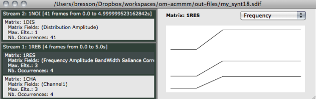
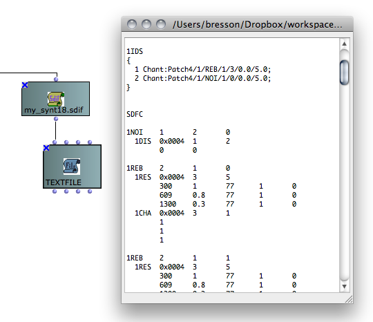

Navigation : [Previous](Intro "page précédente\(Principles\)") |
[Next](Display "Next\(Displaying Results as a
Sonogram\)")
Navigation generale :

  * [Guide](OM-Chant)
  * [Plan](OM-Chant_1)

OM-Chant 2.0 User Manual

Navigation : [Previous](Intro "page précédente\(Principles\)") |
[Next](Display "Next\(Displaying Results as a
Sonogram\)")

# Low-level Control Tools

## Formatting the SDIF control file

The function **WRITE-CHANT-SDIF-FILE** allows to format an SDIF file suitable
to the control of the Chant synthesizer, including all initialization
parameters.

WRITE-CHANT-SDIF-FILE main parameters are

  * A list of SDIF frames containing the actual control data ordered in time (see below : "Generating the SDIF Data frames") ;

  * The name of the file to write ;

  * The patch number (configuration of the synthesizer) ;

  * The total duration of the synthesis process.

Other keyword inputs allow to set specifically, and depending on the selected
synthesis patch :

  * The configuration (size, activation and stop time) of the FOF, filter or noise modules (and pathname for the sound player module) ;

  * The number of channels ;

  * The sample rate.

The output is the name of the SDIF file created, which can be for instance
connected to an **SDIFFile** box.

|

The write-chant-sdif-file function.  
  
---|---  
  
About the Chant "patch" number.

The patch number [0-10] states the configuration of the synthesizer used for a
given synthesis process. The rest of the parameters must be set accordingly
(for instance patch 0 requires - and only requires - setting the FOF modules).

The function **CHANT-PATCH** provides an in-built menu to select among the
different available patches and return the corresponding number.

|

chant-patch and the different configurations of the synthesizer.  
  
---|---  
  
Chant configuration (patches).

  * [Principles](Intro)

Details on the WRITE-CHANT-SDIF-FILE parameters

Use the inline function reference of the function  `d` to get more precision
on the format and meaning of the different arguments.

## Generating the SDIF Data

Structure of the SDIF data

The control data must be provided to WRITE-CHANT-SDIF-FILE in the form of an
**SDIF-BUFFER** object. This data must be provided in accordance with the
initialization data provided to WRITE-CHANT-SDIF-FILE (the synthesis patch,
number of FOFs, begin/end times, number of channels, etc.)

In general :

  * Patches requiring **FOFs** are controlled with frames of type "1FOB" containing SDIF matrices of type "1FQ0" (fundamental frequency) and/or of type "1FOF" (FOF parameters). "1FOB" frames may also contain matrices of type "1CHA" for the multichannel control (see section "[Spatialization and Multi-Channel Control](Spatialization)").
  * Patches requiring **Filters** are controlled with frames of type "1REB" containing SDIF matrices of type "1RES" (resonant filter). "1REB" frames may also contain matrices of type "1CHA" for the multichannel control.
  * Patches requiring **Noise** are controlled by frames of type "1NOI" containing matrices "1DIS".
  * Patches requiring **Sound** are not controlled by SDIF frames (the sound file and playback info are declared in the file header only).

The SDIFFile editor

You can always check the contents of the generated SDIF file either using the
**SDIFFile editor** , where the frame stream and internal matrix types are
visible.

SDIF to Text conversion

Connecting the **SDIFFile** box to a **TextFile** object (or using the **SDIF-
>Text** function) provides a linear text representation of the actual file
contents.

The easy way

The function **GEN-CHANT-SDIF-BUFFER** generates the SDIF-BUFFER for you from
simple list specifications (time value[s]).

The available synthesis parameters are fewer but the essential of what is
generally needed is here (f0, FOF frequencies, amplitude, bandwidths, etc.).

Here also, the formatted data must correspond to the synthesizer's
initializations as provided to WRITE-CHANT-SDIF-FILE

|

gen-chant-sdif-buffer generates an SDIF-Buffer object out of input lists of
time-value(s) pairs.  
  
---|---  
  
Details on the setting of GEN-CHANT-SDIF-BUFFER parameters

Use the inline function reference of the function  `d` to get more precision
of the format and meaning of the different arguments.

Using the OpenMusic SDIF tools

If you are familiar both with the SDIF tools in OM and with the [Chant/SDIF
specification](http://recherche.ircam.fr/anasyn/sdif/SdifNormDoc
"http://recherche.ircam.fr/anasyn/sdif/SdifNormDoc \(nouvelle
fenêtre\)"), then you can generate and format the data with absolute freedom.

Mind however to always keep the control data in accordance with the
initialization data provided to WRITE-CHANT-SDIF-FILE : synthesis patch,
number of FOFs, begin/end times, number of channels, etc.

Example

An example is provided in the library tutorial patch "chant-sdif-buffer2".

Generating the Chant control data using the OM SDIF tools and objects
(tutorial patch "chant-sdif-buffer2")

More about the SDIF tools in OM

  * See the [OM User Manual](http://support.ircam.fr/docs/om/om6-manual/co/SDIF "http://support.ircam.fr/docs/om/om6-manual/co/SDIF \(nouvelle fenêtre\)")

I don't like writing SDIF files...

Note that the other control tools in OM-Chant allow to hide the use of the
SDIF file as an intermediate format and directly connect the control object to
a sound via the **SYNTHESIZE** method.

High-Level Control : The Chant "Events"

  * [Chant Events](Events)

## Chant Synthesis

The function **CHANT-SYNTH** allows to synthesize a sound starting from the
generated SDIF file (if Chant is correctly installed and set with the
library).

It can be connected to the SDIFFile object, or directly the the SDIF file
pathname as returned, for instance, by WRITE-CHANT-SDIF-FILE.

In addition to the SDIF file, additional (keyword) inputs to CHANT-SYNTH allow
to specify the output sound file name, format, and optionally, a normalization
level.

The Chant synthesis process (tutorial patch "chant-sdif-buffer")

Chant installation and setup with OM

  * [Installation](Install)

Normalization

Normalizing the Chant output (level in dB : -0, -3, -6...) might be necessary
in order to avoid saturation of the output sound file.

"Singing voice" synthesis : hints and tools to set the synthesis parameters in
order to imitate voice

  * [Formants and vocal simulation](Formants)

References :

Plan :

  * [Introduction](OM-Chant)
  * [Installation](Install)
  * [Principles](Intro)
  * Low-level Control Tools
  * [Displaying Results as a Sonogram](Display)
  * [Chant Events](Events)
  * [Durations and Continuous Control](Continuous)
  * [Modulating Effects](Modulation)
  * [Formants and vocal simulation](Formants)
  * [Spatialization and Multi-Channel Control](Spatialization)
  * [Time and Structure](Time)
  * [Transitions](Transitions)
  * [Chant Maquettes](Maquette)
  * [Additional resources](Resources)

Navigation : [Previous](Intro "page précédente\(Principles\)") |
[Next](Display "Next\(Displaying Results as a
Sonogram\)")
