Navigation : [Previous](Continuous "page précédente\(Durations and
Continuous Control\)") | [Next](Formants "page
suivante\(Formants and vocal simulation\)")
Navigation generale :

  * [Guide](OM-Chant)
  * [Plan](OM-Chant_1)

OM-Chant 2.0 User Manual

Navigation : [Previous](Continuous "page précédente\(Durations and
Continuous Control\)") | [Next](Formants "page
suivante\(Formants and vocal simulation\)")

# Modulating Effects

Different tools in OM allow for the generation of continuous controllers
suitable for the specification of parameters in OM-Chant events. The outputs
of the following generators are BPFs which can be connected to the OM-Chant
just as described in the previous sections.

## PARAM-PROCESS (Vibrato, Jitter)

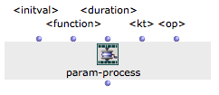

The function PARAM-PROCESS modulates an input parameter (<initval> = constant
value or BPF) with a combination of **vibrato** (sinusoidal modulation) and/or
**jitter** (random perturbation) effects (<function>). Both jitter and vibrato
are determined by a frequency <freq> and amplitude <amp>. They are applied to
generate a controller of length <duration>, modulating <initval> at rate <kt>
(optional), either by addition or multiplication (<op>).

Simple Jitter, constant value:

[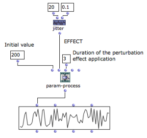](../res/jitter-1.png "Cliquez pour agrandir")

|

The followinf example generates a BPF updated at a given frequency (freq) to
randomly perturb the initial value (<initval>) by a given factor (amp) during
3 seconds.  
  
---|---  
  
Multiple Jitters

Multiple values can be given for the frequencies and/or amplitudes of the
jitter effect, producing a combination of the corresponding modulations.

|

[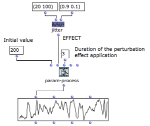](../res/jitter-2.png "Cliquez pour agrandir")  
  
---|---  
  
Jitter control rate

<kt> is not used with Jitter effects. The resolution of depends on the Jitter
frequency[-ies].

Jitter on BPFs

Applied on BPFs, the jitter perturbates the curves at each time determined by
the frequencies.

The following example also illustrates the difference between modulating by
**addition** ('a' = addition of initial value * amp to the initial value) and
by **multiplication** ('m' = multiplication of the initial value by amp).

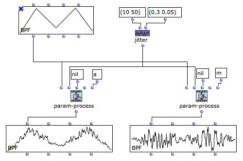

Duration with BPFs

When <initial-value> is a BPF and <duration> is NIL, the original BPF duration
is preserved. Otherwise the effect(s) apply during the specified duration.

All same principles apply with the VIBRATO effect

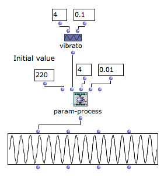

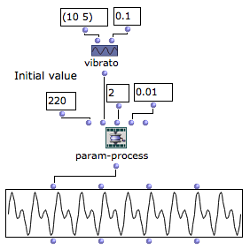

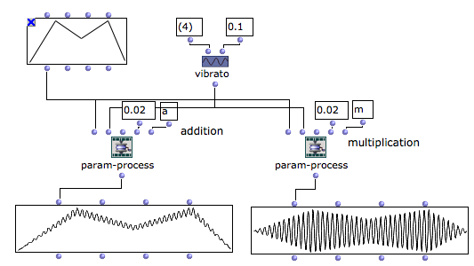

KT with VIBRATO

With the VIBRATO effect the control rate <kt> has to be specified, otherwise
OM will automatically choose one corresponding to the smallest possible value
to avoid spectral aliasing.

Dynamic/Continuous Effects

Effects themselves can have their parameters (freq, amp) varying over time. In
this case, the frequency and amplitudes must be specified as BPFs [time (sec.)
/ value]. In the next examples the frequencies raise while the amplitudes of
the effects decrease.

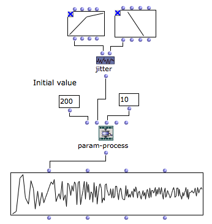

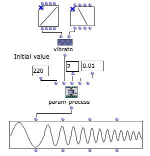

Effects combinations

It is possible to combine JITTER and VIBRATO on a same PARAM-PROCESS:

|

[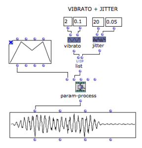](../res/effect-combi.png "Cliquez pour
agrandir")  
  
---|---  
  
Application to Chant synthesis

Tutorial patch : "apply-vibrato"

|

One of the main use of PARAM-PROCESS with VIBRATO is for the modulation of the
frequency in CH-F0 events:  
  
---|---  
  
The tutorial patch "example" monster illustrates the use of jitter and
modulations to the parameters of the FOF generators.

[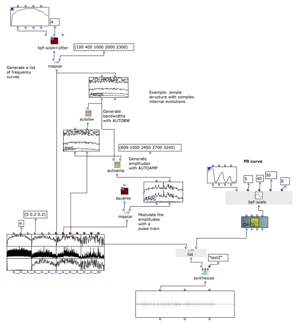](../res/jitter-fofs.png "Cliquez pour
agrandir")

## Pulse train

In certain cases it will be useful to generate a pulse train as a continuous
specification for a given Chant parameter. The function **PULSE-TRAIN**
provides a great flexibility to generate such controller:

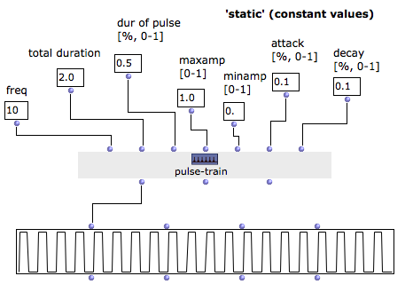

[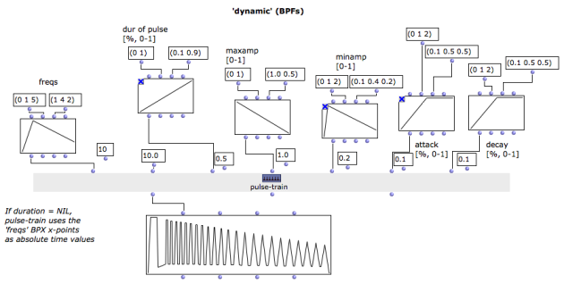](../res/pulse-train-2.png "Cliquez pour
agrandir")

Use `d` to see the PULSE-TRAIN reference page and get a complete description
of the parameters.

Application to Chant synthesis

In this example we use PULSE-TRAIN to generate the amplitude of the noise in
the CH-NOISE event with Chant synthesis patch #4 (NOISE+FILTER).

|

[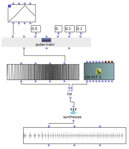](../res/pulse-train-synth.png "Cliquez
pour agrandir")  
  
---|---  
  
References :

Plan :

  * [Introduction](OM-Chant)
  * [Installation](Install)
  * [Principles](Intro)
  * [Low-level Control Tools](Low)
  * [Displaying Results as a Sonogram](Display)
  * [Chant Events](Events)
  * [Durations and Continuous Control](Continuous)
  * Modulating Effects
  * [Formants and vocal simulation](Formants)
  * [Spatialization and Multi-Channel Control](Spatialization)
  * [Time and Structure](Time)
  * [Transitions](Transitions)
  * [Chant Maquettes](Maquette)
  * [Additional resources](Resources)

Navigation : [Previous](Continuous "page précédente\(Durations and
Continuous Control\)") | [Next](Formants "page
suivante\(Formants and vocal simulation\)")
