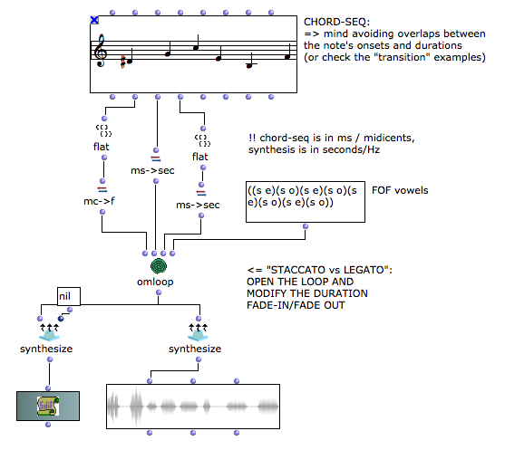
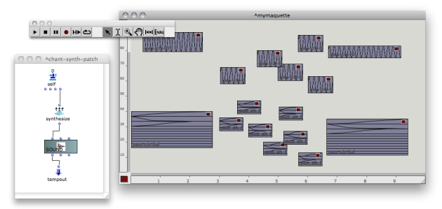
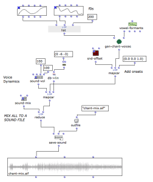

Navigation : [Previous](Spatialization "page
précédente\(Spatialization and Multi-Channel Control\)") | [page
suivante](Transitions "Next\(Transitions\)")
Navigation generale :

  * [Guide](OM-Chant)
  * [Plan](OM-Chant_1)

OM-Chant 2.0 User Manual

Navigation : [Previous](Spatialization "page
précédente\(Spatialization and Multi-Channel Control\)") | [page
suivante](Transitions "Next\(Transitions\)")

# Time and Structure

Sommaire

  1. Iterations
  2. Chord-seq
  3. Maquette
  4. Polyphony (?)

The OM-Chant framework can prove particularly powerful at the time of
generating control "phrases" with numerous events, and organizing them in
consistent/compositional time structures.

## Iterations

The tutorial patch "chant-iteration" is an example of iterative process
generating Chant events. The main difficulty is to accurately set the action-
time and duration of each successive event.

tutorial patch "chant-iteration"

## Chord-seq

The CHORD-SEQ object can be a convenient way of controlling Chant "singing"
notes. It can provide at the same time pitch information for the CH-F0 and
temporal information for the rest of the Chant events.

tutorial patch "chant-chord-seq"

Units

CHORD-SEQ and synthesis parameters are not in the same units :

  * CHORD-SEQ pitches are in midicents, while synthesis frequencies are in Hertz (Hz). You can use **MC- >F** to convert from midicents to Hz.
  * CHORD-SEQ onsets and durations are in millisecons, while synthesis params are in seconds. Use **MS- >SEC** to convert.
  * CHORD-SEQ velocities are in MIDI (0-127) while synthesis amplitudes are generally absolute values between 0.0 and 1.0.

Staccato / Legato and the use of Chant event's duration

The dur parameter of the Chant event classes can be set as a value in seconds,
or as a list (duration fade-in fade-out). Fade in/out allow to "shut" the
event down before/after its start and/or end time, and therefore to "separate"
the notes played by the Chant synthesizer.

Use fade-in/out on CH-FOF in order to apply this to the FOF amplitudes, or to
the CH-F0 in order to use it on the fudamental frequency.

Voir aussi

  * [Events Duration and "Continuous" Control](Continuous)

OMChroma / CR-MODEL

The CR-MODEL object from the OMChroma library can be a concenient and powerful
alternative to store and process time and pitch information for the control of
the Chant synthesis processes.

OVERLAPS

The Chant synthesizer does not handle simultaneous or overlapping controls by
itself.

Successive event's onsets and durations must therefore be carefully checked
abd specified.

See the section "Transitions" in order to control the transitions and
overlapping segments in your OM control patches.

|

Result of the overlapping between two continuous controls.  
  
---|---  
  
Voir aussi

  * [Transitions](Transitions)

## Maquette

Principles

The OM Maquette interface can be used to organize syntheis control objects in
advanced temporal/functional structures.

The "synthesis" patch (double-click in the lower-left corner of the maquette
editor) then converts the Chant events into a sound at the time of rendering
the maquette.

More about the control of sound synthesis in the Maquette

See the "Maquette" section in the [OM User
Manual](http://support.ircam.fr/docs/om/om6-manual/co/Maquettes
"http://support.ircam.fr/docs/om/om6-manual/co/Maquettes \(nouvelle
fenêtre\)").

Chant "phrase" maquettes.

A number of tools available under the `Events/Maquette` menus of the OM-Chant
library have been designed in order to automatically generate control
maquettes for Chant.

These tools also include utilities to easily handle transitions between
events.

|

Generating CH-F0 events as temporal boxes in a maquette  
  
---|---  
  
The Maquette Utilities Tutorials

  * [Using the Maquette as a Control and Interaction Framework](Maquette)

## Polyphony (?)

Chant is a monophonic synthesizer creating sounds starting from linear control
sequences.

To some extent, the tools presented in the next section for transitions and
morphing of events allow to deal with polyphony.

In order to generate simultaneous or parallel voices, a solution is to
generate independent phrases as sound files and mix or arrange them using the
functions in the OM Audio toolbox.

An example is provided in the example patch polyphony.

|

  
  
---|---  
  
The OM Audio Tools

See the "Audio" section in the [OM User
Manual](http://support.ircam.fr/docs/om/om6-manual/co/SoundProcessing
"http://support.ircam.fr/docs/om/om6-manual/co/SoundProcessing \(nouvelle
fenêtre\)").

References :

Plan :

  * [Introduction](OM-Chant)
  * [Installation](Install)
  * [Principles](Intro)
  * [Low-level Control Tools](Low)
  * [Displaying Results as a Sonogram](Display)
  * [Chant Events](Events)
  * [Durations and Continuous Control](Continuous)
  * [Modulating Effects](Modulation)
  * [Formants and vocal simulation](Formants)
  * [Spatialization and Multi-Channel Control](Spatialization)
  * Time and Structure
  * [Transitions](Transitions)
  * [Chant Maquettes](Maquette)
  * [Additional resources](Resources)

Navigation : [Previous](Spatialization "Spatialization and Multi-Channel Control") | [Next](Transitions "Transitions")
