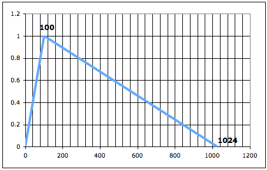

Navigation : [Previous](Getting_Started "page
précédente\(Getting started\)") | [Next](02-Slot's_Description
"Next\(Slots' Description and Default Values\)")

  1. Library Window
  2. Adding a Box Directly to the Patch Editor
  3. Input Slots
  4. Types of Input Data
  5. More About GEN Functions in Csound

The OMChroma's classes are accessible in two ways :

  * via the Library window
  * typing the box's name directly in the patch editor

## Library Window

 **omchroma ** **** in the **OM Packages** **Libraries** in the[
[Library](http://support.ircam.fr/docs/om/om6-manual/co/Library
"http://support.ircam.fr/docs/om/om6-manual/co/Library \(nouvelle
fenêtre\)")](http://support.ircam.fr/docs/om/om6-manual/co/Library
"http://support.ircam.fr/docs/om/om6-manual/co/Library \(nouvelle
fenêtre\)")") window contains the available OM classes and functions organized
in thematic sub packages.

  1. Open the Library window

  2. Select **omchroma** , click on it and press enter to open the classes and functions windows.

  3. Drag and drop the function or the class icon into the patch editor.

## Adding a Box Directly to the Patch Editor

Typing a Class or Function Name

The name of a class or function can always be keyed in a patch editor
directly.

  1. Cmd / right click in the editor : an "undefined" box appears. 

  2. Type the relevant name in the text prompt and validate or click somewhere in the editor.

|

  
  
---|---  
  
## Input Slots

The OMChroma Class has two types of input slots

  * Global slots (blue inlets)
  * Additional slots (keywords) or p-fields input slots (red inlets)

|

  
  
---|---  
  
Global slots

The 4 global slots are always visible and with blue inlets. From left to right
they are :

Name

|

Description  
  
---|---  
  
self

|

Synthesis event  
  
numcols

|

Number of components  
  
action-time

|

Event offset(s)  
  
user-fun

|

A lambda function applied to each component  
  
Additional slots

The Additional slots are not directly showed. To make them appear select the
class and type **shift + arrow key**.

The first two inlets from the left are always the same for every class of a
Csound orchestra, that is :

Name

|

Description  
  
---|---  
  
e-dels

|

Entry delays [sec], time interval between the object's "action-time" and the
beginning of each line in the score.  
  
durs

|

Duration [sec], duration of each line in the score.  
  
The other slots can be many and have their own name according to the requested
data.

|

To see the ScreenTip with the description of the slot point the arrow on it.  
  
---|---  
  
## Types of Input Data

Open the Library window.

|

  
  
---|---  
  

Select the OMChroma Library and click on it and press enter to open the
classes and functions panels.

|

  
  
---|---  
  

|

Double-click on the add-1 icon to open the Om Class - ADD-1 window.  
  
---|---  
  
Take a close look at the icons of the slots.

|

The p-fields with this kind of icon allow only numbers (of any kind).  
  
---|---  
  

|

The p-fields with this kind of icon allow only
[BPF](http://support.ircam.fr/docs/om/om6-manual/co/BPF-BPC
"http://support.ircam.fr/docs/om/om6-manual/co/BPF-BPC \(nouvelle
fenêtre\)") or numbers which refer to a Csound GEN function. Their name always
ends with "env" (ex. aenv).  
  
---|---  
  
## More About GEN Functions in Csound

This section is a close examination of the GEN function in Csound. If you know
it, skip to the next chapter.

Csound uses lookup tables for many purposes. These function tables (f-tables)
contain everything from periodic waveforms to other kind of data. The specific
data are created with Csound's f-tables generator subroutines, or GEN
routines. A Csound f-table is an array of floating point values stored in RAM
to be used while Csound computes sound. These f-tables are usually defined in
the Csound score file and are often restricted to a size of a power of two
(2n) or a power of 2 plus one (2n \+ 1). Tables can be visually displayed as
mathematical graphs with data addresses plotted from left to right along the
x-axis and the actual stored data plotted along the y-axis.

Description of the parameters of the f-statement (or Function Table
Statement).

 **Syntax**

f p1 p2 p3 p4 p5 ...

 **Performance**

 **p1** Table number by which the stored function will be addressed.

 **p2** Action time of the function generation.

 **p3** Size of the function table (it must be a power of 2, or a power-of-2
plus 1).

 **p4** Number of the GEN function to be called.

 **p5** Parameters whose meaning is determined by the particular GEN routine.

Example

p1

|

p2

|

p3

|

p4

|

p5

|

p6

|

p7

|

p8

|

p9  
  
---|---|---|---|---|---|---|---|---  
  
f100

|

0

|

1024

|

7

|

0

|

124

|

1

|

900

|

0  
  
 **p1 = 100** (number of the table, i.e. the number 100 will identify this
table)

 **p2 = 0** (action time of function generation; here, it is at time 0 of the
score)

 **p3 = 1024** (size of the table, i.e. number of points, 210)

 **p4 = 7** (the GEN function number 7 is similar to a BPF, as it draws
linearly interpolated segments between specified points)

 **p5 = 0** (y-axis value at 0 x-axis value)

 **p6 = 124** (x-axis distance from the previous point, that is 124 points
after the beginning)

 **p7 = 1** (y-axis value at p6 x-axis value)

 **p8 = 900** (x-axis distance from the previous point, that s 900 points
after p6)

 **p9 = 0** (y-axis value at p8 x-axis value)

NB: the sum of all the x-axis distances should equal the table's size,
otherwise the table will be padded with zero's or truncated (if the sum is,
respectively, smaller or larger).

Graph of the f-table # 100

 **Special cases**

Normally, the y-values are normalized between 0 and 1 when Csound instanciates
the table. However, a negative GEN number implies that the function is not
rescaled, and maintains its original values.

GEN function number 1 transfers data from a soundfile into a function table
and is therefore used with samplers. Its size is ordinarily a power of 2 or a
power-of-2 plus 1; the maximum tablesize is 16777216 (224) points. The
allocation of table memory can be deferred by setting this parameter to 0; the
size allocated is then the number of points in the file (probably not a power-
of-2), and the table is not usable by normal oscillators, but it is usable by
a loscil unit. The soundfile can also be mono or stereo. The OMChroma classes
**smpl-3** to **smpl-6** use deferred tables.

Voir aussi

  * [Links](05-Links)

References :

Plan :

  * [OMChroma User Manual](OMChroma)
  * [System Configuration and Installation](Installation)
  * [Getting started](Getting_Started)
    * Class Input Slots
    * [Slots' Description and Default Values](02-Slot's_Description)
    * [Amplitude and Internal Editor](03-Amplitude_and_internal_editor)
    * [Amplitude Envelope](04_Amplitude_envelope)
    * [f-GEN Reserved Numbers](05-f-GEN_Reserved_Number)
    * [Audio Waveforms](06-Audio_Waveforms)
    * [Chord-seq to OMChroma](07-Chord-seq_to_OMCh_Class)
    * [Spectrum Chord and Arpeggio](08-Spectrum_Chord_and_Arpeggio)
    * [Velocity versus Amplitude](09-Velocity_vs_Amplitude)
    * [Exponential Amplitude Envelope with a BPF](10-Exponential_Amplitude_Envelope_with_BPF)
    * [Relationship with the Csound .orc and .sco files](11-Relationship_with_the_Csound_orc_and_sco_files)
    * [Slots polymorphism](12-Slots_polymorphism)
  * [Managing GEN function and sound files](Managing_GEN_function_and_sound_files)
  * [Predefined Classes](Predefined_classes)
  * [User-fun](User-fun)
  * [Creating a new Class](Creating_a_new_Class)
  * [Multichannel processing](06-Multichannel_processing)
  * [Appendix A - Common Red Patches](A-Appendix-A_Common_red_patches)

Navigation : [Previous](Getting_Started "page
précédente\(Getting started\)") | [Next](02-Slot's_Description
"Next\(Slots' Description and Default Values\)")
