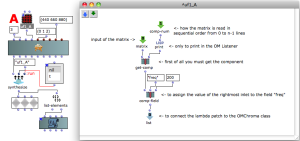
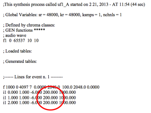
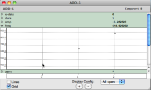

Navigation : [Previous](User-fun "page précédente\(User-fun\)") |
[Next](02-Read_modify_and_replace "Next\(Read
modify and replace\)")

|

The user patch shows the program flow of the user-fun. For more details on
this topic see program flow in [Tutorial User-fun 02 - Read modify and
replace](02-Read_modify_and_replace)  
  
---|---  
  
Patch description

|

The user patch shows the programming flow of the user-fun. See the comments
inside the lambda patch.

The user-fun assign to every field "freq" the value "200". Now follow these
steps :

  * select "nil" via the single-item-list,
  * evaluate the textfile,
  * double click on the textfile to see the file .sco,
  * notice that the frequencies have been replaced by the value "200".

To call the Csound synthesis select "t" via the single-item-list  
  
---|---  
  

|

Double click on ADD-1 to open the editor. There are still the data passed by
the inlet freq (440 660 880).  
  
---|---  
  
Reminder

The lambda function will perform the computation required by the data inside
the OMChroma class writing the score file for the Csound synthesis, without
changing the matrix. So if you wish to control the resulting data of the user-
fun you can't see it in the OMChroma class but you must read the .sco file.

References :

Plan :

  * [OMChroma User Manual](OMChroma)
  * [System Configuration and Installation](Installation)
  * [Getting started](Getting_Started)
  * [Managing GEN function and sound files](Managing_GEN_function_and_sound_files)
  * [Predefined Classes](Predefined_classes)
  * [User-fun](User-fun)
    * Replace data
    * [Read modify and replace](02-Read_modify_and_replace)
    * [Add components](03-Add_components)
    * [Using keywords](04-Using_keywords)
    * [Fletcher-Munson curve](05-Fletcher-Munson_curve)
    * [Filter](06-Filter)
  * [Creating a new Class](Creating_a_new_Class)
  * [Multichannel processing](06-Multichannel_processing)
  * [Appendix A - Common Red Patches](A-Appendix-A_Common_red_patches)

Navigation : [Previous](User-fun "page précédente\(User-fun\)") |
[Next](02-Read_modify_and_replace "Next\(Read
modify and replace\)")
