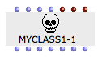
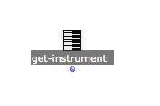
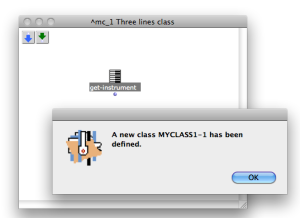
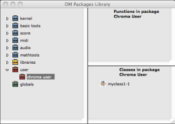
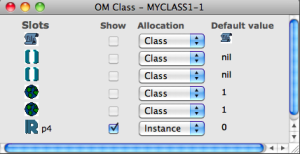
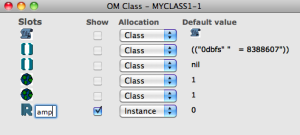
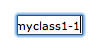
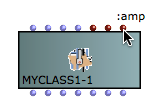
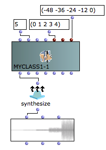
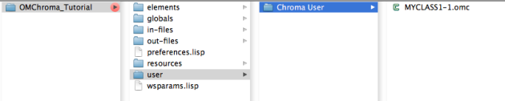

Navigation : [Previous](Creating_a_new_Class "page
précédente\(Creating a new Class\)") | [page
suivante](02-Initialize_GEN_slots "Next\(Initialize GEN
slots\)")
## Tutorial MyClass_01 Three lines class

Csound Orchestra

To start we will use the following Csound orchestra.

instr 1

|

Starts an instrument block.  
  
---|---  
  
iamp = (p4 > 0.0 ? (p4*0.001*0dbfs) : (ampdbfs (p4)))

|

The variable p4 sets the amplitude. Linear values from 0 to 1000 or in dB from
0 to negative values  
  
asig rand iamp

|

The opcode "rand" generates a controlled random number at audio rate with
amplitude +/- "iamp" then writes the output to the audio variable "asig"  
  
out asig

|

The opcode "out" writes the audio data to an external device or stream.  
  
endin

|

Ends the current instrument block  
  
This orchestra is a white noise generator, with only the amplitude control
(p4).

To prepare the orchestra file (which is a text file with extension .orc) an
header is required, and it will have the following parameters.

sr = 96000

|

Sample rate = 96000  
  
---|---  
  
kr = 96000

|

Control rate = 96000  
  
ksmps = 1

|

sr/kr = 1  
  
nchnls = 1

|

number of channels of audio outfut  
  
0dbfs = 8388607

|

Sets the value of 0 decibels using full scale amplitude with 24 bit depth  
  
## Make your OMChroma class

Copy the complete following instructions in a text file and save it
as"myclass1.orc".

sr = 96000

kr = 96000

ksmps = 1

nchnls = 1

0dbfs = 8388607

instr 1

iamp = (p4 > 0.0 ? (p4*0.001*0dbfs) : (ampdbfs (p4)))

asig rand iamp

out asig

endin

Dead box

|

You will find a dead box everytime you open a patch within a class which
doesn't attend in any subfolder of your running workspace. Now don't worry
about it and go forward with the tutorial.  
  
---|---  
  

|

  * Select the function get-instrument,
  * Validate it,
  * Choose "myclass1.orc" in the choose file window,

  
  
---|---  
  

|

A window with "a new MYCLASS1- 1 has been defined" will pop up.

  * Press on "OK",

  
  
---|---  
  

|

  * Open the Library window,
  * Open the "user" folder,
  * Select the "chroma user" folder and type "return",

The "Classes in package Chroma User" will appear with the "myclass1-1" class
inside.

  * Double click on "myclass1-1" to show the OM Class window,

  
  
---|---  
  

|

  * Control how many P-field there are. Iin this class there is only one, so you have to see only p4,

  
  
---|---  
  
Reminder

The meaning of the first three P-fields is reserved. They specific the
instrument number, the start-time and the duration.

i-statement

|

p1

|

p2

|

p3  
  
---|---|---|---  
  
i

|

instrument #

|

start-time

|

duration  
  

|

  * Substitute the name of the slot "p4" with amp (or with what you wish),
  * Set up the default value of the slot "p4" as you wish
  * Close the OM Class window,

  
  
---|---  
  

|

  * Insert as usual the OMChroma class typing in the patch "myclass1-1",

  
  
---|---  
  

|

  * The new "myclass1-1" is ready to use,

  
  
---|---  
  

|

  * Add the objects "synthesize" and "sound",
  * Patch all together as usual,
  * Validate the class "sound",
  * Hear the audio file.

Watch out at the loudspeakers' volume.  
  
---|---  
  
Reminder

Anyway the final result (all the audio file) will be will rescale to your
audio setting (see the Normalize Output Level in "Preferences/Audio"). For
more details about the amplitude managing see [Tutorial GS_02 Amplitude and
Internal Editor](03-Amplitude_and_internal_editor)

Warning

All the elements of the workspace are saved inside the main folder. The user
classes are saved in the path "Main folder/user/Chroma User". So the new class
belongs only to the workspace where it is created. To use it in another
workspace you have to copy the .omc file inside the Chroma User at the same
place inside the other workspace.

References :

Plan :

  * [OMChroma User Manual](OMChroma)
  * [System Configuration and Installation](Installation)
  * [Getting started](Getting_Started)
  * [Managing GEN function and sound files](Managing_GEN_function_and_sound_files)
  * [Predefined Classes](Predefined_classes)
  * [User-fun](User-fun)
  * [Creating a new Class](Creating_a_new_Class)
    * Three lines class
    * [Initialize GEN slots](02-Initialize_GEN_slots)
    * [Orchestra with many instruments](03-Orchestra_with_many_instruments)
  * [Multichannel processing](06-Multichannel_processing)
  * [Appendix A - Common Red Patches](A-Appendix-A_Common_red_patches)

Navigation : [Previous](Creating_a_new_Class "page
précédente\(Creating a new Class\)") | [page
suivante](02-Initialize_GEN_slots "Next\(Initialize GEN
slots\)")
