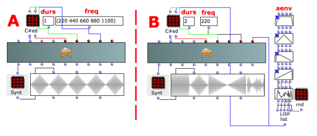
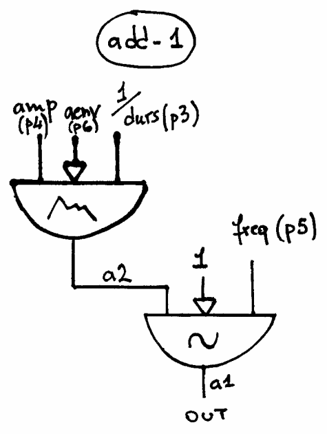

Navigation : [Previous](01-Additive_Synthesis "page
précédente\(Additive Synthesis\)") | [Next](02-add-2 "page
suivante\(Additive Synthesys with ADD-2\)")
## Tutorial ADD-1

Specific Slots

Name

|

Description

|

Default value  
  
---|---|---  
  
amp

|

Maximum Amplitude. Linear from >0.0 to 1000 or in dB from 0 to -∞ (see
[Tutorial Getting Started 02 - Amplitude and Internal
Editor](03-Amplitude_and_internal_editor) for more details)

|

-6.0  
  
freq

|

(Minimum) current frequency [Hz]

|

440.0  
  
aenv

|

Amplitude Envelope [GEN]

|

Instance: GEN07  
  
Class description

The ADD-1 Class realizes an Additive Synthesis with the following controls:

  * The main amplitude,
  * The oscillator's frequency,
  * The amplitude envelope by means of a GEN routine.

Patch description

The example A focuses on the  frequency's values.

The example B deals with the amplitude envelopes made by 5 different
[BPF](http://support-old.ircam.fr/forum-ol-doc/om/om6-manual/co/Edition
"http://support-old.ircam.fr/forum-ol-doc/om/om6-manual/co/Edition
\(nouvelle fenêtre\)") (Break Point Function).

Common Red Patches

For the red patches [Synt,](Synt)
[C#ed](Component_number_and_entry_delay) and
[rnd](Random_BPF) see
[Appendix-A](A-Appendix-A_Common_red_patches).

## Inside the Class

Csound Orchestra of the ADD-1 Class.

instr 1

idur = p3

idurosc = 1/idur

iamp = (p4 > 0.0 ? (p4*0.001*0dbfs) : (ampdbfs (p4)))

ifq = p5

iaenv = p6

iaudiofun = 1

a2 poscil iamp, idurosc, iaenv

a1 poscil a2, ifq, iaudiofun

out a1

endin

Flow chart

References :

Plan :

  * [OMChroma User Manual](OMChroma)
  * [System Configuration and Installation](Installation)
  * [Getting started](Getting_Started)
  * [Managing GEN function and sound files](Managing_GEN_function_and_sound_files)
  * [Predefined Classes](Predefined_classes)
    * [Additive Synthesis](01-Additive_Synthesis)
      * Additive Synthesys with ADD-1
      * [Additive Synthesys with ADD-2](02-add-2)
      * [Additive Synthesys with ADD-3](03-add-3)
      * [Additive Synthesys with ADD-A1](04-add-A1)
    * [Buzz Synthesis](02-Buzz_Synthesis)
    * [Frequency Modulation Synthesis](03-Frequency_modulation)
    * [Formant Wave-Function Synthesis (FOF)](04_Formant_Wave_Function_\(FOF\))
    * [Granular Formant Wave Function (FOG)](05-Granular_Formant_Wave_Function_\(FOG\))
    * [Karplus-Strong](06-Karplus-Strong)
    * [Random Amplitude Modulation](07-Random_Amplitude_Modulation)
    * [Sampler](08-Sampler)
    * [Subtractive Synthesis](09-Subtractive_Synthesis)
    * [Wave Shaping Synthesis](10-Waveshaping)
    * [Hybrid Models](11-Hybrid_Models)
  * [User-fun](User-fun)
  * [Creating a new Class](Creating_a_new_Class)
  * [Multichannel processing](06-Multichannel_processing)
  * [Appendix A - Common Red Patches](A-Appendix-A_Common_red_patches)

Navigation : [Previous](01-Additive_Synthesis "page
précédente\(Additive Synthesis\)") | [Next](02-add-2 "page
suivante\(Additive Synthesys with ADD-2\)")
