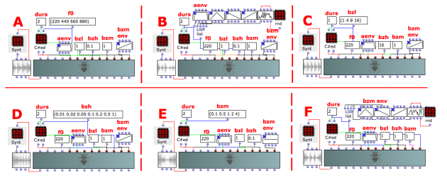
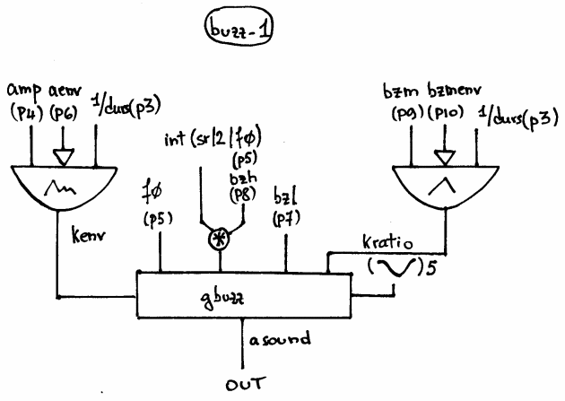

Navigation : [Previous](02-Buzz_Synthesis "page précédente\(Buzz
Synthesis\)") | [Next](02-buzz-2 "Next\(Buzz Synthesis
with BUZZ-2\)")
## Tutorial BUZZ-1

Specific Slots

Name

|

Description

|

Default value  
  
---|---|---  
  
amp

|

Maximum Amplitude. Linear from >0.0 to 1000 or in dB from 0 to -∞ (see
[Tutorial Getting Started 02 - Amplitude and Internal
Editor](03-Amplitude_and_internal_editor) for more details)

|

-6.0  
  
f0

|

Generating frequency [Hz]

|

220.0  
  
aenv

|

Amplitude Envelope [GEN]

|

Instance: GEN07  
  
bzl

|

Lowest harmonic present in the buzz [int]

|

1  
  
bzh

|

Highest harmonic present in the buzz [% of sr/2/f0. From 0.0 to 1.0]

|

1.0  
  
bzm

|

Multiplier in the series of amplitude coefficients [flt]

|

0.95  
  
bzmenv

|

Envelope of the buzz multiplier [GEN]

|

Instance: GEN07  
  
Class description

The BUZZ-1 Class realizes a Buzz Synthesis (a set of harmonically related
cosine partials) with the following controls:

  * The main amplitude,
  * The generating frequency,
  * The amplitude envelope by means of a GEN routine,
  * The lowest and the highest harmonic of the spectrum,
  * The components' amplitude of the spectrum,
  * The components' amplitude envelope by means of a GEN routine.

Patch description

The example A focuses on the  values of the generating frequencies.

The example B deals with the amplitude envelopes made by 5 different
[BPF](http://support-old.ircam.fr/forum-ol-doc/om/om6-manual/co/Edition
"http://support-old.ircam.fr/forum-ol-doc/om/om6-manual/co/Edition
\(nouvelle fenêtre\)") (Break Point Function).

The example C fixes on the lowest component of the spectrum. This integer is
the lowest harmonic's number.

The example D fixes on the highest component of the spectrum. This floating
represents the percentage of the possible components (1 = 100%). The highest
frequency is the the generating frequency multiplied by rounding the half of
the sample rate divided by the generating frequency. E.g. Generating frequency
= 440 Sample Rate = 48000 -> 24000/440= 54.5454... -> 440*54=23.760 Hz.

The example E demonstrates the meaning of the multiplier in the series of
amplitude coefficients.

The example F collects 5 different envelopes of the buzz multiplier.

Common Red Patches

For the red patches [Synt,](Synt)
[C#ed](Component_number_and_entry_delay) and
[rnd](Random_BPF) see
[Appendix-A](A-Appendix-A_Common_red_patches).

## Inside the Class

Csound Orchestra of the BUZZ-1 Class.

instr 1

idur = p3

idurosc = 1/p3

iamp = (p4 > 0.0 ? (p4*0.001*0dbfs) : (ampdbfs (p4)))

ifq = p5

iaenv = p6

inn = sr/2/ifq ; total possible number of harmonics present

inn = int (inn * p8) ; % of possible total

ilh = p7 ; lowest harmonic present

ifn = 5 ; stored cosine function

ibzmul = p9 ; multiplier

ibzmenv = p10 ; envelope for the multiplier

kenv poscil iamp, idurosc, iaenv ; amp envelope

kratio poscil ibzmul, idurosc, ibzmenv ; kratio envelope

asound gbuzz kenv,ifq,inn,ilh,kratio,ifn

out asound

endin

References :

Plan :

  * [OMChroma User Manual](OMChroma)
  * [System Configuration and Installation](Installation)
  * [Getting started](Getting_Started)
  * [Managing GEN function and sound files](Managing_GEN_function_and_sound_files)
  * [Predefined Classes](Predefined_classes)
    * [Additive Synthesis](01-Additive_Synthesis)
    * [Buzz Synthesis](02-Buzz_Synthesis)
      * Buzz Synthesis with BUZZ-1
      * [Buzz Synthesis with BUZZ-2](02-buzz-2)
      * [Buzz Synthesis with BUZFL-1](03-buzfl-1)
    * [Frequency Modulation Synthesis](03-Frequency_modulation)
    * [Formant Wave-Function Synthesis (FOF)](04_Formant_Wave_Function_\(FOF\))
    * [Granular Formant Wave Function (FOG)](05-Granular_Formant_Wave_Function_\(FOG\))
    * [Karplus-Strong](06-Karplus-Strong)
    * [Random Amplitude Modulation](07-Random_Amplitude_Modulation)
    * [Sampler](08-Sampler)
    * [Subtractive Synthesis](09-Subtractive_Synthesis)
    * [Wave Shaping Synthesis](10-Waveshaping)
    * [Hybrid Models](11-Hybrid_Models)
  * [User-fun](User-fun)
  * [Creating a new Class](Creating_a_new_Class)
  * [Multichannel processing](06-Multichannel_processing)
  * [Appendix A - Common Red Patches](A-Appendix-A_Common_red_patches)

Navigation : [Previous](02-Buzz_Synthesis "page précédente\(Buzz
Synthesis\)") | [Next](02-buzz-2 "Next\(Buzz Synthesis
with BUZZ-2\)")
