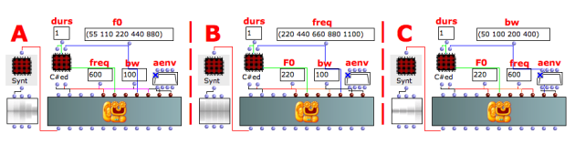
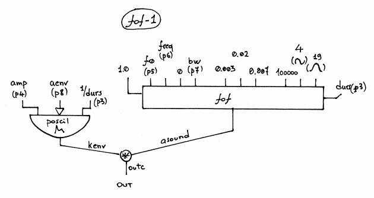

Navigation : [Previous](04_Formant_Wave_Function_\(FOF\)
"page précédente\(Formant Wave-Function Synthesis \(FOF\)\)") | [page
suivante](02-fof-2 "Next\(Formant Wave-Function Synthesis with
FOF-2\)")
# Formant Wave-Function Synthesis with FOF-1

## Tutorial FOF-1

Specific Slots

Name

|

Description

|

Default value  
  
---|---|---  
  
amp

|

Maximum Amplitude. Linear from >0.0 to 1000 or in dB from 0 to -∞ (see
[Tutorial Getting Started 02 - Amplitude and Internal
Editor](03-Amplitude_and_internal_editor) for more details)

|

-6.0  
  
f0

|

Frequency of the impulses that create the sinebursts [Hz]

|

220.0  
  
freq

|

Formant frequency [Hz]

|

609  
  
bw

|

Formant bandwidth at -6dB [Hz]

|

77  
  
aenv

|

Amplitude Envelope [GEN]

|

Instance: GEN07  
  
Class description

The FOF-1 Class realizes a Formant Wave-Function Synthesis with the following
controls:

  * The main amplitude,
  * The fundamental frequency,
  * The formant frequency,
  * The bandwidth of the formant,
  * The amplitude envelope by means of a GEN routine.

Patch description

The example A focuses on the  values of the fundamental frequencies.

The example B deals with frequency of the formant.

The example C spreads the bandwidth of the formant from 50 to 400 Hz.

Common Red Patches

For the red patch [C#ed](Component_number_and_entry_delay) and
[Synt](Synt) see [ Appendix
A](A-Appendix-A_Common_red_patches)

## Inside the Class

Csound Orchestra of the FOF-1 Class.

instr 1

idur = p3

idurosc = 1/p3

iamp = (p4 > 0.0 ? (p4*0.001*0dbfs) : (ampdbfs (p4)))

if0 = p5

ifreq = p6

ibw = p7

iaenv = p8

iolaps = 100000 ; how many simultaneous FOFs can be played (takes little
memory if not used)

; fixed values for vocal synthesis

iris = 0.003

idebatt = 0.02

iatten = 0.007

iafun = 4

isigfun = 19

kenv poscil iamp, idurosc, iaenv

asound fof 1.0, if0, ifreq, 0, ibw, iris, idebatt, iatten, iolaps, iafun,
isigfun, idur

outc asound*kenv

endin

Flow chart

References :

Plan :

  * [OMChroma User Manual](OMChroma)
  * [System Configuration and Installation](Installation)
  * [Getting started](Getting_Started)
  * [Managing GEN function and sound files](Managing_GEN_function_and_sound_files)
  * [Predefined Classes](Predefined_classes)
    * [Additive Synthesis](01-Additive_Synthesis)
    * [Buzz Synthesis](02-Buzz_Synthesis)
    * [Frequency Modulation Synthesis](03-Frequency_modulation)
    * [Formant Wave-Function Synthesis (FOF)](04_Formant_Wave_Function_\(FOF\))
      * Formant Wave-Function Synthesis with FOF-1
      * [Formant Wave-Function Synthesis with FOF-2](02-fof-2)
      * [Formant Wave-Function Synthesis with FOF-3](03_fof-3)
      * [Formant Wave-Function Synthesis with FOF-4](04-fof-4)
      * [Formant Wave-Function Synthesis with FOF-A1](05-fof-a1)
      * [Formant Wave-Function Synthesis with FOF-A4](06-fof-a4)
    * [Granular Formant Wave Function (FOG)](05-Granular_Formant_Wave_Function_\(FOG\))
    * [Karplus-Strong](06-Karplus-Strong)
    * [Random Amplitude Modulation](07-Random_Amplitude_Modulation)
    * [Sampler](08-Sampler)
    * [Subtractive Synthesis](09-Subtractive_Synthesis)
    * [Wave Shaping Synthesis](10-Waveshaping)
    * [Hybrid Models](11-Hybrid_Models)
  * [User-fun](User-fun)
  * [Creating a new Class](Creating_a_new_Class)
  * [Multichannel processing](06-Multichannel_processing)
  * [Appendix A - Common Red Patches](A-Appendix-A_Common_red_patches)

Navigation : [Previous](04_Formant_Wave_Function_\(FOF\)
"page précédente\(Formant Wave-Function Synthesis \(FOF\)\)") | [page
suivante](02-fof-2 "Next\(Formant Wave-Function Synthesis with
FOF-2\)")
