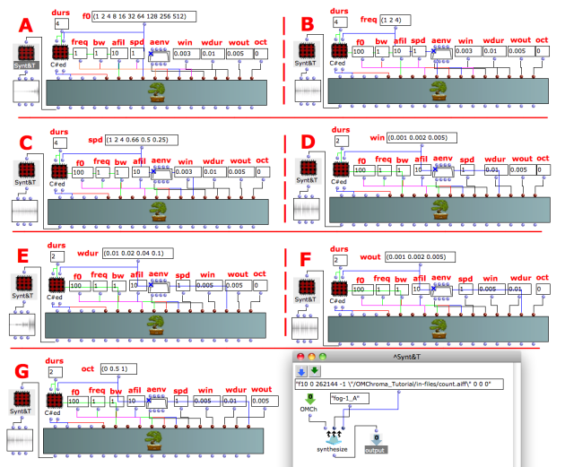
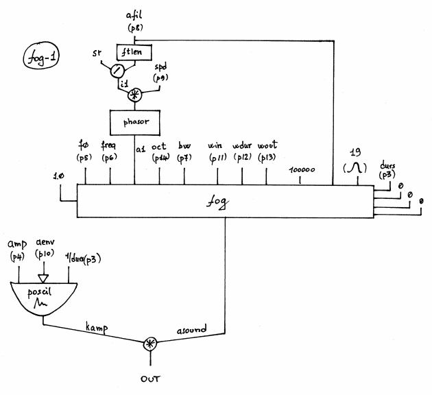

Navigation : [page
precedente](05-Granular_Formant_Wave_Function_\(FOG\) "page
précédente\(Granular Formant Wave Function \(FOG\)\)") | [page
suivante](06-Karplus-Strong "Next\(Karplus-Strong\)")
# Granular Synthesis with FOG-1

## Tutorial FOG-1

Specific Slots

Name

|

Description

|

Default value  
  
---|---|---  
  
amp

|

Maximum Amplitude. Linear from >0.0 to 1000 or in dB from 0 to -∞ (see
[Tutorial Getting Started 02 - Amplitude and Internal
Editor](03-Amplitude_and_internal_editor) for more details)

|

-6.0  
  
f0

|

Density of the grain

|

100  
  
freq

|

Transposition factor (1=same as original)

|

1  
  
bw

|

Bandwidth at -6dB [Hz or % of centre freq]

|

0  
  
afil

|

Audio file [name, with possible path, sound, string, pathname or GEN01]

|

31  
  
spd

|

speed [mlt, 1=same as original]

|

1  
  
aenv

|

Amplitude Envelope [GEN]

|

Instance: GEN07  
  
win

|

Rise time of the local attack (FOF/grain) [sec]

|

0.01  
  
wdur

|

Total duration of the FOF/grain [sec]

|

0.1  
  
wout

|

Decay time of the local decay (FOF/grain) [sec]

|

0.05  
  
oct

|

Octaviation factor of the fof [flt >=0.0]

|

0.0  
  
Class description

The FOG-1 Class realizes a Granular Synthesis with the following controls:

  * The main amplitude,
  * The density of the grain,
  * The audio file transposition factor,
  * The band width,
  * The speed or rate at which successive grains progress through the stored function table,
  * The amplitude envelope by means of a GEN routine,
  * The attack, duration and decay of the grain,
  * The octaviation factor.

Patch description

The example A focuses on the density of the grains.

The example B deals with the transposition factor.

The example C spreads the rate at which successive grains progress through the
stored function table from 0.25 to 4 [1=same speed as original].

The example D focuses on the rise time of the FOF window,

The example E focuses on the duration of the FOF window,

The example F focuses on the decay time of the FOF window,

The example G fixes on the octaviation factor.

Common Red Patches

For the red patch [C#ed](Component_number_and_entry_delay) see [
Appendix A](A-Appendix-A_Common_red_patches)

### Inside the Class

Csound Orchestra of the FOG-1 Class.

instr 1

idur = p3

idurosc = 1/p3

iamp = (p4 > 0.0 ? (p4*0.001*0dbfs) : (ampdbfs (p4)))

idens = p5

ixpf = p6

iband = p7

iafil = p8

iskip = p9

iaenv = p10

iwin = p11

iwdur = p12

iwout = p13

ioct = p14

imode = 0

iolaps = 100000

isigfun = 19

iphs = 0

iinit = 0

; amplitude envelope

amp poscil iamp, idurosc, iaenv

i1 = sr/ftlen(iafil) ;scaling to reflect sample rate and table length

a1 phasor i1*iskip ;index for speed

; aspd,

; xamp, xdens, xtrans, koct, kband, kris, kdur, kdec, iolaps, ifna,

asound fog 1.0, idens, ixpf, a1, ioct, iband, iwin, iwdur, iwout, iolaps,
iafil, isigfun, idur, iphs, imode, iinit

; ifnb, itotdur

outc asound*amp

endin

Flow chart

References :

Plan :

  * [OMChroma User Manual](OMChroma)
  * [System Configuration and Installation](Installation)
  * [Getting started](Getting_Started)
  * [Managing GEN function and sound files](Managing_GEN_function_and_sound_files)
  * [Predefined Classes](Predefined_classes)
    * [Additive Synthesis](01-Additive_Synthesis)
    * [Buzz Synthesis](02-Buzz_Synthesis)
    * [Frequency Modulation Synthesis](03-Frequency_modulation)
    * [Formant Wave-Function Synthesis (FOF)](04_Formant_Wave_Function_\(FOF\))
    * [Granular Formant Wave Function (FOG)](05-Granular_Formant_Wave_Function_\(FOG\))
      * Granular Synthesis with FOG-1
    * [Karplus-Strong](06-Karplus-Strong)
    * [Random Amplitude Modulation](07-Random_Amplitude_Modulation)
    * [Sampler](08-Sampler)
    * [Subtractive Synthesis](09-Subtractive_Synthesis)
    * [Wave Shaping Synthesis](10-Waveshaping)
    * [Hybrid Models](11-Hybrid_Models)
  * [User-fun](User-fun)
  * [Creating a new Class](Creating_a_new_Class)
  * [Multichannel processing](06-Multichannel_processing)
  * [Appendix A - Common Red Patches](A-Appendix-A_Common_red_patches)

Navigation : [page
precedente](05-Granular_Formant_Wave_Function_\(FOG\) "page
précédente\(Granular Formant Wave Function \(FOG\)\)") | [page
suivante](06-Karplus-Strong "Next\(Karplus-Strong\)")
