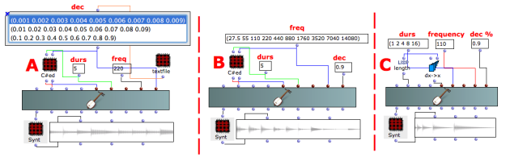
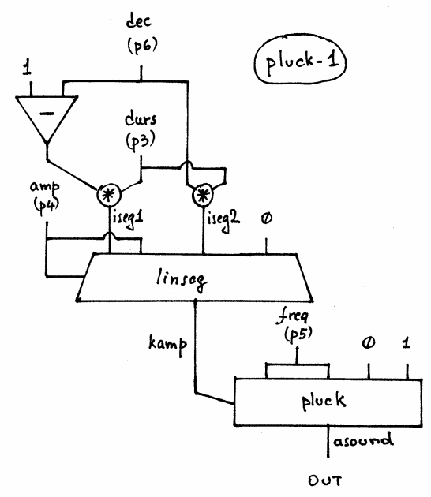

Navigation : [Previous](06-Karplus-Strong "page
précédente\(Karplus-Strong\)") | [Next](02-pluck-2 "page
suivante\(Karplus-Strong Synthesys with PLUCK-2\)")
## Tutorial PLUCK-1

Specific Slots

Name

|

Description

|

Default value  
  
---|---|---  
  
amp

|

Maximum Amplitude. Linear from >0.0 to 1000 or in dB from 0 to -∞ (see
[Tutorial Getting Started 02 - Amplitude and Internal
Editor](03-Amplitude_and_internal_editor) for more details)

|

-6.0  
  
freq

|

(Minimum) fundamental frequency [Hz]

|

440.0  
  
dec

|

Decay time % of the total duration of the amplitude envelope [%]

|

0.8  
  
Class description

The PLUCK-1 Class realizes a Karplus-Strong Synthesys (naturally decaying
plucked string or drum sound) with the following controls:

  * The main amplitude,
  * The fundamental frequency,
  * The decay time of the total duration of the amplitude envelope.

Patch description

The example A collects a list of decay's values (remember they are given in
percentage 1=100%).

The example B focuses on the frequency of the fundamental.

The example C allows us to understand the relationship between the duration
and the decay time.

Common Red Patches

For the red patch [C#ed](Component_number_and_entry_delay) and
[Synt](Synt) see [ Appendix
A](A-Appendix-A_Common_red_patches)

## Inside the Class

Csound Orchestra of the PLUCK-1 Class.

instr 1

idur = p3

iamp = (p4 > 0.0 ? (p4*0.001*0dbfs) : (ampdbfs (p4)))

ifq = p5 ; frequency

ibuf = ifq ; buffer size = frequency

idec = p6 ; percentage [0-1] of idur for the last decay ; affect the nature of
damping

iranfun = 0 ; random noise

imeth = 1 ; simple averaging

iseg1 = (1-idec)*idur

iseg2 = idec*idur

kamp linseg iamp,iseg1,iamp,iseg2,0

asound pluck kamp, ifq, ibuf, iranfun, imeth

out asound

endin

Flow chart

References :

Plan :

  * [OMChroma User Manual](OMChroma)
  * [System Configuration and Installation](Installation)
  * [Getting started](Getting_Started)
  * [Managing GEN function and sound files](Managing_GEN_function_and_sound_files)
  * [Predefined Classes](Predefined_classes)
    * [Additive Synthesis](01-Additive_Synthesis)
    * [Buzz Synthesis](02-Buzz_Synthesis)
    * [Frequency Modulation Synthesis](03-Frequency_modulation)
    * [Formant Wave-Function Synthesis (FOF)](04_Formant_Wave_Function_\(FOF\))
    * [Granular Formant Wave Function (FOG)](05-Granular_Formant_Wave_Function_\(FOG\))
    * [Karplus-Strong](06-Karplus-Strong)
      * Karplus-Strong Synthesys with PLUCK-1
      * [Karplus-Strong Synthesys with PLUCK-2](02-pluck-2)
    * [Random Amplitude Modulation](07-Random_Amplitude_Modulation)
    * [Sampler](08-Sampler)
    * [Subtractive Synthesis](09-Subtractive_Synthesis)
    * [Wave Shaping Synthesis](10-Waveshaping)
    * [Hybrid Models](11-Hybrid_Models)
  * [User-fun](User-fun)
  * [Creating a new Class](Creating_a_new_Class)
  * [Multichannel processing](06-Multichannel_processing)
  * [Appendix A - Common Red Patches](A-Appendix-A_Common_red_patches)

Navigation : [Previous](06-Karplus-Strong "page
précédente\(Karplus-Strong\)") | [Next](02-pluck-2 "page
suivante\(Karplus-Strong Synthesys with PLUCK-2\)")
