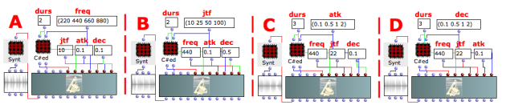
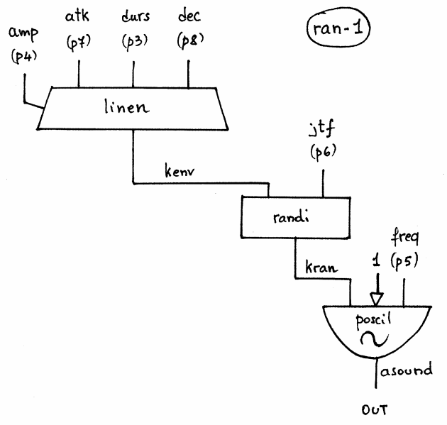

Navigation : [Previous](07-Random_Amplitude_Modulation "page
précédente\(Random Amplitude Modulation\)") | [Next](02-ranfl-1
"Next\(Random Amplitude Modulation Synthesys with RANFL-1\)")

## Tutorial RAN-1

Specific Slots

Name

|

Description

|

Default value  
  
---|---|---  
  
amp

|

Maximum Amplitude. Linear from >0.0 to 1000 or in dB from 0 to -∞ (see
[Tutorial Getting Started 02 - Amplitude and Internal
Editor](03-Amplitude_and_internal_editor) for more details)

|

-6.0  
  
freq

|

(Minimum) fundamental frequency of the oscillator [Hz]

|

440.0  
  
jtf

|

Frequency of the Random Amplitude Modulation [Hz]

|

50.0  
  
atk

|

Attack time of the amplitude envelope [sec]

|

0.2  
  
dec

|

Decay time/% of the total duration of the amplitude envelope [sec]

|

0.3  
  
Class description

The RAN-1 Class realizes a Random Amplitude Modulation of an Additive
Synthesys with the following controls:

  * The main amplitude,
  * The fundamental frequency of the oscillator,
  * Frequency of the Random Amplitude Modulation,
  * The attack time of the amplitude envelope,
  * The decay time of the amplitude envelope.

Patch description

The example A focuses on the frequency of the fundamental.

The example B deals with the frequency of the Random Amplitude Modulation.

The example C collects 4 different attack times of the amplitude envelope.

The example D collects 4 different decay times of the amplitude envelope.

Common Red Patches

For the red patch [C#ed](Component_number_and_entry_delay) and
[Synt](Synt) see [ Appendix
A](A-Appendix-A_Common_red_patches)

## Inside the Class

Csound Orchestra of the RAN-1 Class.

instr 1

idur = p3

iamp = (p4 > 0.0 ? (p4*0.001*0dbfs) : (ampdbfs (p4)))

ifq = p5

iran_fq = p6

imindec = 0.01 ; minimum allowed decay

iatk = p7

idec = p8

idec = (((iatk+idec)>idur) ? idur-iatk : idec)

if idec > imindec goto goon

; very short duration

iatk = idur/2

idec = idur/2

goon:

iaudiofun = 1

kenv linen iamp, iatk, idur, idec ; envelope

kran randi kenv, iran_fq ; random numbers

asound poscil kran, ifq, iaudiofun ; applied to amplitude slot

out asound

endin

References :

Plan :

  * [OMChroma User Manual](OMChroma)
  * [System Configuration and Installation](Installation)
  * [Getting started](Getting_Started)
  * [Managing GEN function and sound files](Managing_GEN_function_and_sound_files)
  * [Predefined Classes](Predefined_classes)
    * [Additive Synthesis](01-Additive_Synthesis)
    * [Buzz Synthesis](02-Buzz_Synthesis)
    * [Frequency Modulation Synthesis](03-Frequency_modulation)
    * [Formant Wave-Function Synthesis (FOF)](04_Formant_Wave_Function_\(FOF\))
    * [Granular Formant Wave Function (FOG)](05-Granular_Formant_Wave_Function_\(FOG\))
    * [Karplus-Strong](06-Karplus-Strong)
    * [Random Amplitude Modulation](07-Random_Amplitude_Modulation)
      * Random Amplitude Modulation Synthesys with RAN-1
      * [Random Amplitude Modulation Synthesys with RANFL-1](02-ranfl-1)
    * [Sampler](08-Sampler)
    * [Subtractive Synthesis](09-Subtractive_Synthesis)
    * [Wave Shaping Synthesis](10-Waveshaping)
    * [Hybrid Models](11-Hybrid_Models)
  * [User-fun](User-fun)
  * [Creating a new Class](Creating_a_new_Class)
  * [Multichannel processing](06-Multichannel_processing)
  * [Appendix A - Common Red Patches](A-Appendix-A_Common_red_patches)

Navigation : [Previous](07-Random_Amplitude_Modulation "page
précédente\(Random Amplitude Modulation\)") | [Next](02-ranfl-1
"Next\(Random Amplitude Modulation Synthesys with RANFL-1\)")
