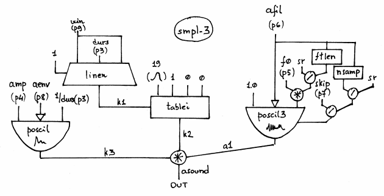

Navigation : [Previous](02-Using_a_deferred_tables "page
précédente\(Using a deferred table\)") | [Next](02-smpl-4 "page
suivante\(Using a deferred table with SMPL-4\)")

## Tutorial SMPL-3

Specific Slots

Name

|

Description

|

Default value  
  
---|---|---  
  
amp

|

Maximum Amplitude. Linear from >0.0 to 1000 or in dB from 0 to -∞ (see
[Tutorial Getting Started 02 - Amplitude and Internal
Editor](03-Amplitude_and_internal_editor) for more details)

|

0.0  
  
f0

|

Transpose the pitch of input sound by this factor (e.g. 0.5 means one octave
lower, 2 is one octave higher, and 1 is the original pitch). Fractional and
negative values are allowed (the latter results in playing the file backwards)

|

1.0  
  
afil

|

Audio file [name, with possible path, sound, string, pathname or GEN01]

|

31  
  
skip

|

(Minimum) starting point when reading an audio file [sec]

|

0.0  
  
aenv

|

Amplitude Envelope [GEN]

|

Instance: GEN07  
  
win

|

Attack and decay time in [sec]

|

0.01  
  
Class description

The SMPL-3 Class is a Sampler with the following controls:

  * The main ampllitude,
  * The transposition factor,
  * The starting point of the audio file,
  * The amplitude envelope by means of a GEN routine,
  * The attack and decay time of the total duration of the amplitude envelope.

Patch description

The examples shows two ways how to pass the deferred table(s) to the class.

The example A shows the correct syntax of the directing assignment of a GEN01
function to the tables keyword "tables"

The examples B uses the GEN01 Class directing connected to the afil input slot

Reminder

The meaning of the other slots is the same as the SMPL-1 Class. So see the
[Tutorial SMPL-1](01-smpl-1) for more details.

Reading or charging the soundfile

The SAMPL-1, SAMPL-2, SAMPL-A1 and SAMPL-A2 read every time the soundfile from
the hard disk, i.e. it will be an access to the hard disk for all the
i-statements (or events) even though the soundfile is always the same.The
SAMPL-3 and SAMPL-4 use the GEN01 subroutine which transfers data from a
soundfile into a function table, i.e. the audiophile is charged only once on
the RAM.So for better computational performance is better to use the GEN01
routine if there are few soundfile.

Common Red Patches

For the red patch 
[Synt](Synt) see [ Appendix
A](A-Appendix-A_Common_red_patches)

## Inside the Class

Csound Orchestra of the SMPL-3 Class.

instr 1

idur = p3

idurosc = 1/idur

iamp = (p4 > 0.0 ? (p4*0.001*0dbfs) : (ampdbfs (p4)))

iamp = iamp/0dbfs ; since sfile is not normalized, reduce amp between 0 and 1

ifile = p6 ; must be a GEN01, non normalized

ixpf = p5*(sr/ftlen(ifile)) ; to match the SI of the table with transposition

iskip = p7 ; in secs

ifilesize = nsamp(ifile) ; size of the sound file (samples)

ifiledur = ifilesize/sr ; duration of the sound file

iphs = iskip/ifiledur ; convert iskip to phase (0-1)

iaenv = p8 ; global amplitude envelope

ixin = (p9 > idur/2 ? idur/2 : p9) ; local envelope

ixout = ixin

ixmode = 1 ; index between 0 and 1

ixoff = 0 ; index offset

iwrap = 0 ; do not wrap around if the end of the table is reached

isigfun = 19 ; sigmoid function

; local envelope (for the grain)

k1 linen 1,ixin,idur,ixout

k2 tablei k1,isigfun,ixmode,ixoff,iwrap

; global envelope

k3 poscil iamp, idurosc, iaenv

; file reading

a1 poscil3 1.0, ixpf, ifile, iphs

asound = a1*k2*k3

outc asound

endin

Flow chart

References :

Plan :

  * [OMChroma User Manual](OMChroma)
  * [System Configuration and Installation](Installation)
  * [Getting started](Getting_Started)
  * [Managing GEN function and sound files](Managing_GEN_function_and_sound_files)
  * [Predefined Classes](Predefined_classes)
    * [Additive Synthesis](01-Additive_Synthesis)
    * [Buzz Synthesis](02-Buzz_Synthesis)
    * [Frequency Modulation Synthesis](03-Frequency_modulation)
    * [Formant Wave-Function Synthesis (FOF)](04_Formant_Wave_Function_\(FOF\))
    * [Granular Formant Wave Function (FOG)](05-Granular_Formant_Wave_Function_\(FOG\))
    * [Karplus-Strong](06-Karplus-Strong)
    * [Random Amplitude Modulation](07-Random_Amplitude_Modulation)
    * [Sampler](08-Sampler)
      * [Reading from a sound file](01-Reading_from_a_Sound_File)
      * [Using a deferred table](02-Using_a_deferred_tables)
        * Using a deferred table with SMPL-3
        * [Using a deferred table with SMPL-4](02-smpl-4)
      * [Crossfading Looper](03-Crossfading_Looper)
    * [Subtractive Synthesis](09-Subtractive_Synthesis)
    * [Wave Shaping Synthesis](10-Waveshaping)
    * [Hybrid Models](11-Hybrid_Models)
  * [User-fun](User-fun)
  * [Creating a new Class](Creating_a_new_Class)
  * [Multichannel processing](06-Multichannel_processing)
  * [Appendix A - Common Red Patches](A-Appendix-A_Common_red_patches)

Navigation : [Previous](02-Using_a_deferred_tables "page
précédente\(Using a deferred table\)") | [Next](02-smpl-4 "page
suivante\(Using a deferred table with SMPL-4\)")
