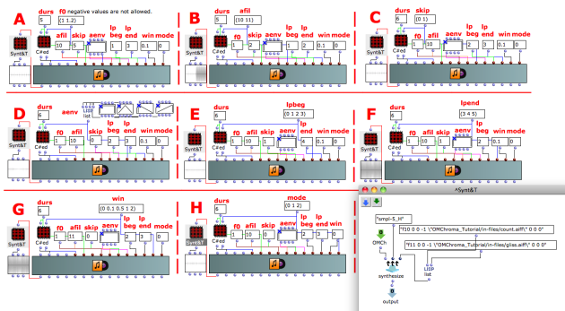
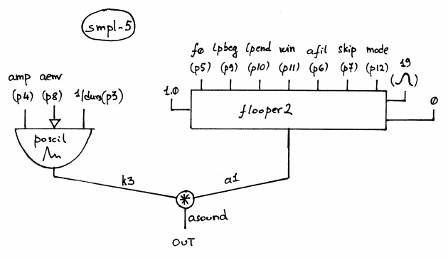

Navigation : [Previous](03-Crossfading_Looper "page
précédente\(Crossfading Looper\)") | [Next](02-smpl-6 "page
suivante\(Crossfading Looper with SMPL-6\)")

## Tutorial SMPL-5

Specific Slots

Name

|

Description

|

Default value  
  
---|---|---  
  
amp

|

Maximum Amplitude. Linear from >0.0 to 1000 or in dB from 0 to -∞ (see
[Tutorial Getting Started 02 - Amplitude and Internal
Editor](03-Amplitude_and_internal_editor) for more details)

|

0.0  
  
f0

|

Minimum value of the pitch transposition of input sound by this factor (e.g.
0.5 means one octave lower, 2 is one octave higher, and 1 is the original
pitch). Fractional values are allowed. Negative values are not.

|

2.0  
  
afil

|

Audio file [name, with possible path, sound, string, pathname or GEN01]

|

31  
  
skip

|

(Minimum) starting point when reading an audio file [sec]

|

0.5  
  
aenv

|

Amplitude Envelope [GEN]

|

Instance: GEN07  
  
lpbeg

|

Loop start point [sec]

|

0.3  
  
lpend

|

Loop end point [sec]

|

0.6  
  
win

|

Crossfade time [sec]

|

0.3  
  
mode

|

Loop modes: 0 forward, 1 backward, 2 back-and-forth

|

1  
  
Class description

The Smpl-5 Class is a Crossfading Looper with the following controls:

  * The main ampllitude,
  * The transposition factor,
  * The starting point of the audio file,
  * The amplitude envelope by means of a GEN routine,
  * The loop start and end point,
  * The crossfade time,
  * The loop mode.

Patch description

The example A displays the transposition factor.

The example B collects two different audio file.

The example C deals with the skipping times.

The example D uses four different BPF as amplitude envelope.

The examples E & F focus on the start and end point of the loop.

The example G fixes on the crossfade time.

The example H allows us to understand the three loop mode.

Common Red Patches

For the red patch [C#ed](Component_number_and_entry_delay) see [
Appendix A](A-Appendix-A_Common_red_patches)

## Inside the Class

Csound Orchestra of the SMPL-5 Class.

instr 1

idur = p3

idurosc = 1/idur

iamp = (p4 > 0.0 ? (p4*0.001*0dbfs) : (ampdbfs (p4)))

iamp = iamp/0dbfs ; since sfile is not normalized, reduce amp between 0 and 1

ixpf = p5

ifile = p6 ; must be a GEN01

iskip = p7 ; secs

iaenv = p8 ; global amplitude envelope

ilpbeg = p9

ilpend = p10

ilpxf = p11

ilpmode = p12

iskp = 0 ; do not skip initialization

isigfun = 19 ; sigmoid function

; global amplitude envelope

k3 poscil iamp, idurosc, iaenv ; file reading

;a1 lposcil 1.0, ixpf, ilpbeg, ilpend, ifile, iphs

a1 flooper2 1.0, ixpf, ilpbeg, ilpend, ilpxf, ifile, iskip, ilpmode, isigfun,
iskp

asound = a1*k3

out asound

endin

Flow chart

References :

Plan :

  * [OMChroma User Manual](OMChroma)
  * [System Configuration and Installation](Installation)
  * [Getting started](Getting_Started)
  * [Managing GEN function and sound files](Managing_GEN_function_and_sound_files)
  * [Predefined Classes](Predefined_classes)
    * [Additive Synthesis](01-Additive_Synthesis)
    * [Buzz Synthesis](02-Buzz_Synthesis)
    * [Frequency Modulation Synthesis](03-Frequency_modulation)
    * [Formant Wave-Function Synthesis (FOF)](04_Formant_Wave_Function_\(FOF\))
    * [Granular Formant Wave Function (FOG)](05-Granular_Formant_Wave_Function_\(FOG\))
    * [Karplus-Strong](06-Karplus-Strong)
    * [Random Amplitude Modulation](07-Random_Amplitude_Modulation)
    * [Sampler](08-Sampler)
      * [Reading from a sound file](01-Reading_from_a_Sound_File)
      * [Using a deferred table](02-Using_a_deferred_tables)
      * [Crossfading Looper](03-Crossfading_Looper)
        * Crossfading Looper with SMPL-5
        * [Crossfading Looper with SMPL-6](02-smpl-6)
    * [Subtractive Synthesis](09-Subtractive_Synthesis)
    * [Wave Shaping Synthesis](10-Waveshaping)
    * [Hybrid Models](11-Hybrid_Models)
  * [User-fun](User-fun)
  * [Creating a new Class](Creating_a_new_Class)
  * [Multichannel processing](06-Multichannel_processing)
  * [Appendix A - Common Red Patches](A-Appendix-A_Common_red_patches)

Navigation : [Previous](03-Crossfading_Looper "page
précédente\(Crossfading Looper\)") | [Next](02-smpl-6 "page
suivante\(Crossfading Looper with SMPL-6\)")
