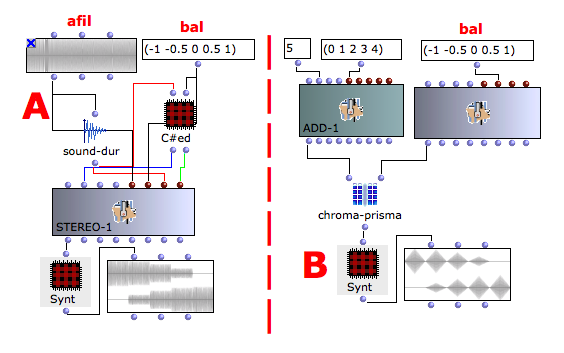

Navigation : [Previous](06-Multichannel_processing "page
précédente\(Multichannel processing\)") | [Next](02-stereo-2
"Next\(Multichannel Processing with Stereo-2\)")
## Tutorial Stereo-1

Specific Slots

Name

|

Description

|

Default value  
  
---|---|---  
  
afil

|

File name

|

nil  
  
bal

|

Panning [-1=left, 1=right, 0=center]

|

0  
  
durs

|

Duration of each line in the score [sec]

|

1  
  
e-dels

|

Entry delays [sec], time interval between the object's "action-time" and the
beginning of each line in the score.

|

0  
  
Class description

The Stereo-1 Class allows to place the audio source in a stereo output with
the following controls :

  * The position in the stereo panorama,
  * The duration of the single event,
  * The entry delay of each event.

Patch description

The example A shows how to place a mono sound file in a stereo panorama from
left to right using the class Sound directly connects to STEREO-1.

Instead of divide the processing in two parts, i.e. to render the audio file
with OMChroma and then to use it as audio file source in the OMPrisma
environment, it is also possible to merge the OMChroma Classes and the
OMPrisma Classes via the generic function Chroma-Prisma.

The example B shows how to use the generic function Chroma-Prisma to place a
mono sound file in a stereo panorama from left to right.

Reminder

The generic funtion sound-dur returns the duration in second of an audio file.

Common Red Patches

For the red patches [Synt,](Synt) and
[C#ed](Component_number_and_entry_delay) and see
[Appendix-A](A-Appendix-A_Common_red_patches).

References :

Plan :

  * [OMChroma User Manual](OMChroma)
  * [System Configuration and Installation](Installation)
  * [Getting started](Getting_Started)
  * [Managing GEN function and sound files](Managing_GEN_function_and_sound_files)
  * [Predefined Classes](Predefined_classes)
  * [User-fun](User-fun)
  * [Creating a new Class](Creating_a_new_Class)
  * [Multichannel processing](06-Multichannel_processing)
    * Multichannel Processing with Stereo-1
    * [Multichannel Processing with Stereo-2](02-stereo-2)
    * [Multichannel Processing with 4CH-1](03-4ch-1)
    * [Multichannel Processing with 4CH-2](04-4ch-2)
    * [Multichannel Processing with 5CH-1](05-5ch-1)
    * [Multichannel Processing with 6CH-1](06-6ch-1)
    * [Multichannel Processing with 8CH-1](07-8ch-1)
    * [Multichannel Processing with 12CH-1](08-12ch-1)
  * [Appendix A - Common Red Patches](A-Appendix-A_Common_red_patches)

Navigation : [Previous](06-Multichannel_processing "page
précédente\(Multichannel processing\)") | [Next](02-stereo-2
"Next\(Multichannel Processing with Stereo-2\)")
