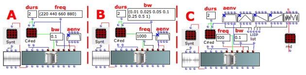
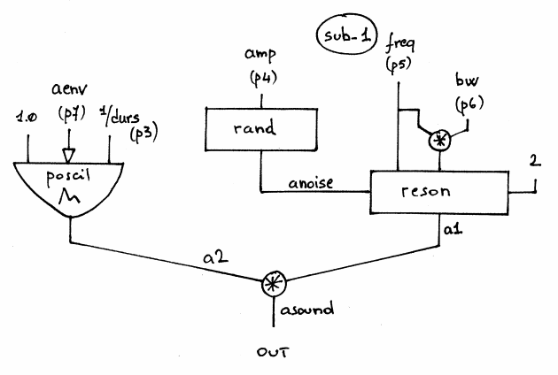

Navigation : [Previous](09-Subtractive_Synthesis "page
précédente\(Subtractive Synthesis\)") | [Next](10-Waveshaping
"Next\(Wave Shaping Synthesis\)")
## Tutorial SUB-1

Specific Slots

Name

|

Description

|

Default value  
  
---|---|---  
  
amp

|

Maximum Amplitude. Linear from >0.0 to 1000 or in dB from 0 to -∞ (see
[Tutorial Getting Started 02 - Amplitude and Internal
Editor](03-Amplitude_and_internal_editor) for more details)

|

-6.0  
  
freq

|

Maximum frequency of the noise [Hz]

|

2000.0  
  
bw

|

Bandwidth of the formant-resonant filter [%]

|

0.01  
  
aenv

|

Amplitude Envelope [GEN]

|

Instance: GEN07  
  
Class description

The SUB-1 Class realizes a Subtractive Synthesis of a white noise generator
and a resonant filter with the following controls:

  * The main amplitude,
  * The center frequency of the resonant filter,
  * The bandwidth of the resonant filter,
  * The amplitude envelope by means of a GEN routine.

Patch description

The example A deals with the center frequency of the resonant filter.

The example B spreads the bandwidth of the resonant filter from 1% to 100%

The example C collects 5 different amplitude envelopes.

## Inside the Class

Csound Orchestra of the SUB-1 Class.

instr 1

idur = p3

idurosc = 1.0/idur

iamp = (p4 > 0.0 ? (p4*0.001*0dbfs) : (ampdbfs (p4)))

icfq = p5

ibw = p6*icfq

iaenv = p7

iskip = 2

anoise rand iamp ; white noise

a1 reson anoise, icfq, ibw, iskip ; filter, iskip = 2

a2 poscil 1.0, idurosc, iaenv

asound = a1*a2

out asound

endin

References :

Plan :

  * [OMChroma User Manual](OMChroma)
  * [System Configuration and Installation](Installation)
  * [Getting started](Getting_Started)
  * [Managing GEN function and sound files](Managing_GEN_function_and_sound_files)
  * [Predefined Classes](Predefined_classes)
    * [Additive Synthesis](01-Additive_Synthesis)
    * [Buzz Synthesis](02-Buzz_Synthesis)
    * [Frequency Modulation Synthesis](03-Frequency_modulation)
    * [Formant Wave-Function Synthesis (FOF)](04_Formant_Wave_Function_\(FOF\))
    * [Granular Formant Wave Function (FOG)](05-Granular_Formant_Wave_Function_\(FOG\))
    * [Karplus-Strong](06-Karplus-Strong)
    * [Random Amplitude Modulation](07-Random_Amplitude_Modulation)
    * [Sampler](08-Sampler)
    * [Subtractive Synthesis](09-Subtractive_Synthesis)
      * Subtractive Synthesis with SUB-1
    * [Wave Shaping Synthesis](10-Waveshaping)
    * [Hybrid Models](11-Hybrid_Models)
  * [User-fun](User-fun)
  * [Creating a new Class](Creating_a_new_Class)
  * [Multichannel processing](06-Multichannel_processing)
  * [Appendix A - Common Red Patches](A-Appendix-A_Common_red_patches)

Navigation : [Previous](09-Subtractive_Synthesis "page
précédente\(Subtractive Synthesis\)") | [Next](10-Waveshaping
"Next\(Wave Shaping Synthesis\)")
