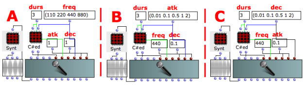
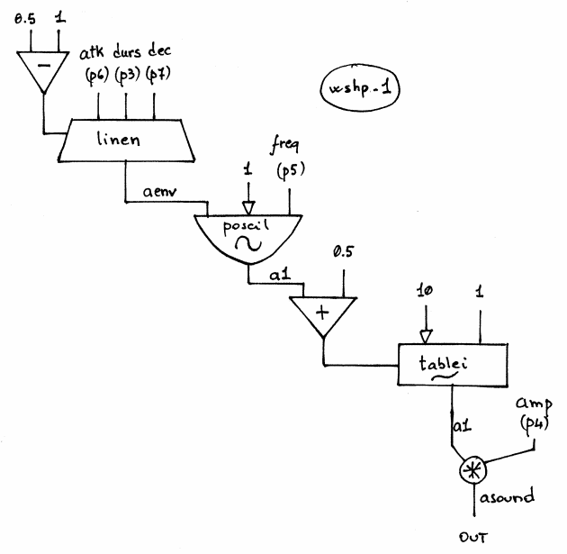

Navigation : [Previous](10-Waveshaping "page précédente\(Wave
Shaping Synthesis\)") | [Next](11-Hybrid_Models "page
suivante\(Hybrid Models\)")
## Tutorial WSHP-1

Specific Slots

Name

|

Description

|

Default value  
  
---|---|---  
  
amp

|

Maximum Amplitude. Linear from >0.0 to 1000 or in dB from 0 to -∞ (see
[Tutorial Getting Started 02 - Amplitude and Internal
Editor](03-Amplitude_and_internal_editor) for more details)

|

500.0  
  
freq

|

(Minimum) current frequency [Hz]

|

220.0  
  
atk

|

Attack time of the amplitude envelope [sec]

|

0.085  
  
dec

|

Decay time of the amplitude envelope [sec]

|

0.64  
  
Class description

The WSHP-1 Class realizes a Wave Shaping Synthesis with the following
controls:

  * The main amplitude,
  * The fundamental frequency,
  * The attack and the decay of the amplitude envelope (linear).

Patch description

The example A deals with the fundamental frequency.

The example B focuses on the attack time of the amplitude envelope.

The example C focuses on the decay time of the amplitude envelope.

Common Red Patches

For the red patch [C#ed](Component_number_and_entry_delay) and
[Synt](Synt) see [ Appendix
A](A-Appendix-A_Common_red_patches)

## Inside the Class

Csound Orchestra of the WSHP-1 Class.

instr 1

idur = p3

iamp = (p4 > 0.0 ? (p4*0.001*0dbfs) : (ampdbfs (p4)))

ifq = p5

iaudiofun = 1

itbloffset = 0.5 ; must be the half of the table size

ixmode = 1 ; index data mode normalized 0-1

ixferfun = 10

iatk = p6

idec = p7

if idur > (iatk+idec) igoto start ; correct atk and dec if too long

iatk = (((idur-iatk) > 0.01) ? iatk : (idur / 2.0))

idec = (((idur-iatk) > 0.01) ? (idur-iatk) : (idur / 2.0))

start:

aenv linen itbloffset-1, iatk, idur, idec ; envelope

a1 poscil aenv, ifq, iaudiofun ; sinus

a1 tablei a1 + itbloffset, ixferfun, ixmode ; transfer function

asound = a1 * iamp ; scale to amplitude

out asound

endin

References :

Plan :

  * [OMChroma User Manual](OMChroma)
  * [System Configuration and Installation](Installation)
  * [Getting started](Getting_Started)
  * [Managing GEN function and sound files](Managing_GEN_function_and_sound_files)
  * [Predefined Classes](Predefined_classes)
    * [Additive Synthesis](01-Additive_Synthesis)
    * [Buzz Synthesis](02-Buzz_Synthesis)
    * [Frequency Modulation Synthesis](03-Frequency_modulation)
    * [Formant Wave-Function Synthesis (FOF)](04_Formant_Wave_Function_\(FOF\))
    * [Granular Formant Wave Function (FOG)](05-Granular_Formant_Wave_Function_\(FOG\))
    * [Karplus-Strong](06-Karplus-Strong)
    * [Random Amplitude Modulation](07-Random_Amplitude_Modulation)
    * [Sampler](08-Sampler)
    * [Subtractive Synthesis](09-Subtractive_Synthesis)
    * [Wave Shaping Synthesis](10-Waveshaping)
      * Wave Shaping Synthesis with WSHP-1
    * [Hybrid Models](11-Hybrid_Models)
  * [User-fun](User-fun)
  * [Creating a new Class](Creating_a_new_Class)
  * [Multichannel processing](06-Multichannel_processing)
  * [Appendix A - Common Red Patches](A-Appendix-A_Common_red_patches)

Navigation : [Previous](10-Waveshaping "page précédente\(Wave
Shaping Synthesis\)") | [Next](11-Hybrid_Models "page
suivante\(Hybrid Models\)")
