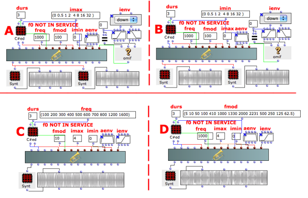
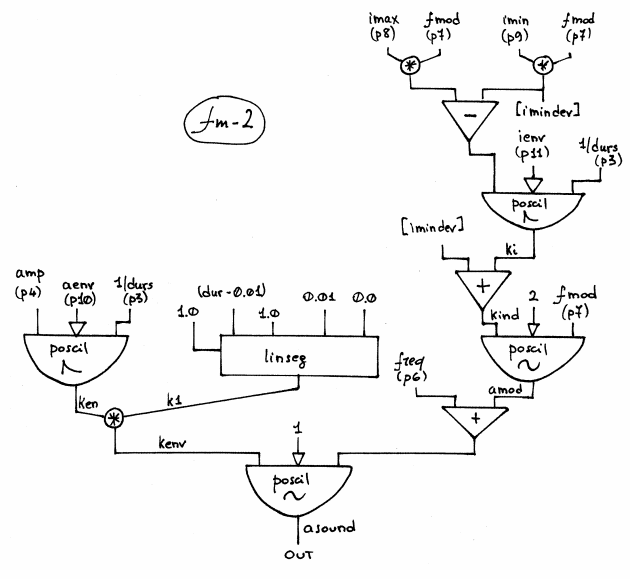

Navigation : [Previous](01-FM-1 "page précédente\(Frequency
Modulation Synthesis with FM-1\)") | [page
suivante](04_Formant_Wave_Function_\(FOF\) "Next\(Formant
Wave-Function Synthesis \(FOF\)\)")
# Frequency Modulation Synthesis with FM-2

## Tutorial FM-2

Specific Slots

Name

|

Description

|

Default value  
  
---|---|---  
  
amp

|

Maximum Amplitude. Linear from >0.0 to 1000 or in dB from 0 to -∞ (see
[Tutorial Getting Started 02 - Amplitude and Internal
Editor](03-Amplitude_and_internal_editor) for more details)

|

-6.0  
  
f0

|

 **NOT IN SERVICE**

|  
  
freq

|

Carrier frequency

|

500.0  
  
fmod

|

Modulating frequency

|

100.0  
  
imax

|

Maximum index (of freq modulation) [flt]

|

5  
  
imin

|

Minimum index (of freq modulation) [flt]

|

0  
  
aenv

|

Amplitude Envelope [GEN]

|

Instance: GEN07  
  
ienv

|

Envelope for the index [GEN]

|

Instance: GEN07  
  
Class description

The FM-1 Class realizes a simple Frequency Modulation Synthesis with the
following controls:

  * The main amplitude,
  * The frequency of the carrier,
  * The frequency of the modulator,
  * The amplitude envelope by means of a GEN routine,
  * The index envelope by means of a GEN routine,
  * The range between (imax & imin) of the index envelope.

FM-2 versus FM-1

There are few little differences between the [FM-1](01-FM-1) and FM-2
classes.

FM-1

|

FM-2  
  
---|---  
  
The Carrier is the generating frequency (f0) multiplied by the factor n1.

|

The Carrier is directly given.  
  
The Modulator is the generating frequency (f0) multiplied by the factor n2.

|

The Modulator is directly given.  
  
The amplitude and index envelope are initialized by a GEN05.

|

The amplitude and index envelope are initialized by a GEN07.  
  
|

 **The slot f0 is not in service.**  
  
Patch description

These examples give the same results as the [Tutorial FM-1](01-FM-1)
entering the data in a different way.

The example A & B show the meaning of the FM index: the number of the
components of the side-band frequencies increase with the rising of the index.

The example C focuses on the carrier frequency with a steady sideband width
(10 Hz). The sound begins rough and ends with a nice vibrato for the sake of
the ratio between the modulating and the carrier frequency. At the beginning
the sidebands are 10% away from the carrier (10/100 = 0.1). At the end they
are 0.625% away (10/1600).

The example D focuses on the ratio between the modulating and the carrier
frequency.

  * M/C > 0.1 -> vibrato,
  * M/C = integer or 1/2^n -> harmonic spectra,
  * M/C = floating -> inharmonic spectra.

Reminder

If imax>imin the [BPF](http://support-old.ircam.fr/forum-ol-
doc/om/om6-manual/co/BPF-BPC "http://support-old.ircam.fr/forum-ol-
doc/om/om6-manual/co/BPF-BPC \(nouvelle fenêtre\)") given as envelope is
read forwards as usual (example A) but if imax<imin the BPF is read backwards
(example B).

Try to evaluate the object with both envelopes each with a different synt.

Common Red Patches

For the red patch [C#ed](Component_number_and_entry_delay) and
[Synt](Synt) see [ Appendix
A](A-Appendix-A_Common_red_patches)

## Inside the Class

Csound Orchestra of the FM-2 Class.

instr 1

idur = p3

idurosc = 1/idur

iamp = (p4 > 0.0 ? (p4*0.001*0dbfs) : (ampdbfs (p4)))

if0 = p5 ; unused here

icar = p6 ; carrier

imod = p7 ; modulating

imax = p8

imin = p9

imindev = imin*imod

imaxdev = imax*imod

ivardev = imaxdev-imindev

iaenv = p10

ienv = p11

icarfun = 1

imodfun = 2

ieps = 0.01 ; short fadeout (avoid clicks in exp envelopes)

ken poscil iamp, idurosc, iaenv ; amplitude envelope

k1 linseg 1, idur-ieps, 1, ieps, 0 ; avoid clicks

kenv = ken * k1

ki poscil ivardev, idurosc, ienv ; dynamic modulator

kind = imindev + ki

amod poscil kind, imod, imodfun

asound poscil kenv, icar+amod, icarfun ; carrier

out asound

endin

Flow chart

References :

Plan :

  * [OMChroma User Manual](OMChroma)
  * [System Configuration and Installation](Installation)
  * [Getting started](Getting_Started)
  * [Managing GEN function and sound files](Managing_GEN_function_and_sound_files)
  * [Predefined Classes](Predefined_classes)
    * [Additive Synthesis](01-Additive_Synthesis)
    * [Buzz Synthesis](02-Buzz_Synthesis)
    * [Frequency Modulation Synthesis](03-Frequency_modulation)
      * [Frequency Modulation Synthesis with FM-1](01-FM-1)
      * Frequency Modulation Synthesis with FM-2
    * [Formant Wave-Function Synthesis (FOF)](04_Formant_Wave_Function_\(FOF\))
    * [Granular Formant Wave Function (FOG)](05-Granular_Formant_Wave_Function_\(FOG\))
    * [Karplus-Strong](06-Karplus-Strong)
    * [Random Amplitude Modulation](07-Random_Amplitude_Modulation)
    * [Sampler](08-Sampler)
    * [Subtractive Synthesis](09-Subtractive_Synthesis)
    * [Wave Shaping Synthesis](10-Waveshaping)
    * [Hybrid Models](11-Hybrid_Models)
  * [User-fun](User-fun)
  * [Creating a new Class](Creating_a_new_Class)
  * [Multichannel processing](06-Multichannel_processing)
  * [Appendix A - Common Red Patches](A-Appendix-A_Common_red_patches)

Navigation : [Previous](01-FM-1 "page précédente\(Frequency
Modulation Synthesis with FM-1\)") | [page
suivante](04_Formant_Wave_Function_\(FOF\) "Next\(Formant
Wave-Function Synthesis \(FOF\)\)")
