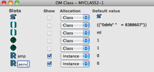
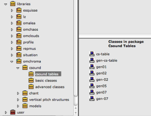
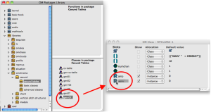
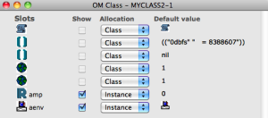
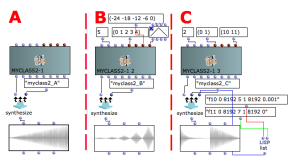

Navigation : [Previous](01-Three_lines_class "page
précédente\(Three lines class\)") | [page
suivante](03-Orchestra_with_many_instruments "page
suivante\(Orchestra with many instruments\)")
## Tutorial MyClass_02 Initialize GEN slots

Csound orchestra

instr 1

|

Starts an instrument block.  
  
---|---  
  
idur = p3

|

The duration is set to p3  
  
idurosc = 1/idur

|

The duration of the amplitude envelope is set to 1/idur  
  
iamp = (p4 > 0.0 ? (p4*0.001*0dbfs) : (ampdbfs (p4)))

|

The variable p4 sets the amplitude. Linear values from 0 to 1000 or in dB from
0 to negative values  
  
iaenv = p5

|

Function table number of the wave form of the amplitude envelope (GEN routine)  
  
aenv poscil iamp, idurosc, iaenv

|

Amplitude envelope  
  
asig rand aenv

|

The opcode "rand" generates a controlled random number at audio rate with aenv
as amplitude envelope, then writes the output to the audio variable "asig"  
  
out asig

|

The opcode "out" writes the audio data to an external device or stream.  
  
endin

|

Ends the current instrument block  
  
Csound Orchestra description

This simple orchestra is a white noise generator with the amplitude envelope
control.

## Make your OMChroma class

Copy the complete following instructions in a text file and save it
as"myclass2.orc".

sr = 96000

kr = 96000

ksmps = 1

nchnls = 1

0dbfs = 8388607

instr 1

idur = p3

idurosc = 1/idur

iamp = (p4 > 0.0 ? (p4*0.001*0dbfs) : (ampdbfs (p4)))

iaenv = p5

aenv poscil iamp, idurosc, iaenv

asig rand aenv

out asig

endin

|

  * Make a new class following the steps of the [Tutorial MyClass_01 Three lines](01-Three_lines_class) class until "Double click on "myclass" to show the OM Class window,
  * Substitute the name of the slot "p4" with amp (or with what you wish),
  * Substitute the name of the slot "p5" with aenv (or with what you wish).

  
  
---|---  
  

|

  * Open the Library window,
  * Open the "omchroma/csound" folder,
  * Select the "csound tables" folder and type "return",

The "Classes in package Csound Tables" will appear.  
  
---|---  
  

|

  * Click on the gen-07 icon and drag it on the aenv icon

  
  
---|---  
  

|

The icon of aenv must change into a BPF icon (look at the picture), and this
slot will have a GEN7 subroutine as default value.  
  
---|---  
  
Warning

Initialise always with a Csound table the slots witch stand for a
[BPF](http://support.ircam.fr/docs/om/om6-manual/co/BPF-BPC
"http://support.ircam.fr/docs/om/om6-manual/co/BPF-BPC \(nouvelle
fenêtre\)") or a Csound GEN function number.

To more details about the slots of the OMChroma classes see [Class Input
Slots](01-Class_Input_Slots).

|

The example A checks the default values of the new class.

The example B uses a[ BPF](http://support-old.ircam.fr/forum-ol-
doc/om/om6-manual/co/Edition "http://support-old.ircam.fr/forum-ol-
doc/om/om6-manual/co/Edition \(nouvelle fenêtre\)") as amplitude
envelope.

The example C uses use a GEN subroutine as amplitude envelope.  
  
---|---  
  
References :

Plan :

  * [OMChroma User Manual](OMChroma)
  * [System Configuration and Installation](Installation)
  * [Getting started](Getting_Started)
  * [Managing GEN function and sound files](Managing_GEN_function_and_sound_files)
  * [Predefined Classes](Predefined_classes)
  * [User-fun](User-fun)
  * [Creating a new Class](Creating_a_new_Class)
    * [Three lines class](01-Three_lines_class)
    * Initialize GEN slots
    * [Orchestra with many instruments](03-Orchestra_with_many_instruments)
  * [Multichannel processing](06-Multichannel_processing)
  * [Appendix A - Common Red Patches](A-Appendix-A_Common_red_patches)

Navigation : [Previous](01-Three_lines_class "page
précédente\(Three lines class\)") | [page
suivante](03-Orchestra_with_many_instruments "page
suivante\(Orchestra with many instruments\)")
