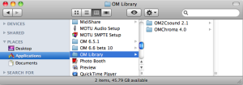
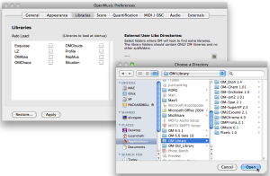
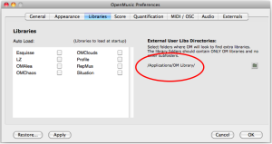
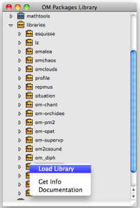
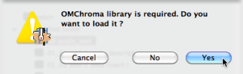
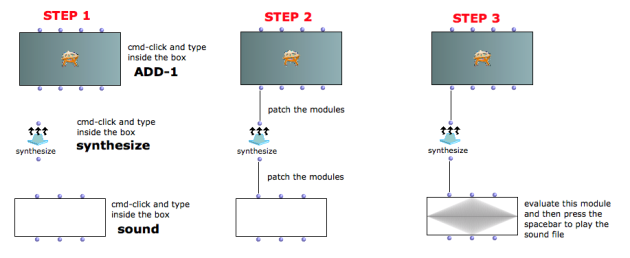
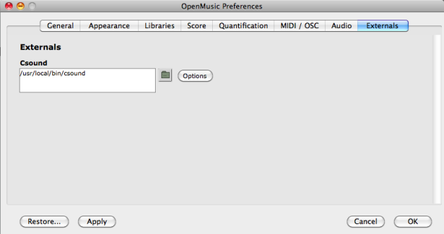
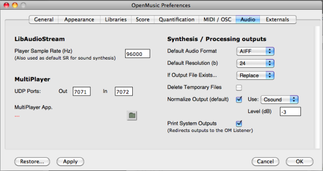

Navigation : [Previous](01-Csound "page précédente\(Csound\)") |
[Next](03-_Importing_tutorials "Next\(Importing
tutorials\)")
## OMChroma library

The libraries are extra tools with a specific purpose. In the "OM
X.X.X/libraries" folder you can find the standard libraries of OpenMusic.

OMChroma is an external library of OpenMusic. So go to the 5-Links section and
download the libraries OM Libraries. You should see OMChroma and OM2Csound.

When you have downloaded them follow the instructions below.

Create a folder "OM Library" (in Applications, or wherever you want) and place
the libraries in it (including OMChroma and OM2Csound).

|

  
  
---|---  
  
Run OpenMusic, open "OM X.X.X/Preferences/Libraries" and select the folder
where OM will look for extra libraries.

|

  
  
---|---  
  
The path shown in the "Preferences/Libraries" window should now be displayed.

|

  
  
---|---  
  
Open the Library Window in OM (shift + cmd + P), open the library folder and
load the OMChroma library.

|

  
  
---|---  
  
If you did not load the OMChroma library properly, a warning window will
appear when trying to open patch with OMChroma boxes inside. Answer yes to the
window.

|

  
  
---|---  
  
Create a new patch, open it and follow the steps below or load the Tutorial
patch sc-01 audio test.

In "OM X.X.X/Preferences/Externals" the Csound's path should be indicated as
below.

In "OM X.X.X/Preferences/Audio" set your preferred audio data.

## Set the main default values

Set the main default values

 **Default Audio Format** : choose between AIFF and WAVE.

 **Default Resolution:** set the bit resolution of the sound file.

 **If Output File Exist:** Auto Rename will add a number to the file name, so
that each time a sound with the same name is synthesized, the old one will not
be overwritten. Beware: this option will fill up your sound file folder very
rapidly! Replace will overwrite sound files with the same name.

 **Delete Temporary Files:** if checked, temporary files (orchestra, score and
the floating point audio file) will be deleted after the synthesis process has
ended. It is a practical solution when one is sure of the results and never
needs to look at the intermediate files.

 **Normalize Output (default):** if checked, normalize the sound (the
synthesis is floating point). The normalization can also be specified as a
keyword (rescale) of synthesize (enter the level of the normalization for that
synthesis process).

 **Use:** Csound or SuperVP. The latter is more general in the case of exotic
formats or number or channels, but the software is not free. For most
purposes, Csound should be enough. The quality is the same. Level is the
maximum level [dB] after normalization (0=full level, digital). Use rather -3
or -6.

 **Print System Outputs:** if checked, the output of Csound will be redirected
to the OM Listener, otherwise it will appear in the Console window (which
should be open). The former is more practical, but much slower in case of many
printouts.

References :

Plan :

  * [OMChroma User Manual](OMChroma)
  * [System Configuration and Installation](Installation)
    * [Foreword](00-Foreword)
    * [Csound](01-Csound)
    * Libraries and main default values
    * [Importing tutorials](03-_Importing_tutorials)
    * [Extended preferences](04-Extended_preferences)
    * [Links](05-Links)
  * [Getting started](Getting_Started)
  * [Managing GEN function and sound files](Managing_GEN_function_and_sound_files)
  * [Predefined Classes](Predefined_classes)
  * [User-fun](User-fun)
  * [Creating a new Class](Creating_a_new_Class)
  * [Multichannel processing](06-Multichannel_processing)
  * [Appendix A - Common Red Patches](A-Appendix-A_Common_red_patches)

Navigation : [Previous](01-Csound "page précédente\(Csound\)") |
[Next](03-_Importing_tutorials "Next\(Importing
tutorials\)")
