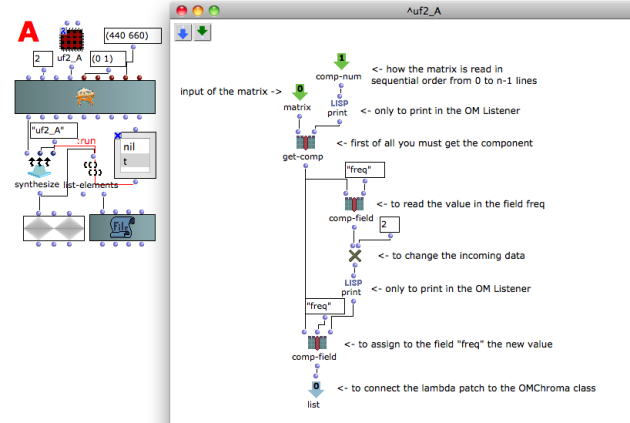
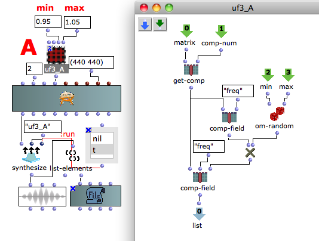

Navigation : [Previous](01-Replace_data "page
précédente\(Replace data\)") | [Next](03-Add_components "page
suivante\(Add components\)")

Patch description

This user-fun reads the value of the "freq" field, multiplies it by 2 and
replace the old value.

Program flow

The user-fun patch must al less have 2 inlets and 1 outlet and these are
always the same.

  * Input # 0 is the matrix of the OMChroma class,
  * Input # 1 pass the number of the rows which is read by the user-fun. Remember the number go from 0 to n-1 rows,
  * Output # 0 to connect the lambda patch to the OMChroma class.

All the other objects realize the algorithm and obviously are different in
each patch. In this case :

  * The function [get-comp](http://support-old.ircam.fr/forum-ol-doc/om/om6-manual/co/ArrayTools "http://support-old.ircam.fr/forum-ol-doc/om/om6-manual/co/ArrayTools \(nouvelle fenêtre\)") gets the component one by one in sequential order,
  * The function [comp-field](corresponding to the line identiefier "corresponding to the line identiefier \(nouvelle fenêtre\)") with 2 inlets returns the value of the field corresponding to the line identiefier (2nd inlet). Here it is "freq",
  * The function OM* performs the calculus,
  * The function comp-field with 3 inlets assigns the value riceived in the 3rd inlet to the field corresponding to the line identiefier. 

## Tutorial User-fun 03 - Multiply for a random number

Patch description

This user-fun reads the value of the "freq" field, multiplies it by a random
number between the minimum and maximum value given by the two supplementary
inlets of the user-fun patch and replace the old value.

Reminder

In addition to the first 2 leftmost inlets, which are the matrix and the
component number of the OMChroma class and that they don't have be connected,
you can add how many inlets you need in the user-fun.

References :

Plan :

  * [OMChroma User Manual](OMChroma)
  * [System Configuration and Installation](Installation)
  * [Getting started](Getting_Started)
  * [Managing GEN function and sound files](Managing_GEN_function_and_sound_files)
  * [Predefined Classes](Predefined_classes)
  * [User-fun](User-fun)
    * [Replace data](01-Replace_data)
    * Read modify and replace
    * [Add components](03-Add_components)
    * [Using keywords](04-Using_keywords)
    * [Fletcher-Munson curve](05-Fletcher-Munson_curve)
    * [Filter](06-Filter)
  * [Creating a new Class](Creating_a_new_Class)
  * [Multichannel processing](06-Multichannel_processing)
  * [Appendix A - Common Red Patches](A-Appendix-A_Common_red_patches)

Navigation : [Previous](01-Replace_data "page
précédente\(Replace data\)") | [Next](03-Add_components "page
suivante\(Add components\)")
