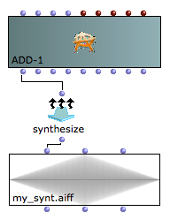

Navigation : [Previous](01-Class_Input_Slots "page
précédente\(Class Input Slots\)") | [page
suivante](03-Amplitude_and_internal_editor "Next\(Amplitude and
Internal Editor\)")

## Tutorial Getting Started 01 - Slots' Description and Default Values

Naming conventions

A synthesis class is also called an **event**. An event has a certain amount
of **elements** , as specified by the value of **num-cols**. The inputs of the
events are also called **slots** (this comes from object-oriented
programming). In this documentation, the names class or event, element or
components, input or slot will be used.

Patching together ADD-1, Synthesize and Sound to get and hear the audio file.

Evaluate the **sound** class and press the space-bar to play the audio file.

To show the red slots (corresponding to p-fields) select ADD-1 and type "alt +
right arrow key". To hide them type "alt + left arrow key".

Specific Slots

Name

|

Default value

|

Description  
  
---|---|---  
  
amp

|

-6.0

|

Maximum Amplitude. Linear from >0 to 1000 or in dB from 0 to negative values  
  
freq

|

440.0 (Hz)

|

(Minimum) current frequency [Hz]  
  
aenv

|

Instance : GEN07

|

Amplitude envelope [GEN]  
  
The ADD-1 Class realizes a simple additive synthesis with the following
controls:

  * The main amplitude,
  * The oscillator's frequency,
  * The amplitude envelope by means of a GEN routine.

Warning: about the final amplitude level

Csound always does all the computation in floating point and generates an
intermediate sound file that is then rescaled to the value specified by
Normalize Output Level in "Preferences/Audio". The default value is -6 dB
(more details about this topic in the [Tutorial Getting Started 02 -_Amplitude
and Internal Editor](03-Amplitude_and_internal_editor)).

## On-line Documentation

To show the on-line documentation select the object and type "d".

References :

Plan :

  * [OMChroma User Manual](OMChroma)
  * [System Configuration and Installation](Installation)
  * [Getting started](Getting_Started)
    * [Class Input Slots](01-Class_Input_Slots)
    * Slots' Description and Default Values
    * [Amplitude and Internal Editor](03-Amplitude_and_internal_editor)
    * [Amplitude Envelope](04_Amplitude_envelope)
    * [f-GEN Reserved Numbers](05-f-GEN_Reserved_Number)
    * [Audio Waveforms](06-Audio_Waveforms)
    * [Chord-seq to OMChroma](07-Chord-seq_to_OMCh_Class)
    * [Spectrum Chord and Arpeggio](08-Spectrum_Chord_and_Arpeggio)
    * [Velocity versus Amplitude](09-Velocity_vs_Amplitude)
    * [Exponential Amplitude Envelope with a BPF](10-Exponential_Amplitude_Envelope_with_BPF)
    * [Relationship with the Csound .orc and .sco files](11-Relationship_with_the_Csound_orc_and_sco_files)
    * [Slots polymorphism](12-Slots_polymorphism)
  * [Managing GEN function and sound files](Managing_GEN_function_and_sound_files)
  * [Predefined Classes](Predefined_classes)
  * [User-fun](User-fun)
  * [Creating a new Class](Creating_a_new_Class)
  * [Multichannel processing](06-Multichannel_processing)
  * [Appendix A - Common Red Patches](A-Appendix-A_Common_red_patches)

Navigation : [Previous](01-Class_Input_Slots "page
précédente\(Class Input Slots\)") | [page
suivante](03-Amplitude_and_internal_editor "Next\(Amplitude and
Internal Editor\)")
