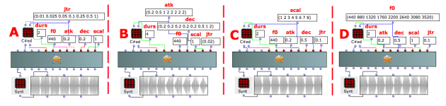
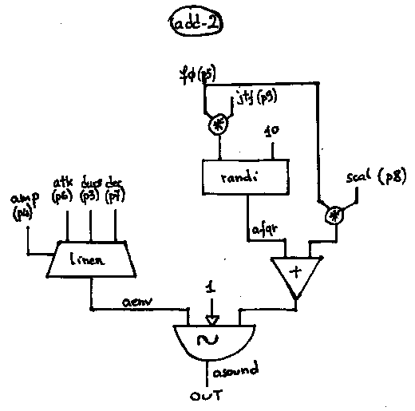

Navigation : [Previous](01-add-1 "page précédente\(Additive
Synthesys with ADD-1\)") | [Next](03-add-3 "page
suivante\(Additive Synthesys with ADD-3\)")
## Tutorial ADD-2

Specific Slots

Name

|

Description

|

Default value  
  
---|---|---  
  
amp

|

Maximum Amplitude. Linear from >0.0 to 1000 or in dB from 0 to -∞ (see
[Tutorial Getting Started 02 - Amplitude and Internal
Editor](03-Amplitude_and_internal_editor) for more details)

|

-6.0  
  
f0

|

(Minimum) fundamental frequency [Hz]

|

440.0  
  
atk

|

Attack time of the amplitude envelope [sec]

|

0.003  
  
dec

|

Decay time of the total duration of the amplitude envelope [sec]

|

0.01  
  
scal

|

Spectral scaler for the audio freq [mlt]

|

1.0  
  
jtf

|

(Centre) frequency of the jitter [%/Hz]

|

0.02  
  
Class description

The ADD-2 Class realizes an Additive Synthesis with the following controls:

  * The main amplitude,
  * The oscillator's frequency,
  * The attack and the decay of the amplitude envelope (linear),
  * The range of a random vibrato.

Patch description

The frequency of the oscillator is f0*scal.

The maximum range of the random vibrato is f0*jtf

The example A focuses on the vibrato range. The jitter's list (0.01 0.025 0.05
0.1 0.25 0.5 1) increases the random vibrato from 4.4 (440*0.01) to 440 Hz
(440*1).

The example B deals with the attack and the decay times of the amplitude
envelope.

The example C demonstrates the meaning of the spectral scaler. The random
vibrato is always 4.4 Hz while the frequency goes to 440 to 3520 (440*8) Hz.
So the first frequency has a 1% random vibrato but the last one has a 0.125%
random vibrato.

The example D shows how to get always the same random vibrato range. In this
case is always 1% of the frequency.

Common Red Patches

For the red patch [C#ed](Component_number_and_entry_delay) and
[Synt](Synt) see [ Appendix
A](A-Appendix-A_Common_red_patches)

## Inside the Class

Csound Orchestra of the ADD-2 Class.

instr 1

idur = p3

iamp = (p4 > 0.0 ? (p4*0.001*0dbfs) : (ampdbfs (p4)))

ifund = p5

ifq = ifund * p8

imindec = 0.01

irise = p6

idec = p7

idec = (((irise+idec)>idur) ? idur-irise : idec)

if idec > imindec goto goon

irise = idur/2

idec = idur/2

goon:

iran = p9

iampran = ifund * iran

afqr randi iampran, 10

aenv linen iamp, irise, idur, idec

asound poscil aenv, ifq + afqr, 1

out asound

endin

Flow chart

References :

Plan :

  * [OMChroma User Manual](OMChroma)
  * [System Configuration and Installation](Installation)
  * [Getting started](Getting_Started)
  * [Managing GEN function and sound files](Managing_GEN_function_and_sound_files)
  * [Predefined Classes](Predefined_classes)
    * [Additive Synthesis](01-Additive_Synthesis)
      * [Additive Synthesys with ADD-1](01-add-1)
      * Additive Synthesys with ADD-2
      * [Additive Synthesys with ADD-3](03-add-3)
      * [Additive Synthesys with ADD-A1](04-add-A1)
    * [Buzz Synthesis](02-Buzz_Synthesis)
    * [Frequency Modulation Synthesis](03-Frequency_modulation)
    * [Formant Wave-Function Synthesis (FOF)](04_Formant_Wave_Function_\(FOF\))
    * [Granular Formant Wave Function (FOG)](05-Granular_Formant_Wave_Function_\(FOG\))
    * [Karplus-Strong](06-Karplus-Strong)
    * [Random Amplitude Modulation](07-Random_Amplitude_Modulation)
    * [Sampler](08-Sampler)
    * [Subtractive Synthesis](09-Subtractive_Synthesis)
    * [Wave Shaping Synthesis](10-Waveshaping)
    * [Hybrid Models](11-Hybrid_Models)
  * [User-fun](User-fun)
  * [Creating a new Class](Creating_a_new_Class)
  * [Multichannel processing](06-Multichannel_processing)
  * [Appendix A - Common Red Patches](A-Appendix-A_Common_red_patches)

Navigation : [Previous](01-add-1 "page précédente\(Additive
Synthesys with ADD-1\)") | [Next](03-add-3 "page
suivante\(Additive Synthesys with ADD-3\)")
