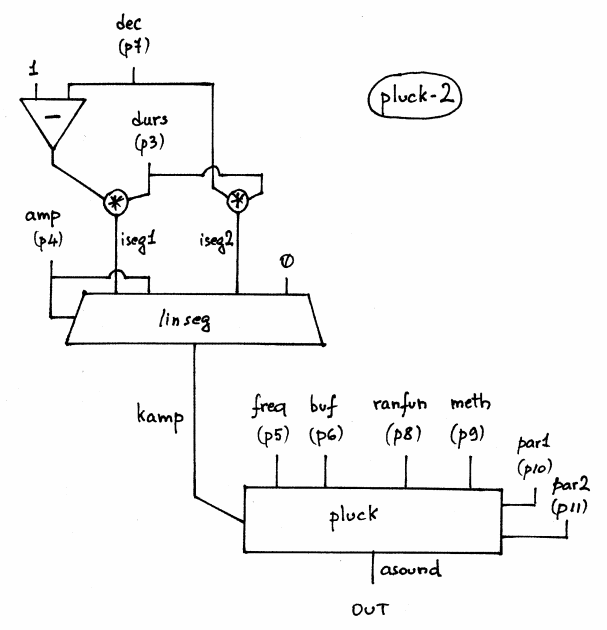

Navigation : [Previous](01-pluck-1 "page précédente\(Karplus-
Strong Synthesys with PLUCK-1\)") | [page
suivante](07-Random_Amplitude_Modulation "Next\(Random
Amplitude Modulation\)")

## Tutorial PLUCK-2 Methods

Specific Slots

Name

|

Description

|

Default value  
  
---|---|---  
  
amp

|

Maximum Amplitude. Linear from >0.0 to 1000 or in dB from 0 to -∞ (see
[Tutorial Getting Started 02 - Amplitude and Internal
Editor](03-Amplitude_and_internal_editor) for more details)

|

-6.0  
  
freq

|

(Minimum) fundamental frequency [Hz]

|

440.0  
  
buf

|

Intended pitch value in Hz, used to set up a buffer of 1 cycle of audio
samples which will be smoothed over time by a chosen decay method. The buffer
normally anticipates the value of the frequency, but may be set artificially
high or low to influence the size of the sample buffer.

|

220.0  
  
dec

|

Decay time % of the total duration of the amplitude envelope [H%]

|

0.8  
  
ranfun

|

Function number of the random source [GEN]

|

0  
  
meth

|

Method of natural decay. There are six, some of which use parameters values
that follow

  1. simple averaging. A simple smoothing process, uninfluenced by parameter values.

  2. stretched averaging. As above, with smoothing time stretched by a factor of iparm1 (>=1).

  3. simple drum. The range from pitch to noise is controlled by a 'roughness factor' in iparm1 (0 to 1). Zero gives the plucked string effect, while 1 reverses the polarity of every sample (octave down, odd harmonics). The setting .5 gives an optimum snare drum.

  4. stretched drum. Combines both roughness and stretch factors. iparm1 is roughness (0 to 1), and iparm2 the stretch factor (>=1).

  5. weighted averaging. As method 1, with iparm1 weighting the current sample (the status quo) and iparm2 weighting the previous adjacent one. iparm1 + iparm2 must be <= 1.

  6. 1st order recursive filter, with coefs .5. Unaffected by parameter values.

|

4  
  
ipar1

|

Parameter required by some values of meth

|

0.5  
  
ipar2

|

Parameter required by some values of meth

|

10.0  
  
Class description

The PLUCK-2 Class realizes a Karplus-Strong Synthesys (naturally decaying
plucked string or drum sound) with the following controls:

  * The main amplitude,
  * The fundamental frequency,
  * The buffer size,
  * The stored function (GEN routine) used to initialize the cyclic decay buffer. If ifn = 0, a random sequence will be used instead. 
  * The decay time of the total duration of the amplitude envelope.
  * The Method of natural decay (see specific slots' description).

Patch description

These examples collect all methods each of which has its own feature (see
specific slots' description). Watch out to the optional parameters and their
range and relationship.

Common Red Patches

For the red patch [C#ed](Component_number_and_entry_delay) and
[Synt](Synt) see [ Appendix
A](A-Appendix-A_Common_red_patches)

## Tutorial PLUCK-2 Buffer and runfun

Patch description

The example F fixes on the buffer size values. With increasing values the
sound changes into more muffled and less brilliant.

The example G gives 5 GEN subroutines as stored function used to initialize
the cyclic decay buffer. The default one (f0) is random sequence, the kind of
function (given as f- functions to the keyword inlets "tables" of synthesize)
influence the timbre of the sound.

Common Red Patches

For the red patch [C#ed](Component_number_and_entry_delay) and
[Synt](Synt) see [ Appendix
A](A-Appendix-A_Common_red_patches)

## Inside the Class

Csound Orchestra of the PLUCK-2 Class.

instr 1

idur = p3

iamp = (p4 > 0.0 ? (p4*0.001*0dbfs) : (ampdbfs (p4)))

ifq = p5 ; frequency

ibuf = p6 ; buffer size

idec = p7 ; percentage [0-1] of idur for the last decay ; affect the nature of
damping

iranfun = p8 ; random noise

imeth = p9 ; simple averaging

ipar1 = p10

ipar2 = p11

iseg1 = (1-idec)*idur

iseg2 = idec*idur

kamp linseg iamp,iseg1,iamp,iseg2,0

asound pluck kamp, ifq, ibuf, iranfun, imeth, ipar1, ipar2

out asound

Flow chart

References :

Plan :

  * [OMChroma User Manual](OMChroma)
  * [System Configuration and Installation](Installation)
  * [Getting started](Getting_Started)
  * [Managing GEN function and sound files](Managing_GEN_function_and_sound_files)
  * [Predefined Classes](Predefined_classes)
    * [Additive Synthesis](01-Additive_Synthesis)
    * [Buzz Synthesis](02-Buzz_Synthesis)
    * [Frequency Modulation Synthesis](03-Frequency_modulation)
    * [Formant Wave-Function Synthesis (FOF)](04_Formant_Wave_Function_\(FOF\))
    * [Granular Formant Wave Function (FOG)](05-Granular_Formant_Wave_Function_\(FOG\))
    * [Karplus-Strong](06-Karplus-Strong)
      * [Karplus-Strong Synthesys with PLUCK-1](01-pluck-1)
      * Karplus-Strong Synthesys with PLUCK-2
    * [Random Amplitude Modulation](07-Random_Amplitude_Modulation)
    * [Sampler](08-Sampler)
    * [Subtractive Synthesis](09-Subtractive_Synthesis)
    * [Wave Shaping Synthesis](10-Waveshaping)
    * [Hybrid Models](11-Hybrid_Models)
  * [User-fun](User-fun)
  * [Creating a new Class](Creating_a_new_Class)
  * [Multichannel processing](06-Multichannel_processing)
  * [Appendix A - Common Red Patches](A-Appendix-A_Common_red_patches)

Navigation : [Previous](01-pluck-1 "page précédente\(Karplus-
Strong Synthesys with PLUCK-1\)") | [page
suivante](07-Random_Amplitude_Modulation "Next\(Random
Amplitude Modulation\)")
