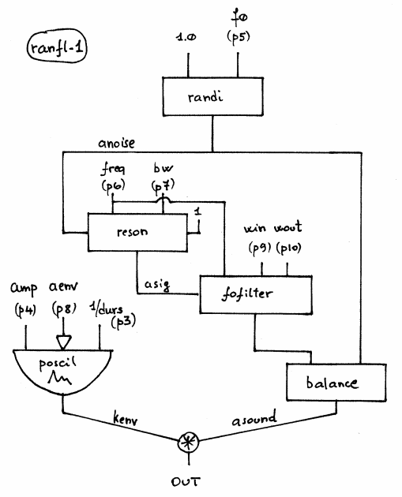

Navigation : [Previous](01-ran-1 "page précédente\(Random
Amplitude Modulation Synthesys with RAN-1\)") | [page
suivante](08-Sampler "Next\(Sampler\)")

## Tutorial RANFL-1

Specific Slots

Name

|

Description

|

Default value  
  
---|---|---  
  
amp

|

Maximum Amplitude. Linear from >0.0 to 1000 or in dB from 0 to -∞ (see
[Tutorial Getting Started 02 - Amplitude and Internal
Editor](03-Amplitude_and_internal_editor) for more details)

|

-6.0  
  
f0

|

Maximum frequency of the Random Amplitude Modulation or of the generating
noise [Hz]

|

263.8  
  
freq

|

Center frequency of the formant-resonant filter [Hz]

|

1600.0  
  
bw

|

Bandwidth of the formant-resonant filter [Hz]

|

500.0  
  
aenv

|

Amplitude Envelope [GEN]

|

Instance: GEN07  
  
win

|

Impulse response attack time [sec]

|

0.03  
  
wout

|

Impulse response decay time [sec]

|

0.3  
  
Class description

The RANFL-1 Class realizes a Random Amplitude Modulation of a Formant-Resonant
Filter with the following controls:

  * The main amplitude,
  * The maximum frequency of the Random Amplitude Modulation or of the generating noise,
  * The center frequency of the formant-resonant filter,
  * The bandwidth of the formant-resonant filter,
  * The amplitude envelope by means of a GEN routine,
  * The Impulse response attack time,
  * The Impulse response decay time.

Patch description

The example A focuses on the maximum frequency of the Random Amplitude
Modulation.

The example B deals with the center frequency of the formant-resonant filter.

The example C spreads the bandwidth of the formant-resonant filter from 1 to
2000 Hz.

The example D collects 5 different amplitude envelopes.

The example E fixes on the impulse response attack times.

The example F fixes on the impulse response decay times.

Common Red Patches

For the red patches [Synt,](Synt)
[C#ed](Component_number_and_entry_delay) and
[rnd](Random_BPF) see
[Appendix-A](A-Appendix-A_Common_red_patches).

## Inside the Class

Csound Orchestra of the RANFL-1 Class.

instr 1

idur = p3

idurosc = 1/p3

iamp = (p4 > 0.0 ? (p4*0.001*0dbfs) : (ampdbfs (p4)))

if0 = p5

ifq = p6

ibw = p7

iaenv = p8

irise = p9

idec = p10

iseed = 2 ; seed from system time

isize = 1 ; 31-bit random numbers

iscl = 1 ; peak response factor = 1

anoise randi 1.0, if0, iseed, isize

asig reson anoise, ifq, ibw, iscl

afil fofilter asig, ifq, irise, idec

asound balance afil, anoise

kenv poscil iamp, idurosc, iaenv ; amp envelope

out asound*kenv

endin

References :

Plan :

  * [OMChroma User Manual](OMChroma)
  * [System Configuration and Installation](Installation)
  * [Getting started](Getting_Started)
  * [Managing GEN function and sound files](Managing_GEN_function_and_sound_files)
  * [Predefined Classes](Predefined_classes)
    * [Additive Synthesis](01-Additive_Synthesis)
    * [Buzz Synthesis](02-Buzz_Synthesis)
    * [Frequency Modulation Synthesis](03-Frequency_modulation)
    * [Formant Wave-Function Synthesis (FOF)](04_Formant_Wave_Function_\(FOF\))
    * [Granular Formant Wave Function (FOG)](05-Granular_Formant_Wave_Function_\(FOG\))
    * [Karplus-Strong](06-Karplus-Strong)
    * [Random Amplitude Modulation](07-Random_Amplitude_Modulation)
      * [Random Amplitude Modulation Synthesys with RAN-1](01-ran-1)
      * Random Amplitude Modulation Synthesys with RANFL-1
    * [Sampler](08-Sampler)
    * [Subtractive Synthesis](09-Subtractive_Synthesis)
    * [Wave Shaping Synthesis](10-Waveshaping)
    * [Hybrid Models](11-Hybrid_Models)
  * [User-fun](User-fun)
  * [Creating a new Class](Creating_a_new_Class)
  * [Multichannel processing](06-Multichannel_processing)
  * [Appendix A - Common Red Patches](A-Appendix-A_Common_red_patches)

Navigation : [Previous](01-ran-1 "page précédente\(Random
Amplitude Modulation Synthesys with RAN-1\)") | [page
suivante](08-Sampler "Next\(Sampler\)")
