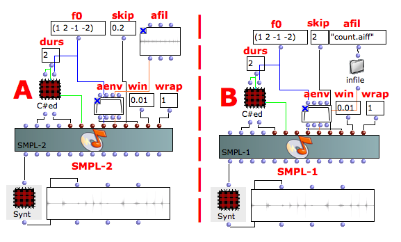

Navigation : [Previous](01-smpl-1 "page précédente\(Reading from a
Sound file with SMPL-1\)") | [Next](03-smpl-A1 "page
suivante\(Reading from a Sound file with SMPL-A1\)")

## Tutorial SMPL-2

Specific Slots

Name

|

Description

|

Default value  
  
---|---|---  
  
amp

|

Maximum Amplitude. Linear from >0.0 to 1000 or in dB from 0 to -∞ (see
[Tutorial Getting Started 02 - Amplitude and Internal
Editor](03-Amplitude_and_internal_editor) for more details)

|

0.0  
  
f0

|

Transpose the pitch of input sound by this factor (e.g. 0.5 means one octave
lower, 2 is one octave higher, and 1 is the original pitch). Fractional and
negative values are allowed (the latter results in playing the file backwards)

|

-1.0  
  
afil

|

Audio file [name, with possible path, sound, string, pathname or GEN01]

|

File: santuri_96  
  
skip

|

(Minimum) starting point when reading an audio file in ****[%]****

|

0.0  
  
aenv

|

Amplitude Envelope [GEN]

|

Instance: GEN07  
  
win

|

Attack and decay time in [sec]

|

0.01  
  
wrap

|

Wrap flag: 0=locations beyond EOF produce silence, <>0=wrap from beg of file

|

1  
  
Class description

The SMPL-2 Class is a Sampler similar to [Smpl-1](01-smpl-1) with the
following controls:

  * The main ampllitude,
  * The transposition factor,
  * The starting point of the audio file,
  * The amplitude envelope by means of a GEN routine,
  * The attack and decay time of the total duration of the amplitude envelope,
  * The wrapping mode (enable or disable).

Reminder

The only different between [SMPL-1](01-smpl-1) and SMPL-2 is the skipping
allocation. In SMPL-1 the skip time is set to an absolute value (e.g. in
seconds), instead in SMPL-2 is set in relative value as a percentage and that
is really useful for reverse playing.

Patch description

The example A employs the SMPL-2 instead the example B employs SAMPL-1 with
the same given data. How you can see the difference is the relative skip time
of SMPL-2.

Reminder

The meaning of the other slots is the same as the SMPL-1 Class. So see the
[Tutorial SMPL-1](01-smpl-1) for more details.

Common Red Patches

For the red patch [C#ed](Component_number_and_entry_delay) and
[Synt](Synt) see [ Appendix
A](A-Appendix-A_Common_red_patches)

## Inside the Class

Csound Orchestra of the SMPL-2 Class.

instr 1

idur = p3

idurosc = 1/idur

iamp = (p4 > 0.0 ? (p4*0.001) : (10 ^ (p4/20.0)))

; relative amplitude to the sound file (to avoid multiplying twice)

if0 = p5 ; transposition factor

ifile = p6

;ifilepeak filepeak ifile ; take away the semicolons if you want to read the

;print ifilepeak ; max amp of the file on the terminal

iskip = (p7 < 0.0 ? (p7*if0) : p7)

; to make the value not depend on the xposition factor if it's negative

iaenv = p8 ; global amplitude envelope

iwin = (p9 > idur/2 ? idur/2 : p9) ; local envelope

iwout = iwin

ixmode = 1 ; index between 0 and 1

ixoff = 0 ; index offset

ixrap = 0 ; no wraparound in table reading

iwrap = p10

iformat = 8 ; 24-bit int, ignored if the sound file has a header

iwsize = 512 ; the bigger, the better the quality of the transposition

ibufsize = 262144 ; maximum = 1048576, higher makes less disk access

iskipinit = 0 ; do not skip initialization

isigfun = 19 ; sigmoid function

; local envelope (for the grain)

k1 linen 1,iwin,idur,iwout

k2 tablei k1,isigfun,ixmode,ixoff,ixrap

; global envelope

k3 poscil iamp, idurosc, iaenv

; file reading

a1 diskin2 ifile, if0, iskip, iwrap, iformat, iwsize, ibufsize, iskipinit

asound = a1*k2*k3

outc asound

endin

Flow chart

References :

Plan :

  * [OMChroma User Manual](OMChroma)
  * [System Configuration and Installation](Installation)
  * [Getting started](Getting_Started)
  * [Managing GEN function and sound files](Managing_GEN_function_and_sound_files)
  * [Predefined Classes](Predefined_classes)
    * [Additive Synthesis](01-Additive_Synthesis)
    * [Buzz Synthesis](02-Buzz_Synthesis)
    * [Frequency Modulation Synthesis](03-Frequency_modulation)
    * [Formant Wave-Function Synthesis (FOF)](04_Formant_Wave_Function_\(FOF\))
    * [Granular Formant Wave Function (FOG)](05-Granular_Formant_Wave_Function_\(FOG\))
    * [Karplus-Strong](06-Karplus-Strong)
    * [Random Amplitude Modulation](07-Random_Amplitude_Modulation)
    * [Sampler](08-Sampler)
      * [Reading from a sound file](01-Reading_from_a_Sound_File)
        * [Reading from a Sound file with SMPL-1](01-smpl-1)
        * Reading from a Sound file with SMPL-2
        * [Reading from a Sound file with SMPL-A1](03-smpl-A1)
        * [Reading from a Sound file with SMPL-A2](04-smpl-A2)
      * [Using a deferred table](02-Using_a_deferred_tables)
      * [Crossfading Looper](03-Crossfading_Looper)
    * [Subtractive Synthesis](09-Subtractive_Synthesis)
    * [Wave Shaping Synthesis](10-Waveshaping)
    * [Hybrid Models](11-Hybrid_Models)
  * [User-fun](User-fun)
  * [Creating a new Class](Creating_a_new_Class)
  * [Multichannel processing](06-Multichannel_processing)
  * [Appendix A - Common Red Patches](A-Appendix-A_Common_red_patches)

Navigation : [Previous](01-smpl-1 "page précédente\(Reading from a
Sound file with SMPL-1\)") | [Next](03-smpl-A1 "page
suivante\(Reading from a Sound file with SMPL-A1\)")
