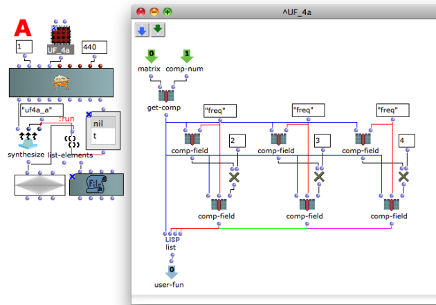
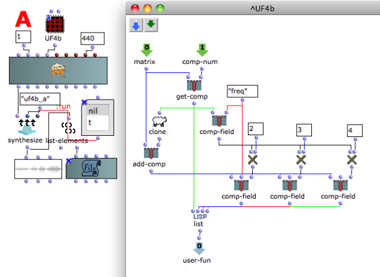
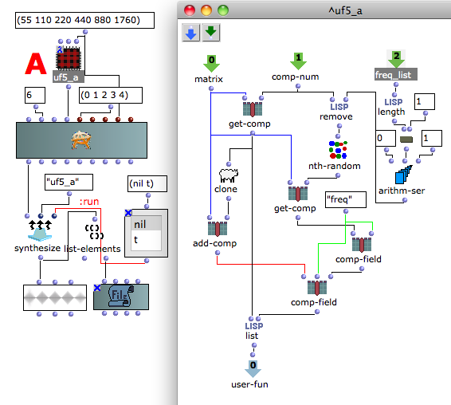
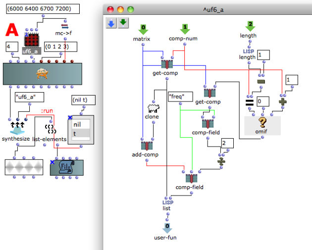

Navigation : [Previous](02-Read_modify_and_replace "page
précédente\(Read modify and replace\)") | [page
suivante](04-Using_keywords "Next\(Using keywords\)")

  1. Tutorial User-fun 04a - Add components (wrong)
  2. Tutorial User-fun 04b - Add components (correct)
  3. Tutorial User-fun 05 - Add another component
  4. Tutorial User-fun 06 - Add next component

## Tutorial User-fun 04a - Add components (wrong)

Patch description

This user-fun reads the value of the "freq" field and adds 3 other components
with frequency equal to freq x 2, freq x 3, freq x 4, but the resulting data
are wrong.

Warning

This method is uncorrect. If you read via the textfile the resulting data you
will find as result of the computation :

  * 440 without change -> correct,
  * 440 x 2 = 880 -> correct,
  * 440 x 3 = 2640 -> wrong,
  * 440 x 4 = 10560 -> wrong.

Now have a close look to how user-fun works reading the lambda patch from left
to right.

  * the component is passed to the function "lisp list",
  * the 1st comp-filed reads the "freq" field, multiplies it by 2, replaces the old value with the new one and passes the result to the function "lisp list", but now the value of the "freq"field is 880,
  * the 2nd comp-filed reads the "freq" field (which now is 880), multiplies it by 3, replaces the old value with the new one and passes the result to the function "lisp list", but now the value of the "freq"field is 2640,
  * the 3rd comp-filed reads the "freq" field (which now is 2640), multiplies it by 4, replaces the old value with the new one and passes the result to the function "lisp list", but now the value of the "freq"field is 10560.

## Tutorial User-fun 04b - Add components (correct)

Patch description

This user-fun reads the value of the "freq" field and adds 3 other components
with frequency equal to freq x 2, freq x 3, freq x 4. This id done using the
two function clone and [[[add-field](This patch reads the value of the "freq"
field and adds 3 other components with frequency equal to freq x 2, freq x 3,
freq x 4 "This patch reads the value of the "freq" field and adds 3 other
components with frequency equal to freq x 2, freq x 3, freq x 4 \(nouvelle
fenêtre\)")](http://support-old.ircam.fr/forum-ol-
doc/om/om6-manual/co/ArrayTools "http://support-old.ircam.fr/forum-ol-
doc/om/om6-manual/co/ArrayTools \(nouvelle fenêtre\)")](This patch reads
the value of the "freq" field and adds 3 other components with frequency equal
to freq x 2, freq x 3, freq x 4 "This patch reads the value of the "freq"
field and adds 3 other components with frequency equal to freq x 2, freq x 3,
freq x 4 \(nouvelle fenêtre\)") in the correct way.

Program flow

  * The function get-comp gets the component and passes it to the other functions,
  * The function clone makes a clone of the component, 
  * The function comp-filed reads the "freq" field,
  * The function add-field adds three copies of the clone component, one for function OM* each.

Reminder

To avoid to change the starting data make always a copy of it with clone and
add new components with add-comp.

## Tutorial User-fun 05 - Add another component

Patch description

This user-fun adds another component randomly chosen among the others.

Program flow

  * The inlet comp-num is used to remove the current component from the list of the additional component. This is to avoid adding a component with the same frequency of the running one.
  * The freq_list input gives the list of all the components.

## Tutorial User-fun 06 - Add next component

Patch description

This user-fun adds to each component a new one with frequency equal to the
frequency of the next following divided by two, except the last component,
which take the frequency of the first one.

Program flow

  * There are two get-comp because you need two different component's numbers at the same time (n & n+1),
  * Notice the use function [omif](http://support-old.ircam.fr/forum-ol-doc/om/om6-manual/co/ConditionalOps "http://support-old.ircam.fr/forum-ol-doc/om/om6-manual/co/ConditionalOps \(nouvelle fenêtre\)") to avoid that an error in the last program call. It can't exist a component number equal to the last plus 1, so we need an alternative choice, and we choose to take the frequency of the first component.

References :

Plan :

  * [OMChroma User Manual](OMChroma)
  * [System Configuration and Installation](Installation)
  * [Getting started](Getting_Started)
  * [Managing GEN function and sound files](Managing_GEN_function_and_sound_files)
  * [Predefined Classes](Predefined_classes)
  * [User-fun](User-fun)
    * [Replace data](01-Replace_data)
    * [Read modify and replace](02-Read_modify_and_replace)
    * Add components
    * [Using keywords](04-Using_keywords)
    * [Fletcher-Munson curve](05-Fletcher-Munson_curve)
    * [Filter](06-Filter)
  * [Creating a new Class](Creating_a_new_Class)
  * [Multichannel processing](06-Multichannel_processing)
  * [Appendix A - Common Red Patches](A-Appendix-A_Common_red_patches)

Navigation : [Previous](02-Read_modify_and_replace "page
précédente\(Read modify and replace\)") | [page
suivante](04-Using_keywords "Next\(Using keywords\)")
